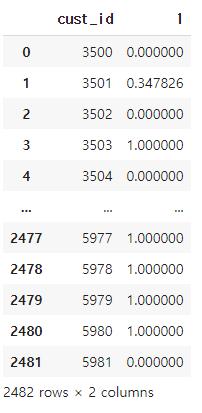

# 의사결정나무(Decision Tree)

```python
from sklearn.tree import DecisionTreeClassifier
md = DecisionTreeClassifier(random_state = 0, max_depth = 20)
md.fit(x_train,y_train)
print('score : ', md.score(x_train, y_train)) # 0.976571
```

* random_state는 난수 seed 설정, max_depth는 트리의 최대 깊이로 값이 클수록 모델의 복잡도가 올라간다.
* 그 외에도 min_samples_split 자식노드를 분할하는데 필요한 최소 샘플 수, max_features 노드에서 분할에 사용할 특징의 최대 수와 같은 parameter가 다수 존재한다.

```python
pred = md.predict_proba(x_test) # 평가데이터에 대해서 확률 추정
pred = pd.DataFrame(pred) # DataFrame로 저장
pred = pred.iloc[:,1] 
```

```python
y_test = 'Jin.csv' # 수험번호로 제출할 내용
ans = pd.concat([x_id,pred], axis = 1)
ans.to_csv(y_test, index = False)
ans
```

