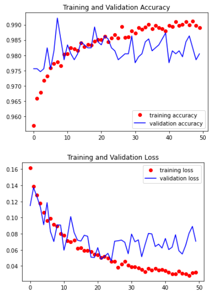

# 1. 앙상블

```python
%reset
import os
import numpy as np
import pandas as pd
import tensorflow as tf
import matplotlib.pyplot as plt
import matplotlib.image as img

from tensorflow.keras.preprocessing.image import ImageDataGenerator
from tensorflow.keras.applications import InceptionResNetV2
from tensorflow.keras.models import Sequential, load_model
from tensorflow.keras.layers import Dense, Dropout, Flatten, BatchNormalization, MaxPooling2D,Conv2D, GaussianNoise, Activation
from tensorflow.keras.optimizers import Adam
from tensorflow.keras.callbacks import ModelCheckpoint
from PIL import ImageFile
ImageFile.LOAD_TRUNCATED_IMAGES = True


test_dir  = '/home/workspace/user-workspace/crack_data_full_8_2/test'
test_label_csv = '/home/workspace/user-workspace/crack_data_full/test.csv'
df_test = pd.read_csv(test_label_csv)

with tf.device('/device:GPU:0'):
    
#     #-------------------------------------Inception_resnet-----------------------------------------
    model1 = tf.keras.models.load_model('/home/workspace/user-workspace/pku/model_save/crack_inception_resenet_full_22.h5')

    test_datagen1 = ImageDataGenerator()

    test_generator1 = test_datagen1.flow_from_dataframe(dataframe = df_test,
                                                  directory = test_dir,                                                         
                                                  target_size=(75, 75),
                                                  x_col = 'file_name',
                                                  y_col = None,
                                                  class_mode=None,                               
                                                  shuffle=False)      
                              
    pred1 = model1.predict(test_generator1, verbose=1).ravel()
    result_dict1 = { 'T':pred1}
    result_df1 = pd.DataFrame(result_dict1)
    result_df1['F']= 1- result_dict1['T']
       

    #-------------------------------------Inception_v2-----------------------------------------
    model2 = tf.keras.models.load_model('/home/workspace/user-workspace/HHD/model_save/InceptionV3_244_244.h5')

    test_datagen2 = ImageDataGenerator(rescale = 1/255)

    test_generator2 = test_datagen2.flow_from_dataframe(dataframe = df_test,
                                                  directory = test_dir,                                                         
                                                  target_size=(244, 244),
                                                  x_col = 'file_name',
                                                  y_col = None,
                                                  class_mode=None,                               
                                                  shuffle=False)      
                              
    pred2 = model2.predict(test_generator2, verbose=1).ravel()
    result_dict2 = { 'T':pred2}
    result_df2 = pd.DataFrame(result_dict2)
    result_df2['F']= 1 - result_dict2['T']
    
#     #-------------------------------------X-inception-----------------------------------------
    model4 = tf.keras.models.load_model('/home/workspace/user-workspace/JSI/model_save/Xception_1.h5')

    test_datagen4 = ImageDataGenerator(rescale = 1/255)

    test_generator4 = test_datagen4.flow_from_dataframe(dataframe = df_test,
                                                  directory = test_dir,                                                         
                                                  target_size=(71, 71),
                                                  x_col = 'file_name',
                                                  y_col = None,
                                                  class_mode=None,                               
                                                  shuffle=False)      
                              
    pred4 = model4.predict(test_generator4, verbose=1).ravel()
    result_dict4 = { 'T' : pred4 }
    result_df4 = pd.DataFrame(result_dict4)
    result_df4['F']= 1- result_dict4['T']        

    #-------------------------------------ResNet101V2-----------------------------------------
    model6 = tf.keras.models.load_model('/home/workspace/user-workspace/HHD/model_save/ResNet101V2_224_224.h5')

    test_datagen6 = ImageDataGenerator(rescale = 1/255)

    test_generator6 = test_datagen6.flow_from_dataframe(dataframe = df_test,
                                                  directory = test_dir,                                                         
                                                  target_size=(224, 224),
                                                  x_col = 'file_name',
                                                  y_col = None,
                                                  class_mode=None,                               
                                                  shuffle=False)      
                              
    pred6 = model6.predict(test_generator6, verbose=1).ravel()
    result_dict6 = { 'T' : pred6 }
    result_df6 = pd.DataFrame(result_dict6)
    result_df6['F']= 1- result_dict6['T']     
    
    #-------------------------------------resnet50v2-----------------------------------------
    model7 = tf.keras.models.load_model('/home/workspace/user-workspace/pku/model_save/resnet50v2_1.h5')

    test_datagen7 = ImageDataGenerator()

    test_generator7 = test_datagen7.flow_from_dataframe(dataframe = df_test,
                                                  directory = test_dir,                                                         
                                                  target_size=(200, 200),
                                                  x_col = 'file_name',
                                                  y_col = None,
                                                  class_mode=None,                               
                                                  shuffle=False)      
                              
    pred7 = model7.predict(test_generator7, verbose=1).ravel()
    result_dict7 = { 'T' : pred7 }
    result_df7 = pd.DataFrame(result_dict7)
    result_df7['F']= 1- result_dict7['T']     
        #-------------------------------------DenseNet169-----------------------------------------
    model9 = tf.keras.models.load_model('/home/workspace/user-workspace/YJS/test_cnn_model_DenseNet169(136,136)_v3.h5')

    test_datagen9 = ImageDataGenerator(rescale = 1/255)

    test_generator9 = test_datagen9.flow_from_dataframe(dataframe = df_test,
                                                  directory = test_dir,                                                         
                                                  target_size=(136, 136),
                                                  x_col = 'file_name',
                                                  y_col = None,
                                                  class_mode=None,                               
                                                  shuffle=False)      
                              
    pred9 = model9.predict(test_generator9, verbose=1).ravel()
    result_dict9 = { 'T' : pred9 }
    result_df9 = pd.DataFrame(result_dict9)
    result_df9['F']= 1- result_dict9['T']     
    #-------------------------------------efficientnet_b7-----------------------------------------
    model10 = tf.keras.models.load_model('/home/workspace/user-workspace/pku/model_save/efficient_net_b7_1.h5')

    test_datagen10 = ImageDataGenerator()

    test_generator10 = test_datagen10.flow_from_dataframe(dataframe = df_test,
                                                  directory = test_dir,                                                         
                                                  target_size=(68, 68),
                                                  x_col = 'file_name',
                                                  y_col = None,
                                                  class_mode=None,                               
                                                  shuffle=False)      
                              
    pred10 = model10.predict(test_generator10, verbose=1).ravel()
    result_dict10 = { 'T' : pred10 }
    result_df10 = pd.DataFrame(result_dict10)
    result_df10['F']= 1- result_dict10['T']     
    
    #-------------------------------------InceptionV3_138-----------------------------------------
    
    model11 = tf.keras.models.load_model('/home/workspace/user-workspace/HHD/model_save/InceptionV3_136_136.h5')

    test_datagen11 = ImageDataGenerator(rescale = 1/255)

    test_generator11 = test_datagen11.flow_from_dataframe(dataframe = df_test,
                                                  directory = test_dir,                                                         
                                                  target_size=(136, 136),
                                                  x_col = 'file_name',
                                                  y_col = None,
                                                  class_mode=None,                               
                                                  shuffle=False)      
                              
    pred11 = model11.predict(test_generator11, verbose=1).ravel()
    result_dict11 = { 'T':pred11}
    result_df11 = pd.DataFrame(result_dict11)
    result_df11['F']= 1 - result_dict2['T']
    
```

```python
### Test
# result_df = result_df1 + result_df2 + result_df3 + result_df4 + result_df6 + result_df7
result_df = result_df1 + result_df2 + result_df4  + result_df6 + result_df7 + result_df9 + result_df10 + result_df11
result_t = tf.cast(result_df.iloc[:,0]>=result_df.iloc[:,1],dtype= tf.int32)
result_dict = { 'label':result_t}
result_df = pd.DataFrame(result_dict)
display(result_df.head())   
display(result_df.sum())
result_df.to_csv('/home/workspace/user-workspace/prediction/prediction_153_together_1114_2200.tsv', header=False, index=False)

```

# 2. DenseNet169

```python
# 사용할 데이터 부터 준비
%matplotlib inline
import matplotlib.pyplot as plt
import numpy as np
import tensorflow as tf
from tensorflow.keras.preprocessing.image import ImageDataGenerator
from tensorflow.keras.models import Sequential
from tensorflow.keras.layers import Dense, Flatten, Conv2D, MaxPooling2D, Dropout, BatchNormalization
from tensorflow.keras.optimizers import Adam, SGD, RMSprop
from tensorflow.keras.applications import ResNet152V2, ResNet50V2
from tensorflow.keras.applications import DenseNet201, DenseNet121, DenseNet169
from tensorflow.keras.callbacks import ModelCheckpoint
from keras.layers.merge import concatenate

from PIL import ImageFile
ImageFile.LOAD_TRUNCATED_IMAGES = True

train_dir = '/home/workspace/user-workspace/crack_data_full_8_2/train'
val_dir = '/home/workspace/user-workspace/crack_data_full_8_2/validation'


#imageDataGenerator

# train : 14074

train_datagen = ImageDataGenerator(rescale=1/255,
                                   rotation_range=25,
                                   width_shift_range=0.1,
                                   height_shift_range=0.1,
                                   shear_range=0.2,
                                   zoom_range=0.2,
                                   horizontal_flip=True,
                                   vertical_flip=True)

validation_datagen = ImageDataGenerator(rescale=1/255)

# train data를 가져오면 => x_data (독립변수, 픽셀데이터), t_data (종속변수, label)
train_generator = train_datagen.flow_from_directory(
    train_dir,                      
    classes=['0','1'],               
    target_size = (136,136),
    batch_size = 30 ,           
    class_mode = 'binary',
   
                                                   )
validation_generator = validation_datagen.flow_from_directory(
    val_dir,           
    classes=['0','1'],  
    target_size = (136,136),  
    batch_size = 32 ,           
    class_mode = 'binary',
    
                                                   )

# 데이터 준비완료
# 모델 생성
## Pretrained Network
with tf.device('/device:GPU:0'):
    model_base = DenseNet169(weights='imagenet',
                             include_top=False,
                             input_shape=(136,136,3))

    model_base.trainable = False  # Convolution Layer 완전 동결

    model = Sequential()

    model.add(model_base)

    model.add(Flatten(input_shape=(4*4*1664,)))

    model.add(Dense(3600,
                    activation='relu'))
    model.add(BatchNormalization())
 
    model.add(Dense(1,
                    activation='sigmoid'))

    model.summary()
    
    lr = 2e-6
    ep = 50
    
    model.compile(optimizer=Adam(learning_rate = lr),
                  loss='binary_crossentropy',
                  metrics=['accuracy'])

    best_weights_file="weights.best.hdf5"
    checkpoint = ModelCheckpoint(best_weights_file, monitor='val_acc', verbose=1, save_best_only=True, mode='max')

    
    history = model.fit(train_generator,
#                         callbacks=[checkpoint],
                        steps_per_epoch=375,
                        epochs=20,
                        validation_data=validation_generator,
                        validation_steps=32,
                        verbose=1)
    
    
    model_base.trainable = False
    fine_tune = 35

    # `fine_tune_at` 층 이전의 모든 층을 고정
    for layer in model_base.layers[-fine_tune:]:
          layer.trainable = True

    ## learning rate를 줄이는게 일반적(미세조절)        
    model.compile(optimizer=Adam(learning_rate = lr),
                  loss='binary_crossentropy',
                  metrics=['accuracy'])

    ## 재학습 진행
    history = model.fit(train_generator,
                             callbacks=[checkpoint],
                             steps_per_epoch=375,
                             epochs=ep,
                             validation_data=validation_generator,
                             validation_steps=32,
                             verbose=1)

    train_acc = history.history['accuracy']
    val_acc = history.history['val_accuracy']
    train_loss = history.history['loss']
    val_loss = history.history['val_loss']

    plt.plot(train_acc, 'bo', color='r', label='training accuracy')
    plt.plot(val_acc, 'b', color='b', label='validation accuracy')
    plt.title('Training and Validation Accuracy')
    plt.legend()
    plt.show()

    plt.plot(train_loss, 'bo', color='r', label='training loss')
    plt.plot(val_loss, 'b', color='b', label='validation loss')
    plt.title('Training and Validation Loss')
    plt.legend()
    plt.show()
    

# model.save('./test_cnn_model_v2.h5')
```


```python
import pandas as pd
with tf.device('/device:GPU:0'):

    test_dir  = '/home/workspace/user-workspace/crack_data_full_8_2/test'
    test_label_csv = '/home/workspace/user-workspace/crack_data_full/test.csv'
    df_test = pd.read_csv(test_label_csv)

    test_datagen = ImageDataGenerator(rescale=1/255)

    test_generator = test_datagen.flow_from_dataframe(dataframe = df_test,
                                                      directory = test_dir,                                                         
                                                      target_size=(136, 136),
                                                      x_col = 'file_name',
                                                      y_col = None,
                                                      class_mode=None,                               
                                                      shuffle=False)      

    pred = model.predict(test_generator, verbose=1).ravel()
    result_t = tf.cast((pred>=0.5), dtype = tf.int32)

    result_dict = { 'label':result_t}
    result_df = pd.DataFrame(result_dict)
    display(result_df.head())   
    result_df.to_csv('/home/workspace/user-workspace/prediction/prediction_153_yjs_DenseNet169(136,136)_v3.tsv', header=False, index=False) 
    model.save('./test_cnn_model_DenseNet169(136,136)_v3.h5')
```

# 3. DenseNet201

```python
# 사용할 데이터 부터 준비
%matplotlib inline
import matplotlib.pyplot as plt
import numpy as np
import tensorflow as tf
from tensorflow.keras.preprocessing.image import ImageDataGenerator
from tensorflow.keras.models import Sequential
from tensorflow.keras.layers import Dense, Flatten, Conv2D, MaxPooling2D, Dropout, BatchNormalization
from tensorflow.keras.optimizers import Adam, SGD, RMSprop
from tensorflow.keras.applications import DenseNet201

from tensorflow.keras.callbacks import ModelCheckpoint
from keras.layers.merge import concatenate

from PIL import ImageFile
ImageFile.LOAD_TRUNCATED_IMAGES = True

train_dir = '/home/workspace/user-workspace/crack_data_full_8_2/train'
val_dir = '/home/workspace/user-workspace/crack_data_full_8_2/validation'


#imageDataGenerator

# train : 14074

train_datagen = ImageDataGenerator(rescale=1/255,
                                   rotation_range=25,
                                   width_shift_range=0.1,
                                   height_shift_range=0.1,
                                   shear_range=0.2,
                                   zoom_range=0.2,
                                   horizontal_flip=True,
                                   vertical_flip=True)

validation_datagen = ImageDataGenerator(rescale=1/255)

# train data를 가져오면 => x_data (독립변수, 픽셀데이터), t_data (종속변수, label)
train_generator = train_datagen.flow_from_directory(
    train_dir,                      
    classes=['0','1'],               
    target_size = (136,136),
    batch_size = 30 ,           
    class_mode = 'binary',
                              
                                                   )
validation_generator = validation_datagen.flow_from_directory(
    val_dir,           
    classes=['0','1'],  
    target_size = (136,136),  
    batch_size = 32 ,           
    class_mode = 'binary',

                              
                                                   )

# 데이터 준비완료
# 모델 생성
## Pretrained Network
with tf.device('/device:GPU:0'):
    model_base = DenseNet201(weights='imagenet',
                             include_top=False,
                             input_shape=(136,136,3))

    model_base.trainable = False  # Convolution Layer 완전 동결

    model = Sequential()

    model.add(model_base)

    model.add(Flatten(input_shape=(4*4*1920,)))

    model.add(Dense(3600,
                    activation='relu'))
    model.add(BatchNormalization())

    model.add(Dense(1,
                    activation='sigmoid'))

    model.summary()
    
    lr = 4e-6
    ep = 50
    
    model.compile(optimizer=Adam(learning_rate = lr),
                  loss='binary_crossentropy',
                  metrics=['accuracy'])

    best_weights_file="weights2.best.hdf5"
    checkpoint = ModelCheckpoint(best_weights_file, monitor='val_acc', verbose=1, save_best_only=True, mode='max')

    
    history = model.fit(train_generator,
#                         callbacks=[checkpoint],
                        steps_per_epoch=375,
                        epochs=20,
                        validation_data=validation_generator,
                        validation_steps=32,
                        verbose=1)
    
    
    model_base.trainable = False
    fine_tune = 35

    # `fine_tune_at` 층 이전의 모든 층을 고정
    for layer in model_base.layers[-fine_tune:]:
          layer.trainable = True

    ## learning rate를 줄이는게 일반적(미세조절)        
    model.compile(optimizer=Adam(learning_rate = lr),
                  loss='binary_crossentropy',
                  metrics=['accuracy'])

    ## 재학습 진행
    history = model.fit(train_generator,
                            callbacks=[checkpoint],
                             steps_per_epoch=375,
                             epochs=ep,
                             validation_data=validation_generator,
                             validation_steps=32,
                             verbose=1)

    train_acc = history.history['accuracy']
    val_acc = history.history['val_accuracy']
    train_loss = history.history['loss']
    val_loss = history.history['val_loss']

    plt.plot(train_acc, 'bo', color='r', label='training accuracy')
    plt.plot(val_acc, 'b', color='b', label='validation accuracy')
    plt.title('Training and Validation Accuracy')
    plt.legend()
    plt.show()

    plt.plot(train_loss, 'bo', color='r', label='training loss')
    plt.plot(val_loss, 'b', color='b', label='validation loss')
    plt.title('Training and Validation Loss')
    plt.legend()
    plt.show()
    

# model.save('./test_cnn_model_v2.h5')
```



```python
import pandas as pd
with tf.device('/device:GPU:0'):

    test_dir  = '/home/workspace/user-workspace/crack_data_full_8_2/test'
    test_label_csv = '/home/workspace/user-workspace/crack_data_full/test.csv'
    df_test = pd.read_csv(test_label_csv)

    test_datagen = ImageDataGenerator(rescale=1/255)

    test_generator = test_datagen.flow_from_dataframe(dataframe = df_test,
                                                      directory = test_dir,                                                         
                                                      target_size=(136, 136),
                                                      x_col = 'file_name',
                                                      y_col = None,
                                                      class_mode=None,                               
                                                      shuffle=False)      

    pred = model.predict(test_generator, verbose=1).ravel()
    result_t = tf.cast((pred>=0.5), dtype = tf.int32)

    result_dict = { 'label':result_t}
    result_df = pd.DataFrame(result_dict)
    display(result_df.head())   
    result_df.to_csv('/home/workspace/user-workspace/prediction/prediction_153_yjs_Densenet201(136,136).tsv', header=False, index=False) 
    model.save('./test_cnn_model_Densenet201(136,136).h5')
```

# 4. DenseNet121

```python
# 사용할 데이터 부터 준비
%matplotlib inline
import matplotlib.pyplot as plt
import numpy as np
import tensorflow as tf
from tensorflow.keras.preprocessing.image import ImageDataGenerator
from tensorflow.keras.models import Sequential
from tensorflow.keras.layers import Dense, Flatten, Conv2D, MaxPooling2D, Dropout, BatchNormalization
from tensorflow.keras.optimizers import Adam, SGD, RMSprop
from tensorflow.keras.applications import DenseNet121

from tensorflow.keras.callbacks import ModelCheckpoint
from keras.layers.merge import concatenate

from PIL import ImageFile
ImageFile.LOAD_TRUNCATED_IMAGES = True

train_dir = '/home/workspace/user-workspace/crack_data_full_8_2/train'
val_dir = '/home/workspace/user-workspace/crack_data_full_8_2/validation'


#imageDataGenerator

# train : 14074

train_datagen = ImageDataGenerator(rescale=1/255,
                                   rotation_range=20,
                                   width_shift_range=0.1,
                                   height_shift_range=0.1,
                                   shear_range=0.2,
                                   zoom_range=0.2,
                                   horizontal_flip=True)

validation_datagen = ImageDataGenerator(rescale=1/255)

# train data를 가져오면 => x_data (독립변수, 픽셀데이터), t_data (종속변수, label)
train_generator = train_datagen.flow_from_directory(
    train_dir,                      
    classes=['0','1'],               
    target_size = (68,68),
    batch_size = 30 ,           
    class_mode = 'binary',
    color_mode="rgb",
                              
                                                   )
validation_generator = validation_datagen.flow_from_directory(
    val_dir,           
    classes=['0','1'],  
    target_size = (68,68),  
    batch_size = 32 ,           
    class_mode = 'binary',
    color_mode="rgb",
                              
                                                   )

# 데이터 준비완료
# 모델 생성
## Pretrained Network
with tf.device('/device:GPU:0'):
    model_base = DenseNet121(weights='imagenet',
                             include_top=False,
                             input_shape=(68,68,3))

    model_base.trainable = False  # Convolution Layer 완전 동결

    model = Sequential()

    model.add(model_base)

    model.add(Flatten(input_shape=(2*2*1024,)))

    model.add(Dense(1800,
                    activation='relu'))
    model.add(BatchNormalization())
#     model.add(Dense(1800,
#                     activation='relu'))
#     model.add(BatchNormalization())

    model.add(Dense(1,
                    activation='sigmoid'))

    model.summary()
    
    lr = 2e-6
    ep = 30
    
    model.compile(optimizer=Adam(learning_rate = lr),
                  loss='binary_crossentropy',
                  metrics=['accuracy'])

#     best_weights_file="weights.best.hdf5"
#     checkpoint = ModelCheckpoint(best_weights_file, monitor='val_acc', verbose=1, save_best_only=True, mode='max')

    
    history = model.fit(train_generator,
#                         callbacks=[checkpoint],
                        steps_per_epoch=375,
                        epochs=ep,
                        validation_data=validation_generator,
                        validation_steps=32,
                        verbose=1)
    
    
    model_base.trainable = False
    fine_tune = 20

    # `fine_tune_at` 층 이전의 모든 층을 고정
    for layer in model_base.layers[-fine_tune:]:
          layer.trainable = True

    ## learning rate를 줄이는게 일반적(미세조절)        
    model.compile(optimizer=Adam(learning_rate = lr),
                  loss='binary_crossentropy',
                  metrics=['accuracy'])

    ## 재학습 진행
    history = model.fit(train_generator,
#                              callbacks=[checkpoint],
                             steps_per_epoch=375,
                             epochs=ep,
                             validation_data=validation_generator,
                             validation_steps=32,
                             verbose=1)

    train_acc = history.history['accuracy']
    val_acc = history.history['val_accuracy']
    train_loss = history.history['loss']
    val_loss = history.history['val_loss']

    plt.plot(train_acc, 'bo', color='r', label='training accuracy')
    plt.plot(val_acc, 'b', color='b', label='validation accuracy')
    plt.title('Training and Validation Accuracy')
    plt.legend()
    plt.show()

    plt.plot(train_loss, 'bo', color='r', label='training loss')
    plt.plot(val_loss, 'b', color='b', label='validation loss')
    plt.title('Training and Validation Loss')
    plt.legend()
    plt.show()
    

# model.save('./test_cnn_model_v2.h5')
```


```python
import pandas as pd
with tf.device('/device:GPU:0'):

    test_dir  = '/home/workspace/user-workspace/crack_data_full_8_2/test'
    test_label_csv = '/home/workspace/user-workspace/crack_data_full/test.csv'
    df_test = pd.read_csv(test_label_csv)

    test_datagen = ImageDataGenerator(rescale=1/255)

    test_generator = test_datagen.flow_from_dataframe(dataframe = df_test,
                                                      directory = test_dir,                                                         
                                                      target_size=(68, 68),
                                                      x_col = 'file_name',
                                                      y_col = None,
                                                      class_mode=None,                               
                                                      shuffle=False)      

    pred = model.predict(test_generator, verbose=1).ravel()
    result_t = tf.cast((pred>=0.5), dtype = tf.int32)

    result_dict = { 'label':result_t}
    result_df = pd.DataFrame(result_dict)
    display(result_df.head())   
    result_df.to_csv('/home/workspace/user-workspace/prediction/prediction_153_yjs_DenseNet121(68,68)_.tsv', header=False, index=False) 
    model.save('./test_cnn_model_DenseNet121(68,68)_v2.h5')
```

# 5. ResNet152V2

```python
# 사용할 데이터 부터 준비
# ResNet152V2
%matplotlib inline
import matplotlib.pyplot as plt
import numpy as np
import tensorflow as tf
from tensorflow.keras.preprocessing.image import ImageDataGenerator
from tensorflow.keras.models import Sequential
from tensorflow.keras.layers import Dense, Flatten, Conv2D, MaxPooling2D, Dropout, BatchNormalization
from tensorflow.keras.optimizers import Adam, SGD, RMSprop
from tensorflow.keras.applications import MobileNetV2, ResNet152V2
from tensorflow.keras.callbacks import ModelCheckpoint
from keras.layers.merge import concatenate

from PIL import ImageFile
ImageFile.LOAD_TRUNCATED_IMAGES = True

train_dir = '/home/workspace/user-workspace/crack_data_full/train'
val_dir = '/home/workspace/user-workspace/crack_data_full/validation'


#imageDataGenerator

# train : 14074

train_datagen = ImageDataGenerator(rescale=1/255,
                                   rotation_range=20,
                                   width_shift_range=0.1,
                                   height_shift_range=0.1,
                                   shear_range=0.2,
                                   zoom_range=0.2,
                                   horizontal_flip=True)

validation_datagen = ImageDataGenerator(rescale=1/255)

# train data를 가져오면 => x_data (독립변수, 픽셀데이터), t_data (종속변수, label)
train_generator = train_datagen.flow_from_directory(
    train_dir,                      
    classes=['0','1'],               
    target_size = (96,96),
    batch_size = 30 ,           
    class_mode = 'binary',
    color_mode="rgb",
                              
                                                   )
validation_generator = validation_datagen.flow_from_directory(
    val_dir,           
    classes=['0','1'],  
    target_size = (96,96),  
    batch_size = 28 ,           
    class_mode = 'binary',
    color_mode="rgb",
                              
                                                   )

# 데이터 준비완료
# 모델 생성
## Pretrained Network
with tf.device('/device:GPU:0'):
    model_base = ResNet152V2(weights='imagenet',
                             include_top=False,
                             input_shape=(96,96,3))

    model_base.trainable = False  # Convolution Layer 완전 동결

    model = Sequential()

    model.add(model_base)

    model.add(Flatten(input_shape=(3*3*2048,)))

    model.add(Dense(3600,
                    activation='relu'))
    model.add(BatchNormalization())

    model.add(Dense(1,
                    activation='sigmoid'))

    model.summary()

    model.compile(optimizer=RMSprop(learning_rate = 2e-6),
                  loss='binary_crossentropy',
                  metrics=['accuracy'])

    best_weights_file="weights.best.hdf5"
    checkpoint = ModelCheckpoint(best_weights_file, monitor='val_acc', verbose=1, save_best_only=True, mode='max')

    
    history = model.fit(train_generator,
                        callbacks=[checkpoint],
                        steps_per_epoch=329,
                        epochs=28,
                        validation_data=validation_generator,
                        validation_steps=150,
                        verbose=1)
    
    
    model_base.trainable = True
    fine_tune = 554

    # `fine_tune_at` 층 이전의 모든 층을 고정
    for layer in model_base.layers[fine_tune:]:
          layer.trainable = False

    ## learning rate를 줄이는게 일반적(미세조절)        
    model.compile(optimizer=RMSprop(learning_rate=2e-6),
                  loss='binary_crossentropy',
                  metrics=['accuracy'])

    ## 재학습 진행
    history = model.fit(train_generator,
                             callbacks=[checkpoint],
                             steps_per_epoch=329,
                             epochs=30,
                             validation_data=validation_generator,
                             validation_steps=150,
                             verbose=1)

    train_acc = history.history['accuracy']
    val_acc = history.history['val_accuracy']
    train_loss = history.history['loss']
    val_loss = history.history['val_loss']

    plt.plot(train_acc, 'bo', color='r', label='training accuracy')
    plt.plot(val_acc, 'b', color='b', label='validation accuracy')
    plt.title('Training and Validation Accuracy')
    plt.legend()
    plt.show()

    plt.plot(train_loss, 'bo', color='r', label='training loss')
    plt.plot(val_loss, 'b', color='b', label='validation loss')
    plt.title('Training and Validation Loss')
    plt.legend()
    plt.show()
    

# model.save('./test_cnn_model_v2.h5')
```


```python
from tensorflow.keras.preprocessing import image
import pandas as pd
import numpy as np
import os

with tf.device('/device:GPU:0'):
    test_dir = '/home/workspace/user-workspace/crack_data_full/test/'
    base_dir = '/home/workspace/user-workspace/crack_data_full/test.csv'

    df = pd.read_csv(base_dir)
    display(df.head())
    
    crack_files = df['file_name'].values
    result_t = []
    for i in range(len(crack_files)):
        img_path = os.path.join(test_dir,crack_files[i])
        img1 = image.load_img(img_path, target_size=(96,96))
        arr_img1 = image.img_to_array(img1)
        arr_img1 = np.expand_dims(arr_img1, axis=0)
        arr_img1 = arr_img1 / 255.0

        result = model.predict(arr_img1)
        result_t.append((result>=0.5)[0][0])

    result_dict = {'label':result_t}
    result_df = pd.DataFrame(result_dict)
    result_df['label'] = result_df['label'].astype(int)

    display(result_df.head())   
    print(result_df['label'].sum())
    result_df.to_csv('/home/workspace/user-workspace/prediction/prediction_153_yjs_v6.tsv', index=False, header=False)
    model.save('./test_cnn_model_v6.h5')
# result_df.to_csv('/home/workspace/user-workspace/prediction/prediction1.csv', index=False)
```

