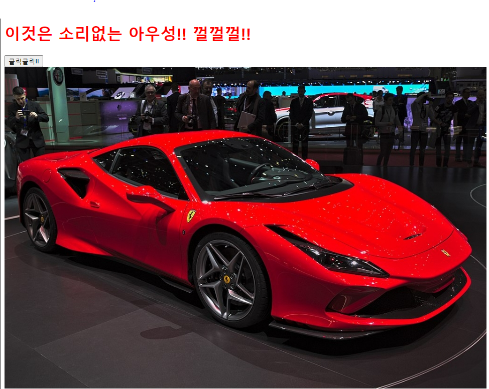

# 1.HTML_Index

* `<head>` 보통 일반적인 설정을 지정하는 태그
* `<title>`,`<style>`태그들이 자주 나온다.
  
* `<script>`태그를 이용해 js 기능을 하기도 한다.

* `<body>`태그 안에 출력하고 싶은 내용들을 넣는다.
```html
<!DOCTYPE html>
<html lang="en">
    <head>
        <!-- html에서의  주석처리  -->
        <!-- 일반적인 설정이 와요!!  -->
        <meta charset="UTF-8">
        <title>Title</title>
        <style>
      
           h1 {
              color : red; 
           } 
       
        </style>
        <script>
            function my_func(){
                alert("소리없는 아우성!!");  // 경고창을 출력!
            }
        </script>
    </head>
    <body> 
        <!-- BROWSER에 출력하고 싶은 내용이 와요!!  -->
        <h1>이것은 소리없는 아우성!! 껄껄껄!!</h1>   <!-- heading 1-->
        <input type="button" value="클릭클릭!!" onclick="my_func()">
        <br>
        
        <!-- element, tag, property(attribute) -->
    </body>
</html>  
```



* HTML 결과 화면


