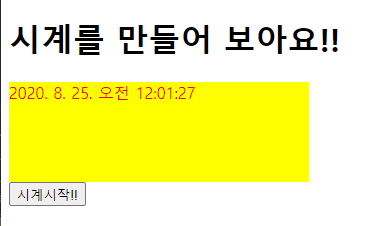

# 4. Javascript_clock

> 시계를 만들어 보자.

```html
<!DOCTYPE html>
<html lang="en">
<head>
    <meta charset="UTF-8">
    <title>Title</title>
    <script src="js/04_javascript_clock.js"></script>
    <style>
        div {
            background-color: yellow;
            color: red;
            width: 300px;
            height: 100px;
        }
    </style>
</head>
<body>
    <h1>시계를 만들어 보아요!!</h1>
    <div id="myDiv">여기에 시간이 출력되요!!</div>
    <input type="button"
           value="시계시작!!"
           onclick="start_clock()">
</body>
</html>
```

```javascript
function start_clock() {
    
    setInterval(function() {
        var today = new Date() // 날짜 객체 생성.
        console.log(today.toLocaleString())  // ok!!
        // HTML의 특정 위치를 지정!!
        var my_div = document.getElementById("myDiv")
        my_div.innerText = today.toLocaleString()
    },1000)
}
```



