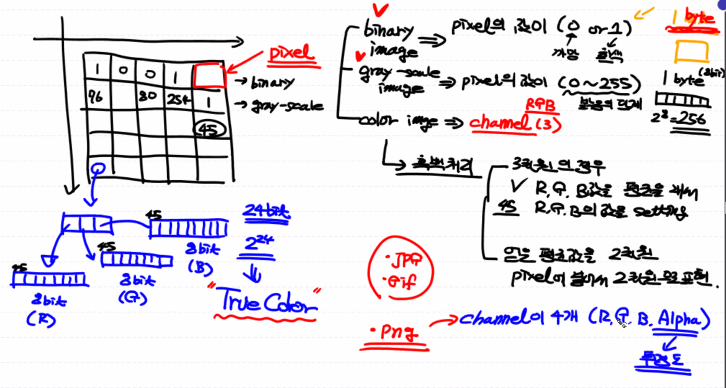

# 03. Machine Learning

* `AI` (Artificial Intelligence - 인공지능)   :  인간이 가지고 있는 학습능력, 응용력, 추론능력을 컴퓨터를 통해서 구현하고자 하는 가장 포괄적인 개념

*  `Machine Learning` : `AI`를 구현하는 하나의 방법론, 데이터를 이용해서 데이터의 특성과 패턴을 학습하고 그 결과를 바탕으로 미지의 데이터에 대한 미래결과를 예측하는 프로그래밍 기법
  ex ) **Regression**,  SVM(Support Vector Machine),  Random Forest, Descision Tree, Clustering, **Neural Network**, **Reinforcement Learning**, 등등등 ..
  * Data Mining : 데이터간의 상관관계나 새로운 속성(feature)을 찾는 것이 주 목적인 작업

* `Deep Learning` :  `Machine Learning`의 한 부분, `Neural Network`을 이용해서 학습하는 알고리즘의 집합. ( CNN, ANN, LSTM, GAN, ...)

## 1. Machine Learning

> 1960년대 개념이 만들어졌다. `Explicit program`의 한계 때문에 고안되었다. `Explicit program`은 `rule based program`으로 `Explicit programming`은 조건이 너무 많아서 프로그램으로 표현하기가 힘든 프로그램이 존재

* `Machine Learning` : 프로그램 자체가 데이터를 기반으로 학습을 통해 배우는 능력을 가지는 프로그램을 지칭,  결과를 바탕으로 미지의 데이터에 대해 미래 결과를 예측
  	1.  Regression (Linear Regression, Logistic Regression : 연속적인 값 예측, 분류 가능
   	2.  SVM (Support Vector Machine)
   	3.  Decision Tree
   	4.  Random Forest
   	5.  Naive Bayes
   	6.  KNN (K-Nearest Neighbor)
   	7.  Neural Network (신경망)
   	8.  Clustering (K-Means, DBSCAN)
   	9.  Reinforcement Learning

### 1) Type

> 학습 방법에 따라서 크게 4가지로 분류

(1) <u>**지도학습 (Supervised Learning)**</u>

- 우리가 해결해야 하는 현실세계의 대부분의 문제가 지도학습 문제

(2) 비지도학습 (Unsupervised Learning)

(3) 준지도학습 (SemiSupervised Learning)

(4) 강화학습 (Reinforcement Learning)


#### 1. 지도학습 (Supervised Learning)

> 지도학습은 학습에 사용되는 데이터와 그 정답(`label`) 을 이용해서 데이터의 특성과 분포를 학습하고 미래결과를 예측하는 방법. 입력값 (x)와 정답 (t)를 포함하는 Training Data Set을 이용. 어떤 종류의 미래값을 예측하느냐에 따라 크게 2가지로 나뉜다.

##### [1]  Regression(회귀) 

> 학습된 결과를 바탕으로 연속적인 숫자값을 예측.

###### 1 -1  Simple Linear Regression (선형회귀) 
> '얼마나' 를 예측하는 방법

###### ex 1) 공부시간 - 시험성적

```python
# Linear Regression Model 구현

import numpy as np
import pandas as pd
import matplotlib.pyplot as plt


# 1. Training Data Set 준비
#    머신러닝에 입력으로 사용될 데이터를 NumPy array 형태로 준비

x_data = np.array([1, 2, 3, 4, 5, 7, 8, 10, 12, 13, 14, 15, 18, 20, 25, 28, 30]).reshape(-1,1)
t_data = np.array([5, 7, 20, 31, 40, 44, 46, 49, 60, 62, 70, 80, 85, 91, 92, 97, 99]).reshape(-1,1)


# 2. Linear Regression Model 정의
#    y = Wx + b
#    W와 b에 대한 변수 선언한 후 초기값은 랜덤값을 이용
W = np.random.rand(1,1)
b = np.random.rand(1)


# 3. loss function 정의 : 손실함수 (loss function)에 대한 코드를 작성
#                         matrix 처리를 해야한다
def loss_func(x,t):
    
    y = np.dot(x,W) + b
    
    return np.mean(np.power((t-y),2))
        
# 미분함수
def numerical_derivative(f,x):
    # f : 다변수 함수
    # x : 모든 변수를 포함하고 있어야한다. ndarray(차원상관없이)
    delta_x = 1e-4
    derivative_x = np.zeros_like(x) # 미분 결과를 저장하는 ndarray

    it = np.nditer(x, flags=['multi_index'])
       
    while not it.finished:
        
        idx = it.multi_index # iterator의 현재 index를 추출(tuple)
        
        # 현재 칸의 값을 어딘가에 잠시 저장
        tmp = x[idx]
        
        x[idx] = tmp + delta_x
        fx_plus_delta = f(x) # f(x + delta_x)

        x[idx] = tmp - delta_x
        fx_minus_delta = f(x)  # f(x - delta_x)   
        
        derivative_x[idx] = (fx_plus_delta-fx_minus_delta) / (2 * delta_x)
        
        x[idx] = tmp
        
        it.iternext()
    return derivative_x


def predict(x):
    return np.dot(x,W) + b # Hypothesis, Linear Regression Model


# 4. learning rate 정의 : 일반적으로 customizing이 되는 값으로 초기에는
#                         0.001정도로 설정해서 사용하고 loss값을 보고
#                         수치를 조절할 필요가 있다.
learning_rate = 0.0001


# 5. 학습을 진행 : 반복적으로 편미분을 이용해서 W 와 b를 update하는 방식으로 구현
# 미분을 진행할 loss_func()에 대한 lambda 정의
f = lambda x : loss_func(x_data,t_data)

for step in range(30000):
    
    W = W - learning_rate * numerical_derivative(f,W)
    b = b - learning_rate * numerical_derivative(f,b)

    if step % 3000 == 0:
        print('W : {}, b : {}, loss : {}'.format(W,b,loss_func(x_data,t_data)))
       
    
print(predict(19))
plt.scatter(x_data.ravel(),t_data.ravel())
plt.plot(x_data, x_data * W +b)
plt.show()

```


###### ex 2)  온도 - 오존량

```python
# SImple Linear Regression
# 온도에 따른 오존량

import numpy as np
import pandas as pd
import matplotlib.pyplot as plt
from my_library.machine_learning_library import numerical_derivative

# 1. Raw Data Loading
df = pd.read_csv('./data/ozone.csv')

# 2. Data Preprocessing (데이터 전처리)
#    - 결측치 처리
#       - 삭제 !!, 값 변경(평균, 최대, 최소), 값을 예측해서 대체
#    - 이상치 처리 (outlier)
#       - 이상치를 검출, 변경하는 작업
#    - 데이터 정규화
#    - 칼럼을 추출, 새로 생성

# 필요한 column (Temp.Ozone)만 추출

training_data = df[['Temp','Ozone']]

# 결측값 제거
training_data = training_data.dropna(how = 'any')
#print(training_data.shape)

# 3. Training Data Set
x_data = training_data['Temp'].values.reshape(-1,1)
t_data = training_data['Ozone'].values.reshape(-1,1)

# 4. Simple Linear Regression
#    y = Wx + b
#    W,b를 정의

W = np.random.rand(1,1)
b = np.random.rand(1)


# 5. loss function 정의

def loss_func(x,t):   
    y = np.dot(x,W) + b  
    return np.mean(np.power((t-y),2))

# 6. 학습종료 후 예측
def predict(x):
    return np.dot(x,W) + b # Hypothesis, Linear Regression Model


# 7. 프로그램에서 필요한 변수 정의
learning_rate = 0.00001
f = lambda x : loss_func(x_data,t_data)
# 8. 학습하기
for step in range(30000):
    
    W = W - learning_rate * numerical_derivative(f,W)
    b = b - learning_rate * numerical_derivative(f,b)

    if step % 3000 == 0:
        print('W : {}, b : {}, loss : {}'.format(W,b,loss_func(x_data,t_data)))
       
# 9. 그림으로 확인
plt.scatter(x_data.ravel(),t_data.ravel())
plt.plot(x_data, np.dot(x_data,W)+b,color='r')
plt.show()

# 10. 예측
result = predict(62)
print(result) # [[35.04243599]]
```


###### ex 3) 온도 - 오존량 sklearn

```python
# sklean을 이용해서 데이터로 학습, 예측

# sklearn은 데이터 분석, 머신러닝 라이브러리
# 유명하고 효율이 좋은 라이브러리

import numpy as np
import pandas as pd
import matplotlib.pyplot as plt
from sklearn import linear_model

# 1. Raw Data Loading
df = pd.read_csv('./data/ozone.csv')

# 2. Data Preprocessing (데이터 전처리)
#    - 결측치 처리
#       - 삭제 !!, 값 변경(평균, 최대, 최소), 값을 예측해서 대체
#    - 이상치 처리 (outlier)
#       - 이상치를 검출, 변경하는 작업
#    - 데이터 정규화
#    - 칼럼을 추출, 새로 생성

# 필요한 column (Temp.Ozone)만 추출

training_data = df[['Temp','Ozone']]
#print(training_data.shape)

# 결측값 제거

training_data = training_data.dropna(how = 'any')
#print(training_data.shape)

# 3. Training Data Set
x_data = training_data['Temp'].values.reshape(-1,1)
t_data = training_data['Ozone'].values.reshape(-1,1)

# 4. sklearn을 이용해서 linear regression model 객체 생성
#    아직 완성되지 않음
model = linear_model.LinearRegression()

# 5. Training Data Set을 이용해서 학습 진행
model.fit(x_data,t_data)

# 6. W와 b
print('W : {}, b : {}'.format(model.coef_,model.intercept_))

# 7. 그래프 확인
plt.scatter(x_data,t_data)
plt.plot(x_data,np.dot(x_data,model.coef_)+model.intercept_,color='r')
plt.show()

# 8. 예측
predict_val = model.predict([[62]])
print(predict_val) # [[3.58411393]]
```


* 회귀 모델 : 어떠한 데이터에 대해 **<u>그 값에 영향을 주는 조건을 고려해서</u>** 데이터의 평균을 구하기 위한 함수
  * 회귀 : 평균으로의 회귀, 데이터가 회귀모델 제시하는 추세선으로 회귀한다.

$$
y =h(x_1,x_2,x_3,...x_k;\beta_1,\beta_1,\beta_1,...\beta_k)+\epsilon \\y = 실측치, 정답 \quad \beta = 회귀계수
$$
* 최종목표 : h()를 최대한 실제와 가깝게 만드는게 목표

* 회귀모델을 만들때, **<u>실제 데이터는 어떤 특성을 가지고 있다고 가정</u>**한다. 이런 가정이 많을수록 단순화 된다. 다양한 회귀모델이 존재. (선형, 비선형)을 구본하는 기준은 독립, 종속변수의 고려가 아니다.

  * Linear Regression Model : 회귀계수가 선형적으로 결합되는 모델. **<u>회귀계수를 추출하기 쉽고, 해석하기가 쉽다.</u>** <u>**새로운 특성(feature)를 쉽게 추가할 수 있다.**</u>

  

  $$
  y = \beta_0+\beta_1x_1+\beta_2x_2+\beta_3x_3
  \\ y = \beta_0x^{\beta_1} => \log{y} = \log{\beta_0}+\beta_1\log{x}
  $$

  $$
  \\ Clasical\ Linear \ Regression\ Model
  \\ \hat{y} = \beta_0+\sum_{i=1}^p \beta_ix_i
  $$

  
  $$
  \hat{y} = \beta_0+\beta_1x_1 +\beta_2x_2+\beta_3x_3 
  \\ y = w_1x_1 +w_2x_2+w_3x_3  + b
  \\ y = \begin{pmatrix} X \end{pmatrix} \bullet w + b = \left( T \right)
  $$
  

  * non-linear Regression Model
    $$
    y = {\beta_1x \over \beta_2+x}
    $$


* 종속변수의 개수에 따른 분류

  * 단변량 회귀모델
  * 다변량 회귀모델

###### 1-2  Multiple Linear Regression (선형회귀) 

> 3.Tensorflow의 ex 확인


###### 2. Logistic Regression

>  분류하는 작업

* 정확도가 상당히 높다
* Deep Learning의 기본 component
* Linear Regression을 이용해서 Training data set의 특성과 분포를 파악해서 직선으로 찾는다. ( 2차원 대상) 직선을 기준으로 데이터를 분류한다.( 0 or 1 )

```python
# 공부시간에 따른 시험 합격여부

import numpy as np
import matplotlib.pyplot as plt
from sklearn import linear_model

x_data = np.array([1, 2, 5, 8, 10, 30]) # 공부시간
t_data = np.array([0, 0, 0, 1, 1, 1])

#plt.scatter(x_data,t_data)

model = linear_model.LinearRegression()
model.fit(x_data.reshape(-1,1),t_data.reshape(-1,1))

plt.scatter(x_data,t_data)
plt.plot(x_data,x_data * model.coef_.ravel()+model.intercept_, color='r')
plt.show()

print(model.predict([[7]]))
```


* Linear Regression 만으로는 분류작업에 문제가 있다. (직선 문제)
  * 문제 해결을 위해 직선을 S모양의 곡선으로 변환 => `Sigmoid`

$$
Sigmoid,\sigma(x) = {1\over1+e^{-x}} =  {1 \over1+e^{-(wx+b)}}
$$

```python
import numpy as np
import matplotlib.pyplot as plt

x_data = np.arange(-7,8)
t_data = 1/(1+np.exp(-1*x_data))

plt.plot(x_data,t_data)
plt.show()
```


* 손실함수 `Cross Enthropy`  => `2.수치미분.loss Function 확인

```python
import tensorflow as tf

# training data set
# x[영어학습, 해외생활]로 t[시험합격여부]를 예측해본다.

x_data = np.array([[1,0],[2,0],[5,1],[2,3],[3,3],[8,1],[10,0]])
t_data = np.array([[0],[0],[0],[1],[1],[1],[1]])

# placeholder
X = tf.placeholder(shape=[None,2], dtype=tf.float32)
T = tf.placeholder(shape=[None,1], dtype=tf.float32)

# weight & bias
W = tf.Variable(tf.random.normal([2,1],name='Weight'))
b = tf.Variable(tf.random.normal([1],name='bias'))

# Hypothesis(Logistic Model)
logits = tf.matmul(X,W) + b
H = tf.sigmoid(logits)

# loss function
loss = tf.reduce_mean(tf.nn.sigmoid_cross_entropy_with_logits(logits=logits, labels=T))
train = tf.train.GradientDescentOptimizer(learning_rate=0.001).minimize(loss)

# Session & initializer
sess = tf.Session()
sess.run(tf.global_variables_initializer())

# learning
for step in range(30000):
    _, W_val, b_val,loss_val = sess.run([train,W,b,loss], feed_dict={X:x_data, T:t_data})
    
    if step %3000 ==0:
        print('W:{}, b:{}, loss:{}'.format(W_val,b_val,loss_val))
        
# predict
print(sess.run(H, feed_dict={X:[[4,2]]})) # [[0.8191685]]로 합격한다. 
```

```python
W:[[0.6019047 ]				
 [0.36565697]], b:[1.891195], loss: 1.5739490985870361
W:[[-0.05496422]
 [ 0.3385291 ]], b:[1.1402998], loss: 0.7388325333595276
W:[[0.014862  ]
 [0.43800277]], b:[0.57935524], loss: 0.6288241744041443
W:[[0.07425766]
 [0.5486113 ]], b:[0.09322251], loss: 0.5446468591690063
W:[[0.12515686]
 [0.65440464]], b:[-0.32658103], loss: 0.48119428753852844
W:[[0.16900556]
 [0.7503001 ]], b:[-0.69004905], loss: 0.4333712160587311
W:[[0.20704447]
 [0.8357438 ]], b:[-1.007069], loss: 0.39690014719963074
W:[[0.2403445]
 [0.9117529]], b:[-1.2863299], loss: 0.3685729503631592
W:[[0.26979503]
 [0.9797136 ]], b:[-1.5349728], loss: 0.34611231088638306
W:[[0.29611203]		# W[:,0],보다 W[:,1]이 더 큰것을 보아 해외경험이 시험합격 여부에 더 영향
 [1.0409483 ]], b:[-1.7586783], loss: 0.32793381810188293
```


ex) 타이타닉 문제

```python
import numpy as np
import tensorflow as tf
import pandas as pd
from scipy import stats
import matplotlib.pyplot as plt
from sklearn.preprocessing import MinMaxScaler

train = pd.read_csv('./data/train.csv')

# df2 = pd.read_csv('./data/test.csv')
# display(df2)

# PassengerId : 승객일련번호 _ 필요 X 

# Survived : 생존여부 _ label

# Pclass : 객실 등급 
#          상관계수를 구해보고 연관성을 파악해서 살린다.

# Name : 이름 _ 필요 X

# Age : 나이 _ 필요 O
#       결측치 포함되어 있다.
#       1. 모든 사람의 평균
#       2. 이름에 포함된 MR, MRS, MISS를 고려해 평균나이 사용
#       유아(0) 청소년(1) 성인(2) 노인(3)

# Sex : male, Female => 0,1로 변경

# SibSp, Parch : column을 합쳐 num_of_family

# Ticket : 삭제
# Fare : 요금 _ 고민을 해 봐야 한다.

# Cabin : 객실번호 X

# Enbarked : 승선위치 S,C,Q  => 숫자로 바꿔서 처리


#######################################################################

# 필요없는 column 삭제
train.drop(['PassengerId','Name','Ticket','Fare', 'Cabin'],axis=1,inplace=True)

# 성별 처리
sex_mapping = {'male':0, 'female':1}
train['Sex'] = train['Sex'].map(sex_mapping)

# 가족 구성원
train['Family'] = train['SibSp']+train['Parch']
train.drop(['SibSp', 'Parch'],axis=1,inplace=True)

# 결측치
# train.isnull().sum()
# Survived      0
# Pclass        0
# Sex           0
# Age         177
# Embarked      2
# Family        0

# Embarked  결측치   
train['Embarked'] = train['Embarked'].fillna('Q')

# Embarked 변환
Embarked_mapping = {'S':0, 'C':1, 'Q':2}
train['Embarked'] = train['Embarked'].map(Embarked_mapping)

# Age 결측치 
train['Age'] = train['Age'].fillna(train['Age'].mean())

# Age에 대해 Binning 처리 (Numerical value -> Categorical value)
train.loc[train['Age']<8,'Age']=0
train.loc[(train['Age']>=8) & (train['Age'] < 20) ,'Age']=1
train.loc[(train['Age']>=20) & (train['Age'] < 65) ,'Age']=2
train.loc[train['Age']>=65,'Age']=3
display(train.head())


# 데이터 준비 완료
# Tensorflow를 이용해서 학습 진행 및 Accuracy를 구현

#train = train.drop('Survived',axis=1, inplace = False).values.reshape(-1,5)


brd = int(train.shape[0]*0.7)

train_data = train.iloc[0:brd]
test_data = train.iloc[brd:]


x_data_train = train_data.drop('Survived',axis=1, inplace = False).values.reshape(-1,5)
t_data_train = train_data['Survived'].values.reshape(-1,1)

x_data_test = test_data.drop('Survived',axis=1, inplace = False).values.reshape(-1,5)
t_data_test = test_data['Survived'].values.reshape(-1,1)

# Tensorflow

X = tf.placeholder(shape=[None,5], dtype= tf.float32)
T = tf.placeholder(shape=[None,1], dtype= tf.float32)

W = tf.Variable(tf.random.normal([5,1]),name='Weight')
b = tf.Variable(tf.random.normal([1]),name='bias')

# Hypothesis
logit = tf.matmul(X,W)+b
H = tf.sigmoid(logit)

# loss function
loss = tf.reduce_mean(tf.nn.sigmoid_cross_entropy_with_logits(logits=logit,labels=T))

# train
train = tf.train.GradientDescentOptimizer(learning_rate=1e-2).minimize(loss)

# session
sess = tf.Session()
sess.run(tf.global_variables_initializer())

# 학습
for step in range(300000):
         _,W_val,b_val,loss_val = sess.run([train,W,b,loss],feed_dict={X:x_data_train,T:t_data_train})
        
         if step % 300000 ==0:
            print('W : {}, b : {}, loss : {}'.format(W_val,b_val,loss_val))
            
            
predict = tf.cast(H >= 0.5, dtype=tf.float32)  # True = 1, False = 0
correct = tf.equal(predict,T)
accuracy = tf.reduce_mean(tf.cast(correct, dtype=tf.float32))
            
accuracy_val = sess.run(accuracy, feed_dict={X:x_data_test,T:t_data_test})
print('Accuracy : {}'.format(accuracy_val))

#W : [[-1.2302276 ]
# [ 0.20031445]
# [ 0.6554951 ]
# [ 0.38552335]
# [ 0.44069144]], b : [1.4703022], loss : 0.7463930249214172
#Accuracy : 0.8097015023231506            
```


##### [2] Classification(분류) 
> 학습된 결과를 바탕으로 어떤 종류의 값(discrete value)인지를 구별하는 방식,  '어떤것' 을 예측한다.
>
> Training Data Set 특성과 분포를 파악하여 미지의 입력 데이터에 대해 어떤 종류의 값으로 분류 될 수 있는 지 예측


* binary classification : 둘 중 하나를 예측 (Logistic Regression)
  * `정확도` 측정이 가능하다.
  * 학습 후 예측. 결과값이 0~1,   0.5이상 = 1,   0.5 미만 =0
  * ex) Email spam 예측,  신용카드 도난카드 여부 등
* Multinomial classification : 여러가지 중 하나를 예측


###### ex) BMI 분류

```python
# Multinomial Classfication
# BMI 지수에 대한 데이터를 가지고 학습 후 예측

# BMI = 몸무게/ 키의 제곱(m)
# 18.5 이하  => 저체중
# 18.5 ~ 23  => 정상
# 23 ~ 25    => 과체중
# 25 ~       => 비만
import numpy as np
import pandas as pd
from scipy import stats

from sklearn.model_selection import train_test_split
from sklearn.preprocessing import MinMaxScaler
from sklearn.linear_model import LogisticRegression
from sklearn.model_selection import cross_val_score
from sklearn.metrics import precision_score, recall_score, accuracy_score

df = pd.read_csv('./data/bmi.csv',skiprows=3)
#display(df)

# 결측치 확인
df.isnull().sum()

# 이상치 확인
zscore = 1.8
# height의 이상치를 검출
#df.loc[np.abs(stats.zscore(df['height'])) >= zscore,:]

# weight의 이상치를 검출
#df.loc[np.abs(stats.zscore(df['weight'])) >= zscore,:]

# Data Split
# Train, Test 7:3 비율
# Train 부분으로 K-fold cross validation
x_data_train, x_data_test, t_data_train, t_data_test = \
train_test_split(df[['height','weight']],df['label'],test_size=0.3, random_state=0)

#display(x_data_test)
scaler = MinMaxScaler()
scaler.fit(x_data_train)

x_data_train_norm = scaler.transform(x_data_train)
x_data_test_norm = scaler.transform(x_data_test)

# sklearn 구현
model = LogisticRegression()
model.fit(x_data_train_norm,t_data_train)

# model의 정확도 측정
# cross validation
kfold = 10
kfold_score = cross_val_score(model,x_data_train_norm,t_data_train,cv=kfold)
print('## cross validation ##')
print('## cross validation score ##')
print('score:{}'.format(kfold_score))
print('평균:{}'.format(kfold_score.mean()))

# 최종모델평가
predict_val = model.predict(x_data_test_norm)
acc = accuracy_score(predict_val, t_data_test)
print('Accuracy : {}'.format(acc))

# Predict
height = 188
weight = 78
my_state = [[height,weight]]
my_state_val = model.predict(scaler.transform(my_state))
print(my_state_val)
```

###### ex) bmi 분류 Tensorflow

```python
%reset

import numpy as np
import pandas as pd
import tensorflow as tf
from scipy import stats

from sklearn.model_selection import train_test_split
from sklearn.preprocessing import MinMaxScaler
from sklearn.model_selection import KFold

# Raw Data Loading
df = pd.read_csv('./data/bmi.csv', skiprows=3)

# 결측치와 이상치 확인 및 처리

# Data Split
x_data_train, x_data_test, t_data_train, t_data_test = \
train_test_split(df[['height','weight']],df['label'],test_size=0.3, random_state=0)
# 7:3 비율로 데이터 분리

#  Normalozation(Min-Max Scaling)
scaler = MinMaxScaler()
scaler.fit(x_data_train)

x_data_train_norm = scaler.transform(x_data_train)
x_data_test_norm = scaler.transform(x_data_test)

del x_data_train
del x_data_test
##################################

# Tensorflow 구현

# 0 = 1 0 0
# 1 = 0 1 0
# 2 = 0 0 1
# 형태로 바꿔야한다
# Tensorflow를 이용해 API를 바꾸는 방법이 있다.
# Tensorflow를 사용하기 위해 Session 필요

sess = tf.Session()
t_data_train_onehot = sess.run(tf.one_hot(t_data_train, depth=3))
t_data_test_onehot = sess.run(tf.one_hot(t_data_test, depth=3))
del t_data_train
del t_data_test

# Training data set 준비완료

# Tensorflow Graph 그리기

# Placeholder
X = tf.placeholder(shape=[None,2],dtype=tf.float32)
T = tf.placeholder(shape=[None,3],dtype=tf.float32)

# Weight & bias
W = tf.Variable(tf.random.normal([2,3]), name = 'weight')
b = tf.Variable(tf.random.normal([3]), name = 'bias')

# Hypothesis(Model)
logit = tf.matmul(X,W)+b
H = tf.nn.softmax(logit)

# loss function
loss = tf.reduce_mean(tf.nn.softmax_cross_entropy_with_logits_v2(logits=logit,
                                                                 labels=T))
# train
train = tf.train.GradientDescentOptimizer(learning_rate=0.1).minimize(loss)


# 반복학습하는 함수
num_of_epoch = 1000
batch_size = 100 # 한번에 학습할 x_data, t_data의 행의 수 16000개중 100개 씩 학습

def run_train(sess, train_x, train_t):
    print('### 학습 시작 ###')
    sess.run(tf.global_variables_initializer()) # session 초기화
    
    total_batch = int(train_x.shape[0] / batch_size)
    
    for step in range(num_of_epoch):
        
        for i in range(total_batch): # 0 ~ 139
            batch_x = train_x[i*batch_size:(i+1)*batch_size]
            # train_x[0:100]
            batch_t = train_t[i*batch_size:(i+1)*batch_size] 
            _, loss_val = sess.run([train,loss], feed_dict={X:batch_x ,
                                                    T:batch_t})            
        if step % 100 == 0:
            print('Loss : {}'.format(loss_val))           
    print('### 학습 종료 ###')
    
    
# Accuracy (정확도 측정)    #    0    1    2
predict = tf.argmax(H,1)    # [[0.5  0.4  0.1]]  입력 값에 대한 예측  
correct = tf.equal(predict, tf.argmax(T,1))
accuracy = tf.reduce_mean(tf.cast(correct,dtype=tf.float32))
  
    
# # training data로 validation    
# run_train(sess,x_data_train_norm,t_data_train_onehot)
# # Accuracy 측정 (training data로 validation)    
# result = sess.run(accuracy, feed_dict={X:x_data_train_norm  ,
#                              T:t_data_train_onehot})

# print('training data로 validation {}'.format(result))    
# # 비추천


# Cross Validation
cv= 5
results = []
kf = KFold(n_splits=cv, shuffle=True)

for training_idx, validation_idx in kf.split(x_data_train_norm):
    # training_idx : index 값을 알아온다
    train_x = x_data_train_norm[training_idx]
    train_t = t_data_train_onehot[training_idx]
    
    valid_x = x_data_train_norm[validation_idx]
    valid_t = t_data_train_onehot[validation_idx]

    run_train(sess,train_x,train_t)
    results.append(sess.run(accuracy, 
                            feed_dict={X:valid_x, 
                                       T:valid_t}))

print('Cross Validation 결과 : {}'.format(results))
print('Cross Validation 최종 결과 : {}'.format(np.mean(results)))
    
# data가 너무 크면 Tensorflow에 들어가지 못하기 때문에 batch로 나눠서 진행
# 학습진행
run_train(sess,x_data_train_norm,t_data_train_onehot)
# Accuracy 측정
result = sess.run(accuracy, feed_dict={X:x_data_test_norm  ,
                             T:t_data_test_onehot})

print('최종 정확도 {}'.format(result))

# Prediction !

height = 187
weight = 78
my_state = [[height,weight]]
my_state_scaled = scaler.transform(my_state)

result = sess.run(H, feed_dict={X:my_state_scaled})
print(result)
print(np.argmax(result))
#[[3.0800593e-04 9.8143333e-01 1.8258655e-02]]
#1

## cross validation ##
## cross validation score ##
#score:[0.98       0.98642857 0.985      0.97642857 0.98642857 0.98428571
# 0.98714286 0.97714286 0.97714286 0.98642857]
#평균:0.9826428571428572
#Accuracy : 0.9845
#[1]
```

##### [3] NN

###### 1 DNN (Deep Neural Network)

> 1개의 `logistic regression`을 나타내는 '`node`'가 서로 연결되어 있는 (인공) 신경망 구조를 기반으로 
> 입력층(`Input Layer`), 1개 이상의 은닉층(`Hidden Layer`), 출력층(`Output Layer`)으로 구축. 
> 출력층의 오차값을 이용해서 각 node의 가중치를 학습시키는 Machine Learning 방법, 
> `Hidden Layer`가 많을수록 학습이 잘 되지만 시간이 오래걸리고 `Overfitting` 위험 

* MultilLayer Perceptron


* Deep Learning 구조


ex) XOR Gate - tensorflow 1.x

```python
import numpy as np
import tensorflow as tf
import pandas as pd
from sklearn.metrics import classification_report

# XOR Gate
x_data = np.array([[0,0],[0,1],[1,0],[1,1]], dtype=np.float32)
t_data = np.array([[0],[1],[1],[0]], dtype=np.float32)

# Tensorflow

# Placeholder
X = tf.placeholder(shape=[None,2], dtype= tf.float32)
T = tf.placeholder(shape=[None,1], dtype= tf.float32)

# Weight & bias
W2 = tf.Variable(tf.random.normal([2,100]),name='Weight2')
b2 = tf.Variable(tf.random.normal([100]),name='bias2')
layer2 = tf.sigmoid(tf.matmul(X,W2) + b2)

W3 = tf.Variable(tf.random.normal([100,6]),name='Weight3')
b3 = tf.Variable(tf.random.normal([6]),name='bias3')
layer3 = tf.sigmoid(tf.matmul(layer2,W3) + b3)

W4 = tf.Variable(tf.random.normal([6,1]),name='Weight4')
b4 = tf.Variable(tf.random.normal([1]),name='bias4')

logit = tf.matmul(layer3,W4)+b4
H = tf.sigmoid(logit)

# loss function
loss = tf.reduce_mean(tf.nn.sigmoid_cross_entropy_with_logits(logits=logit,labels=T))

# train
train = tf.train.GradientDescentOptimizer(learning_rate=1e-2).minimize(loss)

# session
sess = tf.Session()
sess.run(tf.global_variables_initializer())

# 학습
for step in range(30000):
         _,loss_val = sess.run([train,loss],feed_dict={X:x_data,T:t_data})
        
         if step % 10000 ==0:
            print('loss : {}'.format(loss_val))

# 성능평가 (Accuracy)            
accuracy = tf.cast(H >= 0.5, dtype=tf.float32)
result = sess.run(accuracy, feed_dict={X:x_data})
print(classification_report(t_data.ravel(), result.ravel()))  
```

ex) XOR Gate - tensorflow 2.x

```python
import numpy as np
import tensorflow as tf
from tensorflow.keras.models import Sequential
from tensorflow.keras.layers import Flatten, Dense
from tensorflow.keras.optimizers import SGD
from sklearn.metrics import classification_report
import matplotlib.pyplot as plt

# XOR Gate
x_data = np.array([[0,0],[0,1],[1,0],[1,1]], dtype=np.float32)
t_data = np.array([[0],[1],[1],[0]], dtype=np.float32)

keras_model = Sequential()
keras_model.add(Dense(100, activation='sigmoid', input_shape = (2,)))
keras_model.add(Dense(6, activation='sigmoid'))
keras_model.add(Dense(1, activation='sigmoid'))

keras_model.compile(optimizer=SGD(learning_rate=1e-1),
                    loss='binary_crossentropy',
                    metrics=['accuracy'])

history = keras_model.fit(x_data, t_data,
                          epochs=30000,
                          verbose=0)

predict_val = keras_model.predict(x_data)
result = tf.cast(predict_val >= 0.5, dtype= tf.float32).numpy().ravel()

print('tensorflow 2.0의 결과 : ')
print(classification_report(t_data.ravel(),result))
```


* Vanishing Gradient

> `Sigmoid` 값이 0~1사이의 값으로 `Back propagation`이 진행될수록 W값이 0에 수렴해 초기 영역의 W값의 변경이 거의 없어진다. Layer가 많을 수록 현상 심화

 *  Dropout

> `Overfitting`을 해소하기 위해 랜덤하게 학습에 참여하는 Node 수를 제한한다.


##### [4] SVM (Support Vector Machine)

> 데이터를 선형으로 분리하는 최적의 선형 결정경계를 찾는 알고리즘
>
> 선형은 직선을 포함하는 개념으로 평면이나 곡선도 포함한다.
>
> 각 group의 `support vector`들간의 거리가 가정 먼 `support vector`을 구해 `Decision Boundaries`를 구한다.

* 이상치 처리가 중요하다. => 이상치로 인해 `support vector`가 변경 마진이 작아지는 현상 => 모든 데이터를 다 포함하는 `Decision Boundaries`가 생성 => '`Hard Margin`' 발생

* 반대로 `Underfitting` => '`Soft Margin`' => Sklearn에서는 이를 해결하기위해 `hyperparameter`(=C)을 이용한다. C의 값을 크게하면 다른 범주에 있는 데이터 포인트를 적게 허용

* `Decision Boundaries`
  
* 분류를 나누는 선. 이 선을 기준으로 예측하고자 하는 값이 어느 경계에 들어가느냐를 파악
  
* `Support Vector`

  * 각 영역에 들어있는 데이터 포인트

* `kernal` : 2차원에서 Decision Boundaries 구하기 어려워 2차원을 3차원으로 차원을 높인다.
  
  * lines(선) , poly (평면) , rbf(Radical  Bias Function) : 방사기제함수
  
* `gamma` : `Decision Boundaries`를 원만하게 그릴지를 표현하는 값
  
  * 값이 작으면 영향력 행사 거리 증가, 직선 => underfitting, 
  * 값이 크면 영향력 행사 거리 감소, 곡선 => overfitting 
  
* `C`와 `gamma` 설정방법

  1.  수동으로 적합한 `C`, `gamma` 값을 찾는다.

  2.  Sklrearn 최적의 parameter를 찾을 수 있는 방법 제공 

     => `GridSearchCV` :사용할 paramater를 여러개 치정해 CV (= cross validation)를 실험해서 최적의 accuracy 도출하는 `hyperparameter`를 찾는다. 

```python
%reset

import numpy as np
from sklearn.svm import SVC
import matplotlib.pyplot as plt
from mlxtend.plotting import plot_decision_regions
import mglearn

x_data, t_data = mglearn.datasets.make_forge()

x_data_red = x_data[t_data==0]
x_data_blue = x_data[t_data==1]

plt.scatter(x_data_red[:,0],x_data_red[:,1],  color='r')
plt.scatter(x_data_blue[:,0],x_data_blue[:,1],  color='b')

# sklearn을 이용해 model 생성
model = SVC(kernel='linear')
model.fit(x_data,t_data)

# SVM은 support vector를 구하고 이를 이용해서 Decision Boundaries를 구한다
# 학습니 끝나고 SVM에 의해 구해진 Support Vector의 index를 알아낼 수 있다.
print(model.support_vectors_)

plot_decision_regions(X=x_data, y=t_data, clf=model, legend=2)

plt.show()
```


##### [5] Decision Tree

> 데이터를 분석해서 이를 데이터 사이에 존재하는 패턴, 예측가능한 규칙들의 조합을 만드는 알고리즘

* 장점 : 빠르게 학습, 간단한 형태로 독립변수와 종속변수가 이상적인 데이터로 classification 작업을 할 때 다른 모델에 비해 더 좋은 성능을 낼 때가 있다.
* 단점 : class 개수가 많을때, training data가 적을때 좋은 성능을 발휘하지 못한다.

* 순도가 증가하는 방향으로 불순도/ Entropy가 감소하는 방향으로 학습 진행
* `정보이론` : 순도가 증가하고  불순도/ Entropy가 감소하는것 `Information Gain` (정보획득)
* <u>정보획득의 양이 크게 발생하는 방향으로 Node가 분기된다.</u>
* 정보획득량은 어떤 사건이 얼마만큼의 정보를 줄 수 있는지를 수치화 `정보함수 Entropy`
* 정보함수 

$$
I(x) = \log_2 {1\over P(x)}
$$

* 엔트로피 (Entropy) : 무질서도를 정량화해서 수치로 표현 (= 확률변수의 불확실성을 수치로 표현)
  Entropy가 높을수록 불확식성이 높고 특징을 찾기 어렵다. 

$$
Entropy(A) =  -\sum_{k=1}^{m} P_k log_2(P_k) \\P_k : A영역에\ 속하는\ 데이터\ 가운데\ k 범주에\ 속하는\ 데이터\ 비율
$$

* 두개 이상의 영역에 대한 Entropy 

$$
Entropy(A) =  \sum_{i=1}^{d} R_i\bullet(-\sum_{k=1}^{m} P_k \bullet log_2(P_k)) \\R_i : 분할\ 전\ 데이터 \ 가운데\ 분할\ 후\ i \ 영역에 \ 속하는 \ 데이터\ 비율
$$

* 정보량이 많다 => Entropy 높음, 정보량이 적음 => Entropy 낮음
  정보획득량은 전체 Entropy에서 분류 후 Entropy를 뺀 값이 최대한 큰 방향으로 학습진행된다.
* Decesion Tree_ BMI 예제

```python
import numpy as np
import pandas as pd
import matplotlib.pyplot as plt
from mlxtend.plotting import plot_decision_regions
from sklearn.tree import DecisionTreeClassifier

df = pd.read_csv('./data/bmi.csv', skiprows=3)

x_data = df[['height','weight']].values
t_data = df['label'].values

number_of_sample = 30

x_data_red = x_data[t_data==0][:number_of_sample]
t_data_red = t_data[t_data==0][:number_of_sample]

x_data_blue = x_data[t_data==1][:number_of_sample]
t_data_blue = t_data[t_data==1][:number_of_sample]

x_data_green = x_data[t_data==2][:number_of_sample]
t_data_green = t_data[t_data==2][:number_of_sample]

plt.scatter(x_data_red[:,0],x_data_red[:,1],  color='r')
plt.scatter(x_data_blue[:,0],x_data_blue[:,1],  color='b')
plt.scatter(x_data_green[:,0],x_data_green[:,1],  color='g')

x_data_sample = np.concatenate((x_data_red,x_data_blue,x_data_green),axis=0)
t_data_sample = np.concatenate((t_data_red,t_data_blue,t_data_green),axis=0)
# # sklearn을 이용해 model 생성

model = DecisionTreeClassifier()
model.fit(x_data_sample,t_data_sample)
plot_decision_regions(X=x_data_sample, y=t_data_sample, clf=model, legend=2)

plt.show()
```


* Decision Tree_MNIST 예제

```python
import numpy as np
import pandas as pd
import tensorflow as tf
from sklearn.svm import SVC
from sklearn.preprocessing import MinMaxScaler    # Normalization
from sklearn.model_selection import train_test_split # train, test 분리
from sklearn.metrics import classification_report, confusion_matrix
from sklearn.tree import DecisionTreeClassifier

# 1.Raw Data Loading
df = pd.read_csv('./data/digit-recognizer/train.csv')
#display(df.head(), df.shape)   # (42000, 785)

# 2. 결측치와 이상치 처리
#    결측치를 찾고 결측치 존재시 수정, 
#    이상치를 찾고 존재할 경우 수정 (scipy의 zscore를 이용하면 편하다.)
#    결측치와 이상치가 MNIST는 존재하지 않는다

# 4. Data Split
# trin : 학습용(반복학습으로 모델을 완성) 
# validation : 모델 수정용도의 데이터 셋
x_data_train, x_data_test, t_data_train, t_data_test = \
train_test_split(df.drop('label', axis=1), df['label'], test_size=0.3, random_state=0)  

# 5. Normalization (x_data, 독립변수의 처리)
scaler = MinMaxScaler()     # 객체 생성
scaler.fit(x_data_train)    # 객체에 정보를 제공
x_data_train_norm = scaler.transform(x_data_train)
x_data_test_norm = scaler.transform(x_data_test)
del x_data_train
del x_data_test

model = DecisionTreeClassifier()
model.fit(x_data_train_norm, t_data_train)

result = model.predict(x_data_test_norm)
print(classification_report(t_data_test,result))
```


##### [6] CNN (Convolution Nueral Network) 합성곱 신경망

> 대부분 Computer Vision쪽 연구나 응용에서 사용. <u>이미지 처리를 하는 Machine Learning</u>
>
> 이미지의 특징(pattern)을 이용해서 학습 예측. 이미지의 pttern은 수동으로 추출하지 않고 데이터를 이용해 pattern 자체를 학습 => <u>객체인식 분야에 많이 사용</u>


1. Convolution

> 함수 f,g가 있는데 합성곱 연산을 하나의 함수를 반전, shift 시켜서 다른 함수와 곱한 다음 그 결과를 적분
>
> filter와 같은 항에 있는 값끼리 곱해서 더해준다.


2. channel

> 이미지 pixel 하나하나는 '실수', 칼라사진 =>channel 3개 , 흑백 => 1개
> 일반적으로 연산량을 줄이고 오차를 줄이기 위해 이미지를 흑백처리해서 사용하는게 일반적

3. Filter & Stride

> `CNN`에서 `Filter`는 이미지의 특징을 추출하기 위해서 사용하는 공용 parameter
> `filter` = `kernel`이라고 표현하기도 한다. 일반적으로 (3x3, 4x4, 5x5)
> 이 `filter`가 학습하는 대상, 작은 필터가 특징을 더 잘 잡는다.
>
> `filter`는 <u>지정된 간격</u>을 이동하면서 이미지 데이터와 `Convolution` 연산을 수행
> 이 <u>지정된 간격</u>을 `Stride`라고 한다. 값을 변경할 수 있으나 특별한 경우에는 의미가 있지만 평상시는 X , 최종칼라 `Feature Map`


4. Convolution layer

> 여러개의 `Filter`를 사용할 수 있다. (filter의 size는 같아야한다.)
>
> `Feature Map`에는 `Filter`의 개수만큼 `channel`이 생긴다. 이때 만들어진 Feature Map(3차원)에 활성화 함수 `ReLU`를 적용해 만든 결과 `Activation Map` (3차원)

5. Padding

> Filter의 size가 커지면 Feature map의 크기가 작아진다. `stride`의 기본값은 1인데 `stride`를 늘리면 Feature Map의 크기는 작아진다. <u>**결국 Convolution layer를 통과할수록 데이터가 작아진다.**</u> 이를 방지하는 방법을 `Padding` 이라고 한다. 입력데이터 외곽에 지정한 pixel 만큼 특정값으로 채워넣는 것을 의미
>
> 코드상에서는 `Valid`, `Same` option이 있다.
>  `Same` => 입력크기 = 출력크기 , `Valid` => size가 줄어든다.

6. Pooling

* Max, Average, Min pooling '`kernel`', '`stride`' 일반적으로 같은 값을 이용

  * ex) `kernel` : 2x2 , `stride` : 2

  

#. 이미지 




* Image Augmentation (증식)

> Overfitting을 피하는 주요방법 중 하나, <u>**이미지에 noise를 추가해서 새로운 이미지를 생성**</u>
>
> `Rotation - 20~30`, `Scaling - 10 ~ 20%`

* Transger Learning (전이학습)

> 이미 학습되어 있는 `CNN model`을 다양한 parameter를 이용, 수정. `Pretrained Network`에 나의 데이터를 전달 (Transfer)
>
> 처음부터 학습을 진행하지 않고 빠르게 결과를 얻는다.
>
> Goolge : (30층) => `Inception`
>
> MS : 152층으로 구성된 `Resnet]`
>
> VGG : 16 ~ 19층

1. Feature Extraction (특성추출)
2. Fine Tuning (미세조정)


#### 비지도학습 (Unsupervised Learning)

> 학습에 사용되는 데이터가 `label`이 없는 데이터만을 이용하기 때문에 입력값 자체가 가지고 있는 특성과 분포를 이용해서 `Grouping`하는 `Clustering`(군집화)하는데 주로 사용

* Cloustering : 비슷한 데이터끼리 Grouping (Classification : 어떤 분류에 속하는지 정답을 예측 )

#### 3. 준지도학습 (SemiSupervised Learning)

> 데이터의 일부분만 `label`이 제공되는 경우. 

#### 4. 강화학습 (Reinforcement Learning)

> `Agent`, `Environment`, `Action`, `Reward` 게임 쪽에서 많이 사용되는 학습방법.
> ex) Google 알파고


## 2. 수치미분

> 어떤 함수의 정의역 속 각 점에서 독립변수의 값의 변화량과 함수값의 변화량 비율의 극한 혹은 극한의 집합, 치역으로 가지는 새로운 함수. 이를 `미분`, `derivative`라고 한다. 다른 의미로 미분함수(도함수)를 구하는 작업을 `미분법`이라고 하고 `differentiation`이라고 한다.

> 논리적인 전개로 미분을 수행하는 `해석미분`(Anaytical differentiation), 해석미분을 이용해서 문제를 해결할 수 없을때 수치적 근사값을 이용해 미분을 수행하는 방법을 `수치미분`이라고 한다. `delta_x`라는 0과 근사한 값을 이용하는데 이때 소수점 8자리 이하로 내려가면 안된다.(파이썬) 일반적으로 `delta_x`를 0.00001 수준으로 설정해서 수치미분 수행

### 1) 중앙차분방식

$$
f'(x) = {f(x+\bigtriangleup) - f(x-\bigtriangleup)\over 2x}
$$

#### 1. Partial derivative(편미분)

> 입력변수가 하나 이상인 다변수함수에서 미분하고자 하는 변수하나를 제외한 나머지 변수를 상수로 취급하고 해당 변수를 미분

$$
f(x,y) = 2x+3xy+y^3
$$

$$
{\partial f(xy) \over \partial x} = 2 +3y
$$

#### 2. Chain rule (연쇄법칙)

> 여러 함수로 구성된 함수(합성함수), 합성함수를 미분하려면 Chain rule (연쇄법칙). 합성함수를 구성하고 있는 각 함수를 미분하고 곱으로 표현

$$
f(x) = e^{3x^2}
$$

$$
{\partial f \over \partial x} = {\partial f \over \partial t} \times {\partial t \over \partial x} = {\partial e^t \over \partial t} \times {\partial 3x^2 \over \partial x} = e^t \times 6x = 6xe^{3x^2}
$$

#### 3. Gradient Descent Algorithm (경사하강법)

>이 알고리즘으로 최적의 (W,b)를 찾으려면 `loss function`이 `convex function`의 형태를 가져야 한다.

#### # Python 코드로 중앙차분방식 구현

##### (1) 단변수

```python
# f(x) = x^2
# f'(5) = ?

def numerical_derivative(f,x):
    # f : 미분하려는 함수가 들어온다.
    #     python은 일급함수 지원
    #     하나의 함수를 다른 함수의 인자로 전달 가능
    #     일반적으로 외부에서 def, lambda를 이용해서 정의
    # x : 미분값을 알고자하는 입력 값.
    
    # delta_x 는 0과 가까운 작은값을 이용하고 1e-8이하는 사용x
    # 컴퓨터의 반올림 오차로 오답
    # delta_x는 1e-4 ~ 1e-6 정도로 설정
    
    delta_x = 1e-4
    
    # 중앙차분으로 미분 수행
    return (f(x+ delta_x) - f(x-delta_x))/(2*delta_x)

# 미분하려는 함수
def my_func(x):
    return x**2

result = numerical_derivative(my_func,5)
print(result)
# 9.999999999976694
```

##### (2) 다변식 함수

```python
# 다변수 함수에 대한 미분
# f(x,y) = 2x + 3xy + y^3
# f(1.0,2.0) = ??    (8,15)


# 수치미분 최종코드
import numpy as np

def numerical_derivative(f,x):
    # f : 다변수 함수
    # x : 모든 변수를 포함하고 있어야한다. ndarray(차원상관없이)
    delta_x = 1e-4
    derivative_x = np.zeros_like(x) # 미분 결과를 저장하는 ndarray

    it = np.nditer(x, flags=['multi_index'])

    while not it.finished:
        
        idx = it.multi_index # iterator의 현재 index를 추출(tuple)
        
        # 현재 칸의 값을 어딘가에 잠시 저장
        tmp = x[idx]
        
        x[idx] = tmp + delta_x
        fx_plus_delta = f(x) # f(x + delta_x)

        x[idx] = tmp - delta_x
        fx_minus_delta = f(x)  # f(x - delta_x)
        
        derivative_x[idx] = (fx_plus_delta-fx_minus_delta) / (2 * delta_x)
        
        x[idx] = tmp
        
        it.iternext()
    return derivative_x

def my_func(input_data):
    x = input_data[0]
    y = input_data[1]
    
    return 2*x + 3*x*y + np.power(y,3)

result = numerical_derivative(my_func,np.array([1.0, 2.0]))

print(result)
# [ 8.         15.00000001]
```

#### 4. loss Function

```python
# 초기의 기울기 a와 절편 b는 랜덤하게 결정
# 우리가 가지는 데이터의 특성을 잘 표현하는 직선을 찾아가는 과정을 학습(learning)
# 가장 잘 표현한 직선 (y)를 predictive model이라고 한다. (linear regression)

# y = ax + b (수학)
# y = Wx + b (W : weight,가중치)(b : bias,바이어스)

# Cost function(비용함수)
# loss function(손실함수) 차이를 더해 수식으로 표현 loss function

import numpy as np
import pandas as pd
import matplotlib.pyplot as plt

data = {"공부시간(x)" : [1,2,3,4,5,7,8,10,12,13,14,15,18,20,25,28,30],
        "시험점수(t)" : [5,7,20,31,40,44,46,49,60,62,70,80,85,91,92,97,99]}

df = pd.DataFrame(data)


plt.scatter(df['공부시간(x)'],df['시험점수(t)']) # 산점도를 구할 수 있다.
plt.plot(df['공부시간(x)'],df['공부시간(x)']*2+3, color='g')
plt.plot(df['공부시간(x)'],df['공부시간(x)']*5-7, color='r')
plt.plot(df['공부시간(x)'],df['공부시간(x)']*1+8, color='b')
plt.plot(df['공부시간(x)'],df['공부시간(x)']*4-10, color='m')
plt.show()
```

 

##### (1) 최소제곱법 (least squared Method) 
> 오차의 제곱의 평균이 최소가 되는 값을 찾는다.


$$
loss function = {[t_1-wx_1+t]^2 + [t_2-wx_2+t]^2 + ...[t_n-wx_n+t]^2 \over n}
$$

$$
lossfunction = {1 \over n}\sum_{i=1}^n[ t_i-(wx_i+b)]^2 = E(w,b)
$$

* E(w,b) 작다라는 의미는 오차가 작다.

```python
# loss function의 모양 확인

import numpy as np
import matplotlib.pyplot as plt

# training data set
x = np.arange(1,101)
t = np.arange(1,101)

# W
W = np.arange(-10,13)
loss = []

for tmp in W:
    loss.append(np.power((t-tmp*x),2).mean())

plt.plot(W,loss)
plt.show()
```


$$
w = w-\alpha{\partial E(w,b) \over \partial w}
$$
$$
b = b-\alpha{\partial E(w,b) \over \partial b}
$$
$$
\alpha = learning\ rate\ \simeq\ 0.001
$$

* 위 식을 통해서 오차의 합이 최소가 되는 w, b 값을 찾는다. 이 과정이 학습(learning)이다. 

##### (2) Cross Entropy

> logistic의 loss function

$$
Sigmoid,\sigma(x) = {1\over1+e^{-x}} =  {1 \over1+e^{-(wx+b)}}
$$

$$
Cross Entropy,\ E(w,b) = -\sum_{i=1}^n(t_i\log y_i -(1-t_i)\log (1-y_i))
$$


## 3. 데이터 전처리

> 이상치(Outlier)는 속성의 값이 일반적인 값보다 편차가 큰 값을 의미. 데이터 전체 패턴에서 동떨어져 있는 관측치를 지칭. 평균뿐아니라 분산에도 영향을 미치기 때문에 안정성을 저해하는 요소로 반드시 처리하고 검출하고 처리하는데 시간이 많이 소요

### 1) Tukey Outlier

> 4분위값을 이용하는 이상치 검출방식으로 boxplot을 이용해서 검출이 가능하다.

```python
import numpy as np
import matplotlib.pyplot as plt

data = np.array([1,2,3,4,5,6,7,8,9,10,11,12,13,14,22.1])

fig = plt.figure()       # 새로운 그림(figure)을 생성

fig_1 = fig.add_subplot(1,2,1) # 1행 2열의 subplot의 위치가 1번 위치
fig_2 = fig.add_subplot(1,2,2)

fig_1.set_title('Original Data Boxplot')
fig_1.boxplot(data)

print(np.mean(data))     # 평균 8.473333333333333
print(np.median(data))   # 중위수, 2사분위, 미디언 = 8
print(np.percentile(data,25)) # 4.5
print(np.percentile(data,50)) # 8.0
print(np.percentile(data,75)) # 11.5

IQR_val = np.percentile(data,75) - np.percentile(data,25)

upper_fense = np.percentile(data,75) + 1.5 * IQR_val
lower_fense = np.percentile(data,25) - 1.5 * IQR_val

print('upper_fense : {}'.format(upper_fense))
# upper_fense : 22.0
print('lower_fense : {}'.format(lower_fense))
# lower_fense : -6.0

# 이상치를 제거하고 boxplot 그려보기

print(data[(data > upper_fense) | (data < lower_fense)])

result_data = data[(data < upper_fense) & (data > lower_fense)]

fig_2.set_title('Remove Outlier Boxplot')
fig_2.boxplot(result_data)

plt.show()
```


### 2) Z -Score

> 우리가 사용하는 데이터를 정규분포표로 만들고 각각의 데이터가 표준편차상 어느곳에 위치하는지 알려주는 값
>

```python
from scipy import stats

data = np.array([1,2,3,4,5,6,7,8,9,10,11,12,13,14,22.1])

zscore_threshold = 1.8 # zscore outlier 임계값 ( 일반적으로 2 )

outliers = data[np.abs(stats.zscore(data))> zscore_threshold]
print(outliers)
# [22.1]
print(data[np.isin(data,outliers , invert = True)])
# [ 1.  2.  3.  4.  5.  6.  7.  8.  9. 10. 11. 12. 13. 14.]
```

### 3) 정규화


#### [1] Min-Max-Normalization

> 데이터를 정규화하는 가장 일반적인 방법. 모든 feature에 대해서 최소값 0 ~ 최대값 1로 scaling (변환)

$$
x = [ 1, 2, 3, 4, ..., 20]
\\
x_{scaled} = {x_i - x_{min} \over x_{max} - x_{min}}\\
x_{scaled} = [0,0.05,0.1,...,1]
$$

* 장점 : 모든 `feature`들에 대해 동일한 척도로 `scaling`
* 단점 : 이상치에 대해 상당히 민감


#### [2] Z-Score Normalization

>평균과 분산을 이용해 scaling해서 이상치에 덜 민감하지만 모든 feature에 동일한 척도를 제공하지 못한다.

$$
x = [ 1, 2, 3, 4, ..., 20]\\
x_{scaled} = {x_i -\eta  \over \sigma}\\ \eta = x의\ 평균,\  \sigma =x의\ 분산
$$

* 장점 : 이상치에 대해 덜 민감하다
* 단점 : 동일한 척도로 scaling 되지 않는다.

```python
import numpy as np
import pandas as pd
from my_library.machine_learning_library import numerical_derivative
import matplotlib.pyplot as plt
from scipy import stats
from sklearn.preprocessing import MinMaxScaler

# Raw Data Loading
df = pd.read_csv('./data/ozone.csv')

training_data = df[['Temp','Ozone']]
training_data = training_data.dropna(how='any')

zscore_threshold = 2.0 # 97.7% 이상, 2.3% 이하인 값들을 이상치로 판별

# outlier 출력 (=이상치 제거)
# Temp에 대한 이상치(지대점)을 확인
#outliers = stats.zscore(training_data['Temp'])
#print(np.abs(stats.zscore(training_data['Temp']))>zscore_threshold)

outliers= training_data['Temp'][np.abs(stats.zscore(training_data['Temp']))>zscore_threshold]

training_data = training_data.loc[~training_data['Temp'].isin(outliers)]
print(training_data.shape)

outliers= training_data['Ozone'][np.abs(stats.zscore(training_data['Ozone']))>zscore_threshold]

training_data = training_data.loc[~training_data['Ozone'].isin(outliers)]
print(training_data.shape)


# 정규화 처리
# sklearn 처리

# 독립변수와 종속변수의 scaler 객체를 각각 생성
scaler_x = MinMaxScaler()
scaler_t = MinMaxScaler()

scaler_x.fit(training_data['Temp'].values.reshape(-1,1))
#print(scaler_x.n_samples_seen_) #107
#print(scaler_x.data_min_) #[59.]
#print(scaler_x.data_max_) #[96.]
#print(training_data['Temp'].values)
training_data['Temp'] = scaler_x.transform(training_data['Temp'].values.reshape(-1,1))
#print(training_data['Temp'].values)
      
      
scaler_t.fit(training_data['Ozone'].values.reshape(-1,1))
#print(scaler_t.n_samples_seen_) #107
#print(scaler_t.data_min_) # [1.]
#print(scaler_t.data_max_) #[108.]
#print(training_data['Ozone'].values)
training_data['Ozone'] = scaler_t.transform(training_data['Ozone'].values.reshape(-1,1))
#print(training_data['Ozone'].values)


# traing Data Set
x_data = training_data['Temp'].values.reshape(-1,1)
t_data = training_data['Ozone'].values.reshape(-1,1)

# Weight and bias
W = np.random.rand(1,1)
b = np.random.rand(1)

def loss_func(x,t):
    y = np.dot(x,W)+b
    return np.mean(np.power((t-y),2))

def predict(x):
    return np.dot(x,W) +b

learning_rate = 1e-5
f = lambda x : loss_func(x_data,t_data)

for step in range(300000):
    
    W -= learning_rate * numerical_derivative(f,W)
    b -= learning_rate * numerical_derivative(f,b)
    
    if step % 30000 == 0 :
        print('W : {}, b : {}, loss : {}'.format(W,b,loss_func(x_data, t_data)))       
    

plt.scatter(x_data.ravel(),t_data.ravel())
plt.plot(x_data, np.dot(x_data,W)+b,color='r')
plt.show()

# # 예측
print(predict(62))    # [[44.49521627]] ??
                      # [[3.58411393]] sklearn의 결과
                      # [[5.26292942]]
predict_data = np.array([62])
scaled_predict_data = scaler_x.transform(predict_data.reshape(-1,1))
```


```python
predict_data = np.array([62])
scaled_predict_data = scaler_x.transform(predict_data.reshape(-1,1))
print(scaled_predict_data) 				#[[0.08108108]]
scaled_result = predict(scaled_predict_data)
print(scaled_result)					# [[0.03984046]]
result = scaler_t.inverse_transform(scaled_result)
print('예측된 오존량 : {}'.format(result) # 예측된 오존량 : [[5.26292942]]
```

### 4) 결측치 처리

#### [1] Deletion (결측치 제거)

* Listwise : 결측치가 존재하는 행 자체를 삭제
* pairwise : 결측치만 삭제

#### [2] Imputation (결측치 보간)

- 평균화 기법 : ( 평균(grouping 평균) , median , 최빈값 )
- 예측기법 : 독립변수가 아닌경우 (종속변수인 경우) 평균화 기법보다 더 좋은 성능
  - KNN Decision Tree Regression

##### [1] KNN ( K-Nearest Neighbor)

- Lazy-Learning - Instance-base Learning
  - k값 설정 : 너무 작으면 overfitting , 너무 크면 underfitting 
  - 거리계산방식 : Euclidean distance(최단 직선), manhatan distance(삼각형)
  - 단점 : k, 거리계산방식을 정하는 기준이 없다.  점들이 많을 수록 시간이 오래걸림

```python
# KNN의 사용법에 대해서 알아본다.
# BMI 예제를 이용해서 학습한 후 정확도를 측정해 본다.
import numpy as np
import pandas as pd
from sklearn.preprocessing import MinMaxScaler
from sklearn.model_selection import train_test_split
from sklearn.linear_model import LogisticRegression
from sklearn.neighbors import KNeighborsClassifier

# Raw Data Loading
df = pd.read_csv('/content/drive/My Drive/bmi.csv', skiprows=3)

# data split
x_data_train,x_data_test,t_data_train,t_data_test = \
train_test_split(df[['height','weight']], df['label'],
                 test_size=0.3,
                 random_state = 0)

# Normalization
scaler = MinMaxScaler()
scaler.fit(x_data_train)

x_data_train_norm = scaler.transform(x_data_train)
x_data_test_norm = scaler.transform(x_data_test)

# Logistic Regression
model = LogisticRegression()
model.fit(x_data_train_norm, t_data_train)
print(model.score(x_data_test_norm,t_data_test)) # 0.9845

# KNN을 이용한 분류
knn_model = KNeighborsClassifier(n_neighbors=3)
knn_model.fit(x_data_train_norm,t_data_train)
print(knn_model.score(x_data_test_norm,t_data_test)) # 0.998
```

- ex) KNN을 이용해 전처리 진행 후 Ozone

```python
import numpy as np
import pandas as pd
from scipy import stats
from sklearn.preprocessing import MinMaxScaler
from sklearn.neighbors import KNeighborsRegressor
# KNeighborsClassifier : 판별을 할때, logistic 처리를 할때 주로 사용 
# KNeighborsRegressor : 값을 알아내기 위해 사용
import warnings

warnings.filterwarnings(action='ignore') # warning 출력 방지

# Raw data
df = pd.read_csv('/content/drive/My Drive/ozone.csv')

training_data = df
x_data = training_data[['Solar.R', 'Wind', 'Temp']]
t_data = training_data['Ozone']

# 결측치 확인
# 1. 독립변수에 대한 결측치 처리부터 실행
# df.isnull().sum()
# Ozone      37
# Solar.R     7

# Solar.R에 7개의 결측치를 median으로 처리
for col in x_data.columns:
    col_median = np.nanmedian(x_data[col])  
    #  nanmedian : 결측치를 제외하고 남은 median 값 계산
    x_data[col].loc[x_data[col].isnull()] = col_median  
    # 결측치가 존재하는 행에 col_median 값을 추가

# 2. 독립변수에 대한 이상치를 검출해 mean 처리
zscore = 1.8
for col in x_data.columns:
   	outliers = x_data[col][np.abs(stats.zscore(x_data[col])) > zscore]
  	col_mean = np.mean(x_data.loc[~x_data[col].isin(outliers),col]) 
  	# 이상치가 아닌 것들만 모아서 평균값 계산
  	x_data.loc[x_data[col].isin(outliers),col] = col_mean  
  	# 각 column의 이상치들을 각 column의 평균으로 대체

# 3. 정규화 진행
scaler_x = MinMaxScaler()
scaler_t = MinMaxScaler()

scaler_x.fit(x_data.values)
scaler_t.fit(t_data.values.reshape(-1,1)) # 2 차원으로 data가 들어가야하기때문에 reshape작업

x_data_norm =  scaler_x.transform(x_data) # 2차원
t_data_norm =  scaler_t.transform(t_data.values.reshape(-1,1)).ravel()
# 2차원 형태이지만 1차원으로 사용되어야 한다.

# 4. 종속변수(Onone)에 대한 결측치는 KNN을 이용해서 예측값으로 imputation
#    학습에 사용될 x_data_train_norm, t_data_train_norm을 구해야한다.
x_data_train_norm = x_data_norm[~np.isnan(t_data_norm)]
t_data_train_norm = t_data_norm[~np.isnan(t_data_norm)]

# KNN 모델 생성 후 학승진행
knn_regressor = KNeighborsRegressor(n_neighbors=2)
knn_regressor.fit(x_data_train_norm,t_data_train_norm)

# KNN_Predict
knn_predict = knn_regressor.predict(x_data_norm[np.isnan(t_data_norm)])
t_data_norm[np.isnan(t_data_norm)] = knn_predict

# 최종데이터 생성
# x_data_norm
# t_data_norm

############################################
# 학습을 진행. Linear Regression
from sklearn.linear_model import LinearRegression
from tensorflow.keras.models import Sequential
from tensorflow.keras.layers import Flatten, Dense
from tensorflow.keras.optimizers import SGD

test_data = [[310, 15, 80]] # 테스트 데이터

# sklearn
sklearn_model = LinearRegression()
sklearn_model.fit(x_data_norm,t_data_norm)
result = sklearn_model.predict(scaler_x.transform(test_data)).reshape(-1,1)

scaled_result = scaler_t.inverse_transform(result)
print('sklearn의 결과 : {}'.format(scaled_result))
# sklearn의 결과 : [[38.75927452]]

#################################################
# Tensorflow 2.x
# 모델생성
keras_model = Sequential()
# 레이어추가
keras_model.add(Flatten(input_shape=(3,))) # input layer
keras_model.add(Dense(1, activation='linear')) # output layer

# compile
keras_model.compile(optimizer = SGD(learning_rate=1e-2),
                    loss='mse')
# 학습
keras_model.fit(x_data_train_norm,
                t_data_train_norm,
                epochs = 5000,
                verbose = 0)

# prediction
result = keras_model.predict(scaler_x.transform(test_data)).reshape(-1,1)

scaled_result = scaler_t.inverse_transform(result)
print('tensorflow의 결과 : {}'.format(scaled_result))
# tensorflow의 결과 : [[36.693874]]
```


## 4. Tensorflow

> graph를 그려주는 library

* Tensor : 다차원 배열(데이터)
* Node : 수치연산, 데이터의 입력과 출력
* Edge : `node`와 `node`를 연결하는 선. `edge`를 따라서 `Tensor`가 이동

```python
# Tensorflow를 이용한 Linear Regression
# pip install tensorflow=1.15
import tensorflow as tf
#print(tf.__version__)  # 1.15.0

node = tf.constant('Hello World')  # Node 생성
# Graph를 실행하기 위한 Session이 필요
sess = tf.Session()
# Runner인 session이 생성되었으니 node 실행
print(sess.run(node).decode())  # Hello World

# node 2개 만들기
node1 =  tf.constant(10,dtype=tf.float32)
node2 =  tf.constant(20,dtype=tf.float32)
node3 = node1 + node2

sess = tf.Session()

print(sess.run(node3))				# 30.0
print(sess.run([node3,node2]))		# [30.0, 20.0]
```

* placeholder : 입력값을 받아 저장

```python
# placeholder 이용
# 2개의 수를 입력으로 받아서 덧셈연산
import tensorflow as tf

node1 = tf.placeholder(dtype = tf.float32)  # scalar 형태의 값 1개를 실수로 받는다.
node2 = tf.placeholder(dtype = tf.float32)
node3 = node1 + node2

sess = tf.Session()
sess.run(node3,feed_dict={node1:20, node2:40}) # 60.0
```

### ex) Simple Linear Regression

```python
import tensorflow as tf

# 1. Raw Data Loading
# 2. Data Preprocessing(데이터 전처리)

# 3. Training Data Set
x_data = [2,4,5,7,10]
t_data = [7,10,13,17,23]

# 4. Weight & bias
W = tf.Variable(tf.random.normal([1]),name='Weight')
b = tf.Variable(tf.random.normal([1]),name='bias')

# 5. Hypothesis, Simple Linear Regression Model
H = W * x_data + b

# 6. Loss Function
loss = tf.reduce_mean(tf.square(t_data - H))

# 7. train node 생성
optimizer = tf.train.GradientDescentOptimizer(learning_rate = 0.001)
train = optimizer.minimize(loss) # 수치미분 처리 minimize

# 8. 실행준비 및 초기화작업
sess = tf.Session()
sess.run(tf.global_variables_initializer())
# 1.15버젼에서 해줘야한다. 2.0 버젼에서는 필요없어진다.

# 9. 반복해서 학습을 진행
for step in range(30000):
    _,W_val,b_val,_loss = sess.run([train,W,b,loss])
    
    if step %3000 ==0:
        print('W:{}, b:{}, loss: {}'.format(W_val,b_val,_loss))
        
print(sess.run(H))
#####################################################
W:[-0.4319199], b:[-0.8453332], loss: 405.13671875
W:[2.183156], b:[1.5928355], loss: 0.32543671131134033
W:[2.088413], b:[2.2460895], loss: 0.16504444181919098
W:[2.0577216], b:[2.4577136], loss: 0.1482107788324356
W:[2.0477774], b:[2.526273], loss: 0.14644388854503632
W:[2.0445561], b:[2.548486], loss: 0.1462583690881729
W:[2.0435114], b:[2.5556824], loss: 0.14623887836933136
W:[2.0431767], b:[2.5580008], loss: 0.14623680710792542
W:[2.0430634], b:[2.5587857], loss: 0.1462365835905075
W:[2.0430634], b:[2.5587857], loss: 0.1462365835905075
[ 6.6449127 10.731039  12.774102  16.86023   22.98942  ] 	# 예측값
#############################################################
[7,         10,        13,        17,        23]			# 실제값
```

### ex) Multiple Linear Regression _ Ozone 문제

```python
## 온도, 태양광, 바람에 따른 오존량을 학습, Mutiple Linear Regression
## Tensorflow로 구현

import tensorflow as tf
import numpy as np
import pandas as pd
from scipy import stats
import matplotlib.pyplot as plt
from sklearn.preprocessing import MinMaxScaler

df = pd.read_csv('./data/ozone.csv')
df = df.dropna(how='any')
df = df[['Ozone','Solar.R','Wind','Temp']]
#display(df)
#print(df.shape)   # (111,6)

# 이상치 제거
zscore_threshold = 2.0

for col in df.columns:
    outliers= df[col][np.abs(stats.zscore(df[col]))>zscore_threshold]
    df = df.loc[~df[col].isin(outliers)]

#print(df.shape)  # ( 96,4 )

# 정규화

# 독립변수와 종속변수의 scaler 객체를 각각 생성
scaler_x = MinMaxScaler()
scaler_t = MinMaxScaler()

training_data_x = df.iloc[:,1:]
training_data_t = df['Ozone'].values.reshape(-1,1)

scaler_x.fit(training_data_x)  # fit으로 scaler가 데이터를 얻는다, 최대값, 최소값등
scaler_t.fit(training_data_t)

training_data_x = scaler_x.transform(training_data_x) # 0~1사이의 값으로 변형
training_data_t = scaler_t.transform(training_data_t)

# Training Data Set
x_data = training_data_x
t_data = training_data_t


# Placeholder
X = tf.placeholder(shape=[None, 3], dtype=tf.float32)
T = tf.placeholder(shape=[None, 1], dtype=tf.float32)

# Weight & bias   shape =>  ()
W = tf.Variable(tf.random.normal([3,1]),name='Weight')
b = tf.Variable(tf.random.normal([1]),name='bias')

# Simple Linear Regression Model(Hypothesis)
H = tf.matmul(X,W) + b

# Loss Function
loss = tf.reduce_mean(tf.square(H-T))

# train 노드 생성
train = tf.train.GradientDescentOptimizer(learning_rate = 0.001).minimize(loss)

# Session 초기화
sess = tf.Session()
sess.run(tf.global_variables_initializer())

# 학습 진행 (Graph 실행)
for step in range(30000):
    _,W_val,b_val,loss_val = sess.run([train,W,b,loss], feed_dict={X:x_data, T:t_data})
    
    if step %3000 ==0:
        print('W:{}, b:{}, loss:{}'.format(W_val,b_val,loss_val))

# 결과 예측
predict_data_x = np.array([[150,8.0,85]])
predict_data_x = scaler_x.transform(predict_data_x)

result = sess.run(H,feed_dict={X:predict_data_x})
result = scaler_t.inverse_transform(result)
print(result) # [[53.60175]]
```

```python
# 학습진행 결과
W:[[0.6019047 ]
 [0.36565697]], b:[1.891195], loss: 1.5739490985870361
W:[[-0.05496422]
 [ 0.3385291 ]], b:[1.1402998], loss: 0.7388325333595276
W:[[0.014862  ]
 [0.43800277]], b:[0.57935524], loss: 0.6288241744041443
W:[[0.07425766]
 [0.5486113 ]], b:[0.09322251], loss: 0.5446468591690063
W:[[0.12515686]
 [0.65440464]], b:[-0.32658103], loss: 0.48119428753852844
W:[[0.16900556]
 [0.7503001 ]], b:[-0.69004905], loss: 0.4333712160587311
W:[[0.20704447]
 [0.8357438 ]], b:[-1.007069], loss: 0.39690014719963074
W:[[0.2403445]
 [0.9117529]], b:[-1.2863299], loss: 0.3685729503631592
W:[[0.26979503]
 [0.9797136 ]], b:[-1.5349728], loss: 0.34611231088638306
W:[[0.29611203]
 [1.0409483 ]], b:[-1.7586783], loss: 0.32793381810188293
[[0.8191685]]
```

## 4-2.  Tensorflow 2.0

- 가상환경 생성
  - conda install nbconda
  - pip install numpy
  - pip install pandas
  - pip install seaborn
  - pip install sklearn
  - conda install tensorflow
- Eager Execution - TF를 실행하는 방법 변경
- Keras - 유일한 상위 API
  - 비교적 쉽다
  - Modularity - Loss, Activation Function, Optimiser, Layer

### 1) Session이 필요없다.

> TF 1.x 버전에서는 Node가 가지는 값을 얻어올때 Session이 있어야 했다.
> TF 2.x 버전에서는 session 없이 즉시 실행 (Eager Execution)

```python
import tensorflow as tf
import numpy as np

# Numpy
random1 = np.random.rand(2,2)
print(random1)
# [[0.26699023 0.17242945]
#  [0.10769537 0.1529249 ]]

# Tensorflow
random2 = tf.random.normal([1], dtype=tf.float32)
print(random2) # Tensor 출력 
#tf.Tensor([1.2042431], shape=(1,), dtype=float32)

print(random2.numpy())
#[1.2042431]
```

- 상수 생성 및 계산

```python
import tensorflow as tf
 
a = tf.constant(10, dtype=tf.float32)
b = tf.constant(20, dtype=tf.float32)

c = a + b

print('c의 값은 : {}'.format(c.numpy())) # c의 값은 : 30.0

d = 30.0

tensor_d = tf.convert_to_tensor(d)
print((c+tensor_d).numpy()) # 60.0
```

* Variable 초기화 불필요

```python
import tensorflow as tf

W = tf.Variable(tf.random.normal([1]), name = 'weight')
# 가존에는 tf.Variable()을 이용할때
# sess.run(tf.glabal_variable_initializer()) 실행 필요
print(W.numpy()) #[0.5210189]
```

### 2. Model 생성


### ex) Titanic Tensorflow 2.0으로 구현

```python
## Logistic Regression sklearn, Tensorflow 구현
%reset

## Titanic
import numpy as np
import tensorflow as tf
import pandas as pd
from scipy import stats
from sklearn.preprocessing import MinMaxScaler
from sklearn.model_selection import train_test_split
from sklearn.linear_model import LogisticRegression
from sklearn.linear_model import LinearRegression
from tensorflow.keras.models import Sequential
from tensorflow.keras.layers import Flatten, Dense
from tensorflow.keras.optimizers import SGD

df = pd.read_csv('/content/drive/My Drive/Multi Campus Data/notebook_dir/data/train.csv')

# Raw Data Loading
# Feature Engineering
# 필요없는 column 삭제
df = df.drop(['PassengerId','Name','Ticket','Cabin','Fare'], axis=1, inplace=False)

# 하나로 합칠 수 있는 column 처리
df['Family'] = df['SibSp'] + df['Parch']
df.drop(['SibSp','Parch'], axis=1, inplace=True)

# 문자로 되어 있는 column을 숫자로 변환
sex_dict = { 'male' : 0, 'female' : 1 }
df['Sex'] = df['Sex'].map(sex_dict)

embarked_dict = {'S' : 0, 'C' : 1, 'Q' : 2}
df['Embarked'] = df['Embarked'].map(embarked_dict)

# # 결측치 처리
# Age에 177개의 결측치, Embarked에 결측치 2
# Age는 median, Embarked는 mode를 이용하여 결측치 처리
df.loc[df['Age'].isnull(),'Age'] = np.nanmedian(df['Age'].values)
mode_result = stats.mode(df['Embarked'],nan_policy='omit')[0].ravel()
df.loc[df['Embarked'].isnull(),'Embarked'] = mode_result[0]


# 이상치 확인
# zscore = 1.8
# for col in df.columns:
#     outliers = df.loc[np.abs(stats.zscore(df[col])) >= zscore,col]
#     print('Col : {}에 이상치 : {}개'.format(col,outliers.sum()))
#     print('outliers : {}'.format(outliers))
# 실제로 이상치가 검출되지만 사실값이기 때문에 수정하지 않음.

def age_category(age):
    if ((age >=0) & (age<25)):
        return 0
    elif ((age >=25) & (age<50)):
        return 1
    else:
        return 2
df['Age'] = df['Age'].map(age_category)    

#################################################

# data split
x_data_train, x_data_test, t_data_train, t_data_test = \
train_test_split(df.drop('Survived', axis=1, inplace=False), df['Survived'], test_size=0.3, random_state=0)

# Normalization
scaler = MinMaxScaler()
scaler.fit(x_data_train)
x_data_train_norm = scaler.transform(x_data_train)
x_data_test_norm = scaler.transform(x_data_test)

del x_data_train
del x_data_test

##################

# sklearn으로 모델 구현
sklearn_model = LogisticRegression() # 모델 생성
sklearn_model.fit(x_data_train_norm, t_data_train)
sklearn_result = sklearn_model.score(x_data_test_norm, t_data_test)

print('sklearn의 정확도는 {}'.format(sklearn_result))
# sklearn의 정확도는 0.7947761194029851

# tensorflow 2.x로 구현
keras_model = Sequential()
keras_model.add(Flatten(input_shape=(x_data_train_norm.shape[1],)))
keras_model.add(Dense(1, activation='sigmoid')) # output layer

# compile
keras_model.compile(optimizer = SGD(learning_rate=1e-3),
                    loss='binary_crossentropy',
                    metrics=['accuracy'])

# 학습
result = keras_model.fit(x_data_train_norm,
                         t_data_train,
                         epochs = 1000,
                         verbose = 0,
                         validation_split=0.3)

keras_result = keras_model.evaluate(x_data_test_norm,t_data_test)

print('tensorflow의 정확도는 {}'.format(keras_result))
# tensorflow의 정확도는 [0.44994494318962097, 0.7947761416435242]   loss, accuracy
```

- plt로 본 train과 test의 accuracy

```python
import matplotlib.pyplot as plt

print(type(result)) # <class 'tensorflow.python.keras.callbacks.History'>
print(type(result.history)) # <class 'dict'>
print(result.history.keys()) # dict_keys(['loss', 'accuracy', 'val_loss', 'val_accuracy'])

plt.plot(result.history['accuracy'], color='b')
plt.plot(result.history['val_accuracy'], color='r')
plt.show()
```


### ex) MNIST Tensorflow 2.0 구현

1. Sklearn으로 구현

```python
# Multinomial Classification _ MNIST

%reset

import numpy as np
import tensorflow as tf
import pandas as pd

from scipy import stats

from sklearn.preprocessing import MinMaxScaler
from sklearn.model_selection import train_test_split
from sklearn.linear_model import LogisticRegression
from sklearn.metrics import classification_report

from tensorflow.keras.models import Sequential
from tensorflow.keras.layers import Flatten, Dense
from tensorflow.keras.optimizers import SGD

df = pd.read_csv('/content/drive/My Drive/Multi Campus Data/notebook_dir/data/digit-recognizer/train.csv')

# 결측치나 이상치 존재 X
# feature engineering 불가 => 이미지 데이터

# 독립변수 종속변수 분리
x_data = df.drop('label', axis=1, inplace=False)
t_data = df['label']

# Normalization
scaler = MinMaxScaler()
scaler.fit(x_data)
x_data_norm = scaler.transform(x_data)

# Data Split
x_data_train, x_data_test, t_data_train, t_data_test = \
train_test_split(x_data_norm, t_data, test_size=0.3, random_state=0)

# 학습 진행
sklearn_model = LogisticRegression(solver='saga')
# solver, default = lbfgs
# lbfgs : 작은 데이터셋에 좋다. 데이터량이 많으면 성능이 별로다.
# sag (Stochastic Average Gradient Descent) : 데이터량이 많을 때 사용
# saga : sag를 개량한 버젼으로 많이 사용됨 
sklearn_model.fit(x_data_train,t_data_train) # 학습진행
print('sklearn result :')
print(classification_report(t_data_test,
                            sklearn_model.predict(x_data_test)))
```


2. Tensorflow 2.x

```python
# TF 2.0 구현
keras_model = Sequential()
keras_model.add(Flatten(input_shape = (x_data_train.shape[1],)))
keras_model.add(Dense(10, activation='softmax'))

keras_model.compile(optimizer=SGD(learning_rate=1e-2),
                    loss='sparse_categorical_crossentropy',
                    metrics=['sparse_categorical_accuracy'])
					# one-hot 인코딩을 하지 않을 경우 sparse를 사용
history = keras_model.fit(x_data_train, 
                          t_data_train, 
                          epochs=500,
                          batch_size=100,
                          verbose=0,
                          validation_split=0.3)
print(keras_model.evaluate(x_data_test,t_data_test)) # [0.288373202085495, 0.9201587438583374]
print('tensorflow의 result : ')
print('tensorflow의 result : ')
print(classification_report(t_data_test,
                           (tf.argmax(keras_model.predict(x_data_test),axis=1)).numpy()))
```


```python
import matplotlib.pyplot as plt

plt.plot(history.history['sparse_categorical_accuracy'], color='b')
plt.plot(history.history['val_sparse_categorical_accuracy'], color='r')
```


## 5. 성능평가 지표

> 성능평가를 하는 방법 = <u>**정답 VS 모델 예측값**</u> 에 대한 정답 비율

### 1) Confusion Matrix


- sklearn.metrics.confusion_metrix()

```python
from sklearn.metrics import confusion_matrix

y_true = [2, 0, 2, 2, 0, 1]  # 정답
y_pred = [0, 0, 2, 2, 0, 2]  # 예측

confusion_matrix(y_true,y_pred)
```


### 2) Precision(정밀도), Recall(재현율), Accuracy(정확도)

#### (1) Precision

> 우리의 `Model`이 `True`로 분류한 것 중에 실제로 `True`인 것에 대한 비율

$$
Precision = {TP\over TP+FP}
$$

#### (2) Recall

> 실제 True인 것중에 우리의 Model이 True로 예측한 비율
> Sensitivity(민감도), Hit Rate라고도 불림

$$
Recall = {TP\over TP+FN}
$$

#### (3) Accuracy

> 직관적인 평가지표

$$
Accuracy = {TP+TN\over TP+FN+FP+TN}
$$

* Learning rate
  * 적절한 learning rate보다 값이 큰 경우 `Over Shooting` 발생
  * 값이 작을 경우 `Local Minimal`
  * 0.001, 0.01을 기준으로 loss값을 비교해 조절

* Normalozation
  * Min-Max Normalization : 모든 fearute를 scailing할 수 있으나, 이상치에 취약
  * Standardization => Z-score Normalization : 이상치에 상대적으로 둔감하지만 동일한 척도로 scailing 하지 않는다.
* Overfitting :  Trainging data에 대해 너무 학습이 잘 되어 오히려 실제 데이터에 적용이 안되는 case
  * 많은 양의 Training data
  * Feature의 개수를 줄인다. =(`Feature Engineering`)
    * 종속 변수와 연관이 없는 독립변수들 제거
  * weight의 값을 인위적으로 조절 => Regularization
  * Deep Learning => Drop out
  * 학습의 수를 줄인다.
    * 전체 학습 데이터로 1번 학습 = '1 epoch'
* Underfitting : 학습이 제대로 되지 않은 경우

* Evaluation

  

  * 데이터가 많을때 Training, Validation, Testing 으로 데이터를 나눈다.
  * 데이터가 적을경우 Cross Validation


- sklearn.metris.classification_report(,,)
  - 첫번째 인자 : t 값(정답) => 1차원 array, multinominal인 경우 T를 one-hot으로 변경
  - 두번째 인자 : pred(예측) => 1차원 array
  - 세번째 인자 : 출력시 각 label을 표현하기위한 문자열

```python
from sklearn.metrics import classification_report

y_true = [0, 1, 2, 2, 2]  # 정답
y_pred = [0, 0, 2, 2, 1]  # 예측

target_name = ['thin', 'normal', 'fat']

print(classification_report(y_true, y_pred, target_names = target_name))
```


```python
%reset

# Tensorflow 1.15을 가지고 MNIST예제 구현

import numpy as np
import pandas as pd
import tensorflow as tf
import matplotlib.pyplot as plt
import seaborn as sns

from sklearn.preprocessing import MinMaxScaler    # Normalization
from sklearn.model_selection import train_test_split # train, test 분리
from sklearn.model_selection import KFold         # Cross Validation
from sklearn.metrics import classification_report, confusion_matrix

# 1.Raw Data Loading
df = pd.read_csv('/content/drive/My Drive/Multi Campus Data/train.csv')
#display(df.head(), df.shape)   # (42000, 785)

# 2. 결측치와 이상치 처리
#    결측치를 찾고 결측치 존재시 수정, 
#    이상치를 찾고 존재할 경우 수정 (scipy의 zscore를 이용하면 편하다.)
#    결측치와 이상치가 MNIST는 존재하지 않는다

# 3. 사용하는 데이터가 이미지 데이터이므로 이미지 확인 (필수 X)

img_data = df.drop('label', axis=1, inplace=False).values     # 이미지들의 pixel 데이터만 ndarray로 추출(2차원)
                                                              # 이미지 데이터를 출력
fig = plt.figure()        # 출력할 전체 화면을 지칭하는 객체를 가져온다.
                          # fig안에 subplot을 만들어 저장할 list 생성
fig_arr = list()

for n in range(10):
  fig_arr.append(fig.add_subplot(2,5,n+1))
  fig_arr[n].imshow(img_data[n].reshape(28,28), cmap='Greys', interpolation='nearest')
  plt.tight_layout()

plt.show()

# 4. Data Split
# trin : 학습용(반복학습으로 모델을 완성) 
# validation : 모델 수정용도의 데이터 셋
x_data_train, x_data_test, t_data_train, t_data_test = \
train_test_split(df.drop('label', axis=1), df['label'], test_size=0.3, random_state=0)  

# 5. Normalization (x_data, 독립변수의 처리)
scaler = MinMaxScaler()     # 객체 생성
scaler.fit(x_data_train)    # 객체에 정보를 제공
x_data_train_norm = scaler.transform(x_data_train)
x_data_test_norm = scaler.transform(x_data_test)
del x_data_train
del x_data_test

# 6. one-hot encoding 처리 (t_data(label)데이터 )

sess = tf.Session()

t_data_train_onehot = sess.run(tf.one_hot(t_data_train, depth=10))  # depth는 label의 종류 개수
t_data_test_onehot = sess.run(tf.one_hot(t_data_test, depth=10))
######################################################################## 
# => train, test용 데이터 준비 완료
#########################################################################
# Tensorflow 구현

# 1. Placeholder
X = tf.placeholder(shape=[None, 784], dtype=tf.float32) # x_data(독립변수)를 받아내기 위한 placeholder
T= tf.placeholder(shape=[None, 10], dtype=tf.float32) # t_data(종속변수)를 받아내기 위한 placeholder

# 2. Weight, bias
W = tf.Variable(tf.random.normal([784,10]), name = 'Weight')
b = tf.Variable(tf.random.normal([10]), name = 'bias')

# 3. Model (Hypothesis) => Multinomial
logit = tf.matmul(X,W) + b
H = tf.nn.softmax(logit)

# 4. loss function
loss = tf.reduce_mean(tf.nn.softmax_cross_entropy_with_logits_v2(logits=logit, labels=T ))

# 5. Optimizer를 이용한 train ( Optimizer = loss 값을 줄이는 알고리즘 )
train = tf.train.GradientDescentOptimizer(learning_rate=1e-1).minimize(loss)

# 6. 학습용 parameter setting (기본적으로 2개는 설정)
number_of_epoch = 100
batch_size = 100

# 7. 학습진행
def run_train(sess,train_x,train_t):
  print('### 학습시작 ###')
  sess.run(tf.global_variables_initializer())
  total_batch = int(train_x.shape[0] / batch_size)

  for step in range(number_of_epoch):

    for i in range(total_batch):
      batch_x = train_x[i*batch_size:(i+1)*batch_size]
      batch_t = train_t[i*batch_size:(i+1)*batch_size]
      _, loss_val = sess.run([train,loss], feed_dict={X:batch_x, T:batch_t})
    
    if step % 10 == 0:
      print('Loss : {}'.format(loss_val))
  print('### 학습종료 ###')

# 8. Accuracy
predict = tf.argmax(H,1)  # [[0.1 0.3 0.2 0.2 ... 0.1]]

# 9. sklearn을 이용해서 classification_report 출력
target_name = ['num 0', 'num 1', 'num 2', 'num 3', 
               'num 4', 'num 5', 'num 6', 'num 7',
               'num 8', 'num 9']
# train데이터로 학습 진행
run_train(sess,x_data_train_norm,t_data_train_onehot)
print(classification_report(t_data_train, sess.run(predict, feed_dict={X:x_data_train_norm}),target_names = target_name))


# seaborn을 이용한 confusion matrix의 그래프 출력
fig, ax = plt.subplot(figuresize=(10,10))  # inch 단위로 그림의 크기

sns.heatmap(
    confusion_matrix(t_data_train,  sess.run(predict, feed_dict={X:x_data_train_norm})),
    annot = True,    # 숫자표현
    cbar = True,     # color bar
    fmf = '3d'       # 정수표현
    cmap = 'Blues',  # 색상지정
    ax = ax          # 그래프로 사용할 subplot
)  

ax.set_xlabel('Predict')
ax.set_ylabel('Actual')

plt.show()
```


Impurity (불순도) / Entropy (불확실성)

## # Optimizer

### 1. Gradient Descent Optimizer

> W,b의 값을 update 하기위해 사용하는 알고리즘. <u>**단순해 쉽게 사용가능하지만 시간이 오래 걸린다**</u>.
>
> Full batch 형태로 처리한다.

### 2. Stochastic Gradient Descent

> input data를 여러개의 batch 형태로 나누어 처리. 속도가 빠르지만 <u>**learning rate에 값이 크게 변한다**</u>.

### 3. Momentum

> 이전의 W,b를 반영해 관성을 준다.

### 4. Adagrad (=Adaptive gradient)

> W,b의 변화량을 보고 learning rate의 변화를 주는 방법. 복잡한 자료유형의 경우 답을 잘 못찾는 경우가 발생

- 1.  **adadelta**
- 2.  **RMSPROP**

### 5. Adam (Adaptive Moment Estimator)

> Momentum 과 RMSPROP를 합친 형태