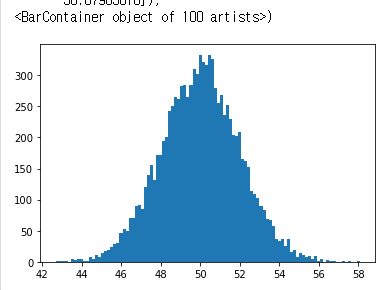
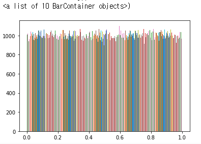
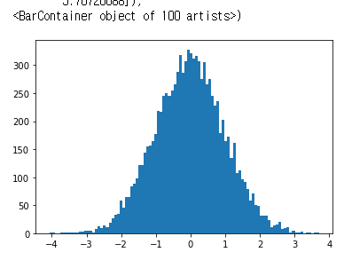
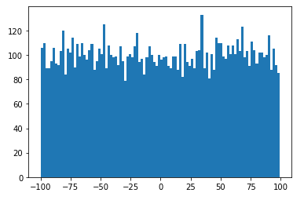
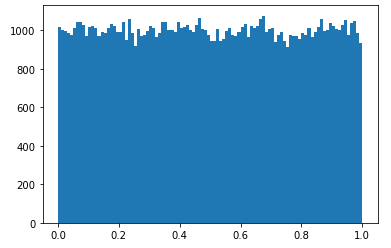

# 1. NumPy
> `NumPy` : Numerical Python
## 1. 특징

* `NumPy`는 `vector`와 `matrix` 연산에 특화되어 있다.

* `NumPy`는 `pandas`와 `Matplotlib`의 기반이 되는 `module`

* `Machine learning` , `Deep learning` 에서 만이 사용된다

* `Numpy`는 `ndarray`라고 불리는 n-차원의 배열을 제공

* `ndarray`의 특징 : `python`의` list`와 상당히 유사

* `python`의 `list`는 다른 데이터 타입을 같이 `list`에 저장

* `Numpy`의 `ndarray`는 모두 같은 데이터 타입을 사용

* `python`의 `list`보다 메모리 효율이나 실행속도면에서 우위

## 2. 실습

### 1. 설치

* pip install numpy

* conda install numpy

## 2. 코드

> python의 list와 비교해본다.

```python
import numpy as np
#python의 list
a = [1,2,3,4,5]
print(a)			# [1,2,3,4,5] => list literal
print(type(a))		# <class list>

arr = np.array([1,2,3,4,5])
print(arr)			# [1 2 3 4 5] => ndarray의 literal
print(type(arr))	# <class 'numpy.ndarray'>
print(arr.dtype)	# int32(int:정수, 32:32bit) 
print(arr[0])		# 1
print(type(arr[0])	# <class 'numpy.int32'>
print(arr[:2])		# [1 2]
      
arr = np.array([100, 3.14, True, 'Hello'])
print(arr)			# ['100' '3.14' 'True' 'Hello']
```

* `list`와는 달리 공백으로 요소를 나눈다.
* 다른 형식으로 요소를 입력할 경우 가능한 같은 형태로 표현된다.

## 3. 다차원의 ndarray

> `python`의 `list`는 중첩리스트만 존재한다.

```python
import numpy as np
a = [[1,2,3],
     [4,5,6]]

b = np.array(a)
print(b)			# [[1 2 3]
 					# [4 5 6]]
b = np.array(a, dtype=np.float64)
print(b)			# [[1. 2. 3.]
 					# [4. 5. 6.]]
    
print(b[1,1])		# 5	행과 열은 각각 0 ~ 1, 0 ~ 2 존재
```

## 4. ndarry의 속성

```python
import numpy as np

a = [1,2,3,4]
arr = np.array[a, dtype=np.float64]
print(arr)			# [1. 2. 3. 4.]

print(arr.ndim)		# 1, ndim => 차원의 개수 : 1
print(arr.shape)	# 차원의 개수와 각 차원의 요소를 tuple로 표현
					# (4,)
    
a = [[1,2,3],[4,5,6],[7,8,9],[10,11,12]]
arr = np.array(a, dtype = np.float64)
print(arr.shape)	# (4,3)

## 3차원
a = [[[1,2,3],[4,5,6]],[[7,8,9],[10,11,12]]]
arr = np.array(a, dtype = np.float64)
print(arr)
print(arr.shape)
#[[[ 1.  2.  3.]
#  [ 4.  5.  6.]]

# [[ 7.  8.  9.]
#  [10. 11. 12.]]]

# (2, 2, 3)

# numpy array의 크기
a = [[1,2,3],[4,5,6],[7,8,9],[10,11,12]] 	# 4 x 3
arr = np.array(a, dtype=np.float64)
print(arr)
print(arr.size)		# 12
print(len(arr))		# 첫번째 차원의 요소 개수를 리턴 : 4
print(arr.shape)	# (4,3)

arr.shape = (2,6)	# shape의 속성을 새로운 tuple로 변경
print(arr.shape)	# (2,6)
print(arr)			#	[[ 1.  2.  3.  4.  5.  6.]
					# 	[ 7.  8.  9. 10. 11. 12.]]
arr.shape = (2,2,3)
print(arr)			
#[[[ 1.  2.  3.]
#  [ 4.  5.  6.]]

# [[ 7.  8.  9.]
#  [10. 11. 12.]]]

arr,shape = [3,2,3]
print(arr) 			# value error, size가 맞아야 shape 변경 가능
```

* `shape` 속성을 이용해서 변경하는 방식은 잘 사용되지 않는다.
* `shape`을 변경하기 위해 `reshape()` 함수를 이용

```python
import numpy as np

arr = np.array([1.5, 2.3, 8.4, 9.8, 7.7], dtype = np.float64)
print(arr) 							# [1.5 2.3 8.4 9.8 7.7]
result = arr.astype(np.int32)
print(result)						# [1 2 8 9 7]	소수점을 버림
```

## 6. ndarray를 만드는 다른 방법

```python
import numpy as np
# 1.zeros
arr = np.zeros((2,2))   # 0으로 채운 numpy array를 만든다.
print(arr)              # shape을 명시해야한다.
#[[0. 0.]
# [0. 0.]]    

arr = np.array([(1,2,3),(4,5,6)])			#[[1 2 3]
print(arr)									# [4 5 6]]

result = np.zeros_like(arr, dtype = np.float64)		#[[0. 0. 0.]
print(result)										#[0. 0. 0.]]

# 2.ones				# dtype은 np.float64로 지정
arr = np.ones((2,2))    # 1로 채우는 numpy
print(arr)
#[[1. 1.]
# [1. 1.]]
# 3. full
arr = np.full((2,2),7, dtype=np.float64)
print(arr)
#[[7. 7.]
# [7. 7.]]

# 4.empty
arr = np.empty((3,3))	# 3x3 ndarray를 생성, 초기값을 주지 않는다.
print(arr)				# 내가 원하는 shape의 공간만 설정. 초기화 하지 않는다.
#[[1. 2. 3.]
# [4. 5. 6.]
# [7. 8. 9.]]

# 5. arange		
# 주어진 범위 내에서 지정된 간격으로 연속적인 원소를 가진 ndarray생성
arr = np.arange(1,10,1)
print(arr)				# [1 2 3 4 5 6 7 8 9]

# 6. linspace
# np.linspace(start, stop, num), start부터 stop까지 num개의 숫자를 뽑는다
import numpy as np
import matplotlib.pyplot as plt

a = np.linspace(0,10,11)
print(a)				# [ 0.  1.  2.  3.  4.  5.  6.  7.  8.  9. 10.]

arr = np.linspace(1,121,31)	# (stop-start)/(num-1)
print(arr)				
#[  1.   5.   9.  13.  17.  21.  25.  29.  33.  37.  41.  45.  49.  53.
#  57.  61.  65.  69.  73.  77.  81.  85.  89.  93.  97. 101. 105. 109.
# 113. 117. 121.]
plt.plot(arr,'*')
plt.show()

```


##  * 랜덤값 기반으로 ndarray 생성

### 1. np.random.normal()

> 정규분포 확률밀도 함수에서 `ndarray` 생성 / 평균, 표준편차 필요

``` python
import numpy as np
import matplotlib.pyplot as plt
# 1. np.random.normal() : 정규분포 확률밀도 함수에서 ndarray 생성
# 						  평균, 표준편차
mean = 50
std = 2
arr = np.random.normal(mean,std,(10000,))	# 개수가 많을수록 정교한 정규분포
plt.hist(arr,bins = 100)
```



### 2. np.random.rand(d0,d1,d2,.....)

> 실수를 추출하는데 [0,1) 범위에서 추출하고 균등분포로 추출

```python
import numpy as np
import matplotlib.pyplot as plt
arr = np.random.rand(100000,10)
print(arr)
plt.hist(arr, bins = 100)
```



### 3. np.random.randn(d0,d1,d2,.....)

> 실수추출, 표준정규분포에서 난수를 추출 / 평균이 0, 표준편차 1

```python
import numpy as np
import matplotlib.pyplot as plt
arr = np.random.randn(10000)
plt.hist(arr, bins=100)
```



### 4. np.random.randint()

> 균등분포 확률밀도함수에서 난수 추출, 정수값을 난수로 추출

```python
import numpy as np
import matplotlib.pyplot as plt
arr = np.random.randint(-100,100,(10000,))
plt.hist(arr,bins=100)
plt.show()
```



### 5. np.random.random(shape)

> [0,1) 균등분포에서 실수 난수를 추출 

```python
import numpy as np
import matplotlib.pyplot as plt
arr = np.random.random((100000,))
plt.hist(arr, bins=100)
plt.show()
```



### 6. NumPy가 제공하는 랜덤 관련 함수

##### 1. 난수의 재현

> 초기값을 설정해주면 같은 랜덤값이 도출

```python
import numpy as np
np.random.seed(10)
arr = np.random.randint(0,100,(10,))
print(arr) 	# [60 47 68 18  4 85 26 25 65 58]
```

##### 2. ndarray의 순서를 랜덤하게 변경

```python
import numpy as np
arr = np.arange(10)
print(arr) 				# [0 1 2 3 4 5 6 7 8 9]
np.random.shuffle(arr)  # ndarray 자체가 변경
print(arr) 				# [1 5 2 9 7 0 3 4 6 8]
```

##### 3. ndarray 안에서 일부를 무작위로 선택

```python
import numpy as np
#np.random.choice(arr,size,replace,p)
# arr : numpy array가 나오거나 혹은 정수가 나올 수 있다. 정수면 arrange(정수)
# size : 정수값, 샘플의 숫자
# replace : Boolean(True, False)
#           True: 한번선택한 데이터 다시 샘플링 가능 , 
#           False
# p : ndarray. 각 데이터가 샘플링될 확률을 가지고 있는 ndarray

arr = np.random.choice(5, 3,replace = True)
print(arr) 							# [0 4 1]
arr =np.random.choice(5,10,replace=True,p=[0.2, 0, 0.3, 0.4, 0.1])
print(arr) 							# [4 3 3 0 2 3 2 2 3 3]
```

##### 4. Reshape

```python
import numpy as np
arr = np.arange(0,12,1)
arr1 = arr.reshape(4,3)

print(arr)	# [ 0  1  2  3  4  5  6  7  8  9 10 11]
print(arr1) #[[ 0  1  2]		view를 리턴
			# [ 3  4  5]		arr[0] = 100 으로 한다면
			# [ 6  7  8]		arr1의 첫번째 값도 100으로 변경
			# [ 9 10 11]]

arr = np.arange(0,12,1)
arr1 = arr.reshape(2,2,-1)			# 나머지 차원 계산/ 2,2,-1 => 2,2,3
```

##### 5. ravel()

> `ndarray`의 모든 요소가 포함된 1차원 `vector`를 리턴, `view`를 리턴

```python
import numpy as np
arr = np.arange(0,100,1).reshape(5,-1)
print(arr)
arr1 = arr.ravel()
print(arr1)

[[ 0  1  2  3  4  5  6  7  8  9 10 11 12 13 14 15 16 17 18 19]
 [20 21 22 23 24 25 26 27 28 29 30 31 32 33 34 35 36 37 38 39]
 [40 41 42 43 44 45 46 47 48 49 50 51 52 53 54 55 56 57 58 59]
 [60 61 62 63 64 65 66 67 68 69 70 71 72 73 74 75 76 77 78 79]
 [80 81 82 83 84 85 86 87 88 89 90 91 92 93 94 95 96 97 98 99]]
[ 0  1  2  3  4  5  6  7  8  9 10 11 12 13 14 15 16 17 18 19 20 21 22 23
 24 25 26 27 28 29 30 31 32 33 34 35 36 37 38 39 40 41 42 43 44 45 46 47
 48 49 50 51 52 53 54 55 56 57 58 59 60 61 62 63 64 65 66 67 68 69 70 71
 72 73 74 75 76 77 78 79 80 81 82 83 84 85 86 87 88 89 90 91 92 93 94 95
 96 97 98 99]
```

##### 6. resize()

> `reshape()`와는 달리 요소의 개수가 맞지 않아도 `shape`가 변경된다. 이때 초과되는 요소는 0으로 채워진다. 요소의 개수가 줄어들면 기존 데이터를 버린다.

```python
import numpy as np
import matplotlib.pyplot as plt

np.random.seed(10)
arr = np.random.randint(0,10,(3,4))
print(arr)							# [[9 4 0 1]
 									# [9 0 1 8]
 									# [9 0 8 6]]
arr.resize(2,6)	# view가 생성되지 않고 원본이 변경
print(arr)							# [[9 4 0 1 9 0]
 									# [1 8 9 0 8 6]]
arr.resize(3,5) # 요소의 개수가 맞지 않아도 shape이 변경
print(arr)    						# [[9 4 0 1 9]
									# [0 1 8 9 0]
 									# [8 6 0 0 0]]
```

## 7. Indexing & Slicing

```python
import numpy as np
arr = np.arange(10,20,1)
# print(arr)

# ndarray의 각 요소를 출력할 경우
# for tmp in arr:
#    print(tmp)

for (idx,tmp) in enumerate(arr):
    print('인덱스 : {}, 데이터 {}'.format(idx,tmp))
    
# 인덱스 : 0, 데이터 10
# 인덱스 : 1, 데이터 11
# 인덱스 : 2, 데이터 12
# 인덱스 : 3, 데이터 13
# 인덱스 : 4, 데이터 14
# 인덱스 : 5, 데이터 15
# 인덱스 : 6, 데이터 16
# 인덱스 : 7, 데이터 17
# 인덱스 : 8, 데이터 18
# 인덱스 : 9, 데이터 19

print(arr[3]) 		# 13
print(arr[1:4]) 	# [11 12 13]
print(arr[:-1])		# [10 11 12 13 14 15 16 17 18]
print(arr[1:-1:2]) 	# [11 13 15 17]

arr = np.arange(1,17,1).reshape(4,4).copy()
print(arr)
# [[ 1  2  3  4]
#  [ 5  6  7  8]
#  [ 9 10 11 12]
#  [13 14 15 16]]
print(arr[1,2])		# 7
print(arr[1][2])	# 7
print(arr[1])		# [5 6 7 8]
print(arr[1:3,:])	# [[ 5  6  7  8]
 					#  [ 9 10 11 12]]
print(arr[1:3,:2])	# [[ 5  6]
 					#  [ 9 10]]
```

## 8. Boolean indexing과 Fancy indexing

### 1. Boolean indexing

> `True`, `False`로 구성된 `boolean mask`를 이용해 `ndarray`요소의 선택여부를 지정
>
> `boolean mask`의 `True`에 해당하는 `index` 만을 조회하는 방식

```python
import numpy as np

np.random.seed(1)
arr = np.random.randint(0,10,(5,))

print(arr)				# [5 8 9 5 0]
print(arr % 2)			# [1 0 1 1 0]
print(arr % 2 ==0)  	# [False  True False False  True]
print(arr[arr %2 ==0]) 	# [8 0]
```

### 2. Fancy indexing

> `ndarray`에 `index`배열을 전달하여 배열요소를 참조하는 방식

```python
import numpy as np
arr = np.arange(0,12,1).reshape(3,4).copy()
print(arr)
#[[ 0  1  2  3]
# [ 4  5  6  7]
# [ 8  9 10 11]]

print(arr[2,2])     	#indexing : 10
print(arr[1:2,2])   	# slicing : [6]
print(arr[1:2,1:2]) 	# slicing : [[5]]

print(arr[[0,2],2]) 			# [ 2 10]

print(arr[[0,2],2:3]) 			# [[ 2]
 								#  [10]]
    
print(arr[[0,2]][:,[1,3]]) 			# [[ 1  3]
 									#  [ 9 11]]

print(arr[np.ix_([0,2],[1,3])])		#[[ 1  3]
 									# [ 9 11]]
```

## 9. ndarray의 사칙연산과 행렬곱

### 1. 덧셈

```python
import numpy as np
arr1 = np.array([[1,2,3],[4,5,6]])
arr2 = np.array([[7,8,9],[10,11,12]])
arr3 = np.array([[1,2],[3,4],[5,6]])

print(arr1+arr2)
# [[1 2 3] 	+ [[ 7  8  9] =	[[ 8 10 12]
# [4 5 6]]	+  [10 11 12]]=	 [14 16 18]]
arr2 = 3
print(arr1+arr2)
# [[4 5 6]	=> [[1+3 2+3 3+3]
#  [7 8 9]]	=>	[4+3 5+3 6+3]]
arr2 = np.array([1,2,3])
print(arr1+arr2)
# [[2 4 6]  => [[1+1 2+2 3+3]
#  [5 7 9]] =>	[4+1 5+2 6+3]]

# 2. Multiple
# 행렬 곱은 np.dot(), np.matmul()로 수행
# np.dot(A,B)에서 A행렬의 열, B행렬의 행의 size가 같아야 한다.
```

### 2. 곱셈

> 행렬 곱은 `np.dot()`, `np.matmul()`로 수행
>
> `np.dot(A,B)`에서 A행렬의 열, B행렬의 행의 `size`가 같아야 한다.
>
> `broadcasting`은 사칙연산에만 적용되고 `dot product`에서는 일어나지 않는다.

```python
import numpy as np
arr1 = np.array([[1,2,3],[4,5,6]])
arr2 = np.array([[7,8],[9,10],[11,12]])

print(np.dot(arr1,arr2))	# [[ 58  64]
 							#  [139 154]]

```

## 10. Transpose

> 전치행렬은 원본행렬의 행과 열을 바꾼 행렬을 의미한다.
>
> 전치행렬의 표현은 윗첨자로 T를 이용한다.

```python
import numpy as np
arr = np.array([[1,2,3],[4,5,6]])
print(arr)		# [[1 2 3]
				#  [4 5 6]]

print(arr.T)	# [[1 4]
 				#  [2 5]
				#  [3 6]]
t_array = arr.T

arr[0,0] = 100
print(arr)		# [[100   2   3]
				#  [  4   5   6]]
print(t_array)	# [[100   4]
				# [  2   5]
				# [  3   6]]
```

## 11. Iterator(순환자)

```python
import numpy as np
# for문을 이용
arr = np.array([1,2,3,4,5])
for tmp in arr:
    print(tmp, end = ' ')
# 1 2 3 4 5

# 1차원에서 iterator를 이용해 구현
arr =np.array([1,2,3,4,5])
it = np.nditer(arr, flags=['c_index'])

while not it.finished: 	# iterator가 지정하는 위치가 끝이 아닐동안 반복
    idx = it.index	   	# iterator가 현재가리키는 곳의 index 가리킨다.
    print(arr[idx], end=' ')
    it.iternext()	   	# iterator를 다음 요소로 이동시키는 작업
# 1 2 3 4 5

# 2차원 ndarray에서 순서대로 출력
arr = np.array([[1,2,3],[4,5,6]])

# 1
for tmp in arr.ravel():
    print(tmp, end = ' ')    

# 2   
for row in range(arr.shape[0]):
    for col in range(arr.shape[1]):
        print(arr[row,col], end = ' ')
        
# iter
it = np.nditer(arr, flags=['multi_index'])
while not it.finished: 		# 
    idx = it.multi_index	# 
    print(idx)
    print(arr[idx], end=' ')
    it.iternext()  
```

## 12. 비교연산

```python
import numpy as np
np.random.seed(0)
arr1 = np.random.randint(0,10,(2,3))
arr2 = np.random.randint(0,10,(2,3))

print(arr1)				# [[5 0 3]
 						#  [3 7 9]]
print(arr2)				# [[3 5 2]
						#  [4 7 6]]

print(arr1 == arr2)    	#	[[False False False]
					   	#	 [False  True False]]
arr1 = np.arange(10)
arr2 = np.arange(10)
print(np.array_equal(arr1,arr2)) 	# True
```

## 13. 집계함수 & Axis

### 1. 집계함수

```python
import numpy as np
arr = np.arange(1,7,1).reshape(2,3).copy()
print(arr)

result = 0
for row in range(arr.shape[0]):
    for col in range(arr.shape[1]):
        result += arr[row,col]
print(result)			# 21
print(np.sum(arr))		# 21
print(arr.sum())		# 21
print(np.cumsum(arr))	# [ 1  3  6 10 15 21]  누적합
print(np.mean(arr))		# 3.5  평균
print(np.max(arr))		# 6  최대값
print(np.min(arr))	`	# 1	 최소값
print(np.argmax(arr))	# 5  최대값의 index
print(np.argmin(arr))	# 0  최소값의 index
print(np.std(arr))		# 1.707825127659933 표준편차
print(np.exp(arr))		# [[  2.71828183   7.3890561   20.08553692]
# 자연상수 				  # [ 54.59815003 148.4131591  403.42879349]]
print(np.log10(arr))	# log10()

# Numpy의 모든 집계함수는 axis를 기준으로 계산된다.
# 만약 axis를 지정하지 않으면 axis는 None으로 설정되고
# 함수의 대상범위를 전체 ndarray로 지정한다.
```

*  Numpy의 모든 집계함수는 axis를 기준으로 계산된다.
   만약 axis를 지정하지 않으면 axis는 None으로 설정되고
   함수의 대상범위를 전체 ndarray로 지정한다.

```python
%%time
import numpy as np
# 1. for문을 이용한 합
arr = np.arange(100000, dtype = np.float64)
result = 0
for tmp in arr:
    result += tmp
print(result)
# 4999950000.0
# Wall time: 25.9 ms    
```

```python
%%time
import numpy as np
# 2. 집계함수
arr = np.arange(100000, dtype = np.float64)
print(arr.sum())
# 4999950000.0
# Wall time: 998 µs
```


### 2. Axis

```python
import numpy as np
arr = np.array([1,2,3,4,5])
print(arr.sum(axis=0))		# 15
print(arr.sum(axis=1))		# error, 1차원에는 axis=1이 없기 때문에
# 1차원에서 axis =0의 의미는 열방향을 의미. 가로방향

arr = np.array([[1,2,3],[4,5,6]])
print(arr.sum())			# 21
print(arr.sum(axis=0))		# [5 7 9]
print(arr.sum(axis=1))		# [ 6 15]
# 2차원에서 axis =0의 의미는 행방향을 의미. 세로방향
# axis =1의 의미는 열방향을 의미. 가로방향
print(arr.argmax(axis=1))	# [2 2]

np.random.seed(1)

arr1 = np.random.randint(0,10,(2,2,3))
print(arr1)
print(arr1.sum(axis = 0))   # 3차원에서 axis = 0 => depth 방향
[[ 6 15 15]					# 3차원에서 axis = 1 => 행 방향, 세로
 [14  2  4]]				# 3차원에서 axis = 2 => 열 방향, 가로
    						
```

## 14. ndarray 정렬

> `NymPy array`는 `axis`를 기준으로 정렬하는 `sort()` 함수를 제공, `axis`를 지정하지 않으면 -1 값으로 지정 => 마지막 `axis`

* `np.sort()` : 원본은 변하지 않고 정렬된 결과 `ndarray`를 리턴
* `arr.sort()` : 원본을 정렬, `return` 값은 `None`

```python
import numpy as np

arr = np.arange(10)
np.random.shuffle(arr)
print(arr)					# [8 3 5 9 0 6 1 7 4 2]

print(np.sort(arr))			# [0 1 2 3 4 5 6 7 8 9]
print(np.sort(arr)[::-1]) 	# [9 8 7 6 5 4 3 2 1 0]

arr = np.arrange(1,17)
np.random.shuffle(arr)
arr = arr.reshape(4,4).copy()
print(arr)

print(np.sort(arr, axis=0))	# 행방향으로 정렬
print(np.sort(arr, axis=1))	# 열방향으로 정렬

```

## 15. concatenate() _ 요소추가

> `ndarray`에 `row` 혹은 `column`을 추가하기 위한 함수

```python
import numpy as np

arr = np.array([[1,2,3],[4,5,6]])

new_row = np.array([7,8,9]) 	# new_row.shape = (3,)

result = np.concatenate((arr,new_row.reshape(1,3)),axis = 0) 
# axis = 0 행방향 , axis =1 열방향
print(result)
#[[1 2 3]
# [4 5 6]
# [7 8 9]]
```

## 16. delete()_요소삭제

> `axis`를 기준으로 행과 열을 삭제, `axis`를 지정하지 않으면 1차원 배열로 변환 후 삭제한다. 원본은 변경하지 않고 처리가 된 새로운 배열을 return

```python
import numpy as np

np.random.seed(1)

arr = np.random.randint(0,10,(3,4))
print(arr)
#[[5 8 9 5]
# [0 0 1 7]
# [6 9 2 4]]
result = np.delete(arr,1)

print(result)
#[5 9 5 0 0 1 7 6 9 2 4]

result = np.delete(arr,1, axis = 1)
print(result)
#[[5 8 9 5]
# [6 9 2 4]]
```


# 연습문제

```python
arr = np.arange(1,17).reshape(4,4).copy()
print(arr)

# 10보다 큰 수가 몇개 있는지 알아보려면 어떻게 해야하나 6
# 1. for문
result =0
for tmp in arr.ravel():
    if tmp > 10:
        result += 1
print(result)	# 6

# 2. 
print((arr>10).sum()) 	# 6

# 표쥰 정규분포에서
# 200개의 샘플을 추출
# 내림차순으로 상위 5% 결과 출력

arr1 = np.random.randn(200)
print((np.sort(arr1)[::-1])[0:10])
print((np.sort(arr1)[::-1])[0:int(len(arr)/100*int(ar))])
```


