# 1. Pandas

> `ndarray`(`NumPy`)를 기본 자료구조로 이용. `ndarray`를 가지고 `Pandas`는 두개의 또 다른 자료구조를 이용

* `Series` : 동일한 데이터 타입의 복수개의 성분으로 구성되는 자료구조

* `DataFrame` : 엑셀에서 `Table`과 같은 개념. `Database`의 `Table`과 같은 개념.
                         `Series`로 구성되어 있다.

## 1. Series

```python
import numpy as np
import pandas as pd

# ndarray
arr = np.array([-1,4,5,99], dtype = np.float64)
print(arr)				# [-1.  4.  5. 99.]
# Series
s = pd.Series([-1,4,5,99], dtype = np.float64)
print(s)
# 0    -1.0
# 1     4.0
# 2     5.0
# 3    99.0
# dtype: float64
print(s.values)			# [-1.  4.  5. 99.]
print(s.index)			# RangeIndex(start=0, stop=4, step=1)
print(s.dtype)			# float64
```

* `Series` 생성 시 `index`를 별도로 지정가능. `list`로 지정
  숫자 `index`는 기본으로 사용 가능

```python
s = pd.Series([1,-8,5,10],dtype = np.float64, index = ['c','b','a','k'])
print(s)
# c     1.0
# b    -8.0
# a     5.0
# k    10.0
# dtype: float64
print(s[0])		# 1.0
print(s['c'])	# 1.0

# index를 지정할때 같은 index가 있을 경우 실행이 된다.
s = pd.Series([1,-8,5,10],dtype = np.float64, index = ['c','b','c','k'])
print(s)
# c     1.0
# b    -8.0
# c     5.0
# k    10.0
# dtype: float64
print(s['c'])
# c    1.0
# c    5.0
# dtype: float64

# 새로운 데이터 추가하는 방법
s = pd.Series([1,2,3,4])
print(s)
###########
0    1
1    2
2    3
3    4
dtype: int64
###########    

s[4] = 100
print(s)

###########
0      1
1      2
2      3
3      4
4    100
dtype: int64
###########

# index 값이 연속이 아니여도 추가가 된다.    
s[6] = 200
print(s)
###########
0      1
1      2
2      3
3      4
4    100
6    200
dtype: int64
###########

# 데이터 삭제    
s = s.drop(2)
print(s)
# 0      1
# 1      2
# 3      4
# 4    100
# 6    200
# dtype: int64
```

* `Slicing`도 가능하다

```python
print(s[1:3])			# 1 포함 3 미포함
# b   -8.0
# c    5.0
# dtype: float64
print(s['b':'k'])		# b , k 모두 포함
# b    -8.0
# c     5.0
# k    10.0
# dtype: float64
```

* `Boolean Indexing`

```python
print(s[s%2==0])
# b    -8.0
# k    10.0
# dtype: float64
```

* `Fancy Indexing`

``` python
print(s[[0,2,3]])
# c     1.0
# c     5.0
# k    10.0
# dtype: float64
```

* `python`의 `dict`를 이용해 `Series`를 만들 수 있다. `dict`의 `key`가 `index`가 된다.

```python
import numpy as np
import pandas as pd

my_dict = {'서울': 1000, '부산': 2000, '제주':3000}
s = pd.Series(my_dict)
s.name = '지역별 가격 데이터'
s.index.name = '지역명'
print(s)

#지역명
# 서울    1000
# 부산    2000
# 제주    3000
# Name: 지역별 가격 데이터, dtype: int64
```
### 1. 연습문제

```python
# A 공장의 2020-1-1부터 10일간 생산량 Seires로 저장
# 생산량 = 평균 50, 표준편차 5인 정규분포에서 랜덤하게 생성(정수)
import numpy as np
import pandas as pd
from datetime import date, datetime, timedelta

start_day = datetime(2020,1,1)
factory_A = pd.Series([int(x) for x in np.random.normal(50,5,(10,))], 
                      index =[start_day+timedelta(days=x) for x in range(10)])
print(factory_A)
# 2020-01-01    50
# 2020-01-02    49
# 2020-01-03    50
# 2020-01-04    48
# 2020-01-05    51
# 2020-01-06    50
# 2020-01-07    51
# 2020-01-08    51
# 2020-01-09    46
# 2020-01-10    60
# dtype: int64


# B 공장의 2020-1-1부터 10일간 생산량 Seires로 저장
# 생산량 = 평균 70, 표준편차 8인 정규분포에서 랜덤하게 생성(정수)
start_day = datetime(2020,1,1)
factory_B = pd.Series([int(x) for x in np.random.normal(70,8,(10,))], 
                      index =[start_day+timedelta(days=x) for x in range(10)])
print(factory_B)
# 2020-01-01    54
# 2020-01-02    68
# 2020-01-03    65
# 2020-01-04    72
# 2020-01-05    65
# 2020-01-06    78
# 2020-01-07    75
# 2020-01-08    79
# 2020-01-09    74
# 2020-01-10    81
# dtype: int64

## 날짜별 모든 공장의 생산량
# 같은 index 끼리 더해준다.
# index가 다를 경우 NaN으로 나온다.
print(factory_A + factory_B)		# B의 start_day를 5일로 변경
# 2020-01-01      NaN
# 2020-01-02      NaN
# 2020-01-03      NaN
# 2020-01-04      NaN
# 2020-01-05    122.0
# 2020-01-06    109.0
# 2020-01-07    115.0
# 2020-01-08    118.0
# 2020-01-09    118.0
# 2020-01-10    121.0
# 2020-01-11      NaN
# 2020-01-12      NaN
# 2020-01-13      NaN
# 2020-01-14      NaN
# dtype: float64
```

## 2. DataFrame

> `Python`의 `dict`로 생성한다.  데이터의 개수가 맞지 않으면 `Error` 발생한다.
> `dict`의 `key`가 `DataFrame`의 `column`으로 들어가며 `DataFrame`은 `Series`의 집합으로 구성된다. 각각의 `column`이 `Series`이다.

```python
import numpy as np
import pandas as pd

# dict
data = {'names' : ['아이유', '김연아', '홍길동', '이순신', '강감찬'],
       'year' : [2015, 2019, 2020, 2013, 2017],
       'points': [3.5, 1.5, 2.0, 3.4, 4.0] }
df = pd.DataFrame(data)
display(df)
# 기억해야 하는 속성
print(df.shape)     # (5, 3)
print(df.size)      # 15
print(df.ndim)      # 2
print(df.index)   	# RangeIndex(start=0, stop=5, step=1)
print(df.columns)   # Index(['names', 'year', 'points'], dtype='object')
print(df.values)
# [['아이유' 2015 3.5]
#  ['김연아' 2019 1.5]
#  ['홍길동' 2020 2.0]
#  ['이순신' 2013 3.4]
#  ['강감찬' 2017 4.0]]

df.index.name = '학번'
df.columns.name = '학생정보'
display(df)
```

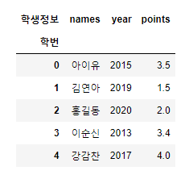

### 1)DataFrame을 생성하는 방법

#### [1] CSV 파일을 이용해서 DataFrame을 생성

```python
#ex1
import pandas as pd

df = pd.read_csv('./data/student.csv')
display(df)
```

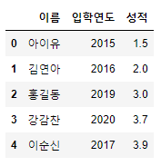

```python
#ex2
import pandas as pd

df = pd.read_csv('./data/movies.csv')
display(df.head())	# 상위 5개만 보여준다
display(df.tail())	# 하위 5개만 보여준다.
```


#### [2] DBMS

> 데이터베이스는 일반적으로 정제된, 연관성이 있는 자료의 집합이다.
> DBMS(Database Management System)프로그램으로 
>  `Oracle`, `Cybase`, `DB2`, `Infomix`, `MySQL`, `SQLite`, etc ...있으며 
> `MySQL`을 가지고 DB를 구축해 `pandas`의 `DataFrame`로 가져와본다.

* `MySQL` 5.6 설치

  1. `MySQL` 실행 후 `MySQL DBMS Server` 시작

  * `cmd` 창에서 `SQL` 프로그램 폴더로 위치 변경후 mysqld 입력

  2. `MySQL Server`를 실행시킨 상태에서 `MySQL Console`창에 들어갈 수 있다.

  * 창 종료시 mysqladmin -u root shutdown 입력

  3. `MySQL` 서버접속

  * => mysql -u root 입력 == root 유저 권한으로 `MySQL` 접속

  4. 사용자 생성_ 사용자 `id` 'data', `password` 'data'

  * => create user data identified by "data";
  * => create user data@localhost identified by "data";

  5. 데이터베이스 생성

  * => create database library;

  6. 생성된 데이터베이스(library)에 대한 사용자 권한을 data 사용자에게 부여

  * => grant all priviliges on library. * to data;
  * => grant all priviliges on library. * to data@localhost;

  7. 작업에 권한부여작업을 `flush`

  * => flush privileges;

  8. `Console` 종료

  * => exit;

  9. 제공된 파일을 복사 `SQL` 폴더의 `bin`폴더에 복사 후 실행

  * => mysql -u data -p library < _BookTavleDump.sql

```python
import pymysql.cursors		# pip install pymysql
import pandas as pd

conn = pymysql.connect(host='localhost', 
                       user='data',
                       password='data',
                       db = 'library',
                       charset='utf8')

# 데이터베이스에 접속되면 SQL 문을 실행시켜 Database로부터 데이터를 가져와
# DataFrame 생성

sql = 'select btitle, bauthor, bprice from book'
# sql 문법 -> SELECT, FROM, LIKE 등등
sql = 'SELECT btitle, bauthor, bprice FROM book WHERE btitle like "%여행%" '
# => 책의 제목중 '여행'이 있는 책 제목을 가져온다.

df = pd.read_sql( sql , con = conn)
display(df)

# DataFrame을 json파일로 저장할때 4가지 방식이 존재한다. 
# unicode로 파일을 생성한 후 데이터를 저장해야 한글이 정상 처리된다.
# with : 일반적으로 파일처리 순서는 파일열기-내용쓰기-파일닫기로 이루어지며 with 구문을 이용하면
#        resource의 close 처리가 자동으로 이루어진다.
with open('./data/json/books_columns.json', 'w', encoding='utf-8') as file:
    df.to_json(file, force_ascii=False, orient='columns')

with open('./data/json/books_records.json', 'w', encoding='utf-8') as file:
    df.to_json(file, force_ascii=False, orient='records')
    
with open('./data/json/books_index.json', 'w', encoding='utf-8') as file:
    df.to_json(file, force_ascii=False, orient='index')
    
with open('./data/json/books_values.json', 'w', encoding='utf-8') as file:
    df.to_json(file, force_ascii=False, orient='values')
```

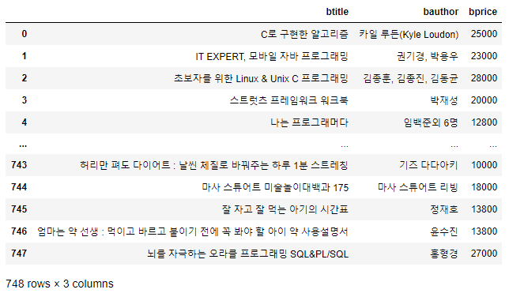

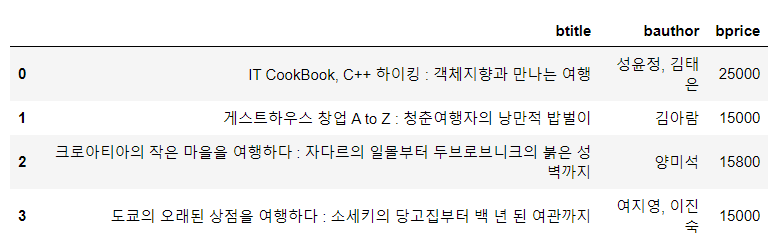

#### [3] Open API의 json이용

> `open api`를 통해 `json`을 받아와 `DataFrame`로 생성

```python
# 1. Json 파일을 읽어서 DataFrame 생성

import numpy as np
import pandas as pd
import json

with open('./data/json/books_columns.json','r',encoding='utf-8') as file:
    dict_books = json.load(file)  # json 데이터를 python의 dictionary로 저장
print(dict_books)
print(type(dict_books)) # <class 'dict'>

df = pd.DataFrame(dict_books)
display(df)
```

```python
# 2. open api에서 Json 파일을 읽어서 DataFrame 생성

import numpy as np
import pandas as pd
import json
import urllib

# date = input('날짜')
openapi_url = 'http://www.kobis.or.kr/kobisopenapi/webservice/rest/boxoffice/searchDailyBoxOfficeList.json?key=b46ba4cd00838e5bb5e830856991548b&targetDt=20200909'

load_page = urllib.request.urlopen(openapi_url)
# load_page => response 객체

json_page = json.loads(load_page.read()) # dict 추출

j_p = json_page['boxOfficeResult']['dailyBoxOfficeList']

movie_rank = {'순위':[],
              '영화제목':[],
              '총매출액':[]
             }
#print(j_p)
for k in j_p:
    movie_rank['순위'].append(k['rank'])
    movie_rank['영화제목'].append(k['movieNm'])
    movie_rank['총매출액'].append(k['salesAmt'])

df = pd.DataFrame(movie_rank).set_index('순위')

display(df)
```

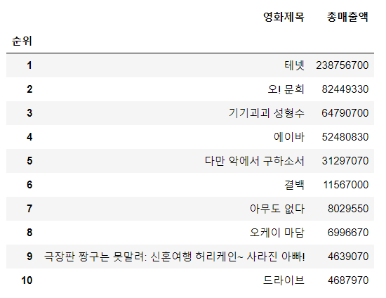

### 2) DataFrame의 Indexing

> `DataFrame`에서 특정 `column`을 추출할 수 있다. 만약 하나의 `column`을 `DataFrame`에서 추출하면 결과는 `Series`가 된다.

```python
import numpy as np
import pandas as pd

data ={'이름' : ['이지은', '박동훈', '홍길동','강감찬','오혜영'],
      '학과':['컴퓨터','기계','철학','컴퓨터','철학'],
      '학년':[1,2,3,4,3],
      '학점':[1.5,2.0,3.1,1.1,2.7]}
df = pd.DataFrame(data, columns = ['학과','이름','학점','학년','등급'],
                 index = ['one','two','three','four','five'])
display(df)


display(df)
display(df.describe())
# DataFrame은 기본 분석 함수를 제공한다. count, 평균, 표준편차, 최대, 최소, 사분위 등 숫자연산이 가능한 Column에 한해서 기본분석함수를 return한다.
```

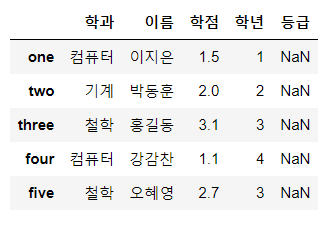                    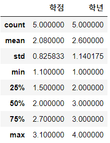

--------

#### [1] 하나의 column을 추출할 수 있다.

```python
print(df.이름)
print(df['이름']) # 같은 결과
--------------------------
one      이지은
two      박동훈
three    홍길동
four     강감찬
five     오혜영
Name: 이름, dtype: object
---------------------------
```
#### [2]  Series의 내용을 변경할 수 있다.
```python
year = df['학년'].copy()	# .copy를 통해서 원본을 건드리지 않는다.
year['one'] = 100		 # 따라서 Series는 변경되지만 DataFrame에는 변경이 없다.		
print(year)
---------------------------
one      100
two        2
three      3
four       4
five       3
Name: 학년, dtype: int64  # Series의 내용변경을 확인 할 수 있다.
---------------------------
```
#### [3] 복수의 column 호출
```python
-----------X------------
display(df['학과','학점'])   # Error (문법 오류)
display(df['학과':'학점'])   # Error (slicing 적용 불가)
-----------X-------------
display(df[['학과','학점']])	# Fancy indexing 적용가능
```

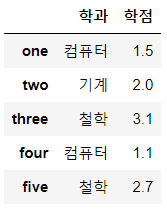

#### [4] 특정 column 값을 수정

> 단일값, `numpy array`, `list`를 이용해 내용을 수정 가능

```python
df['등급'] = ['A','B','A','D','C']
df['등급'] = np.array(['A','B','A','D','C']) # 같은 결과

display(df)
```

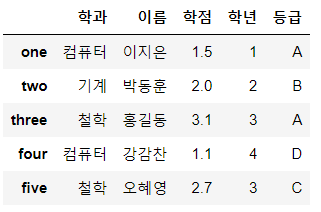

#### [5] 두개 이상의 column 값을 수정

> 단일값, `ndarray`, `list`를 이용해 내용 수정

```python
df[['학과','등급']] = [['영어영문','A'],
                  ['철학','C'],
                  ['국거국문','A'],
                  ['화학','F'],
                  ['물리','C']]
```

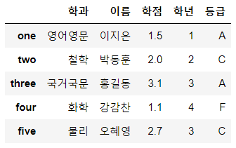

#### [6] 새로운 column 추가

>  `scalar`, `ndarray`, `list`, `Series`를 이용해 추가가능


```python
df['나이'] = [20,21,22,23,24]
----------X------------
df['나이'] = [20,21,22]  # Error : column을 추가하려면 개수가 맞아야한다.
----------X------------
df['나이'] = pd.Series([20,21,22,23,24], index = ['one','two','three','four','five'])
# Series로 column을 추가할 때는 값의 대입기준이 index

df['나이'] = pd.Series([20,22,24],index = ['one','three','five'])
# 다양한 수의 데이터를 추가할 수 있다. index 기반으로 추가되기 때문에

display(df)
```

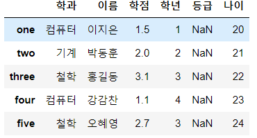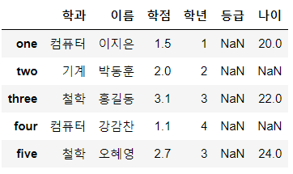

#### [7] 새로운 column을 column 연산을 통해서 추가가 가능하다.

```python
df['장학생여부'] = df['학점'] > 3.0
display(df)
```

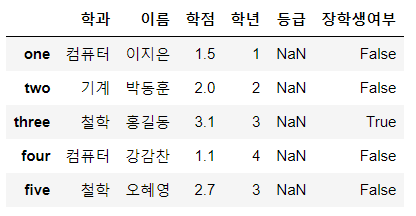

#### [8] Column 삭제

> 열,행을 삭제할 경우 둘 다 `drop()` 사용

```python
# inplace = True 이면 원본을 지운다. return이 없다
# inplace = False이면 원본은 보존하고 살제된 결과 df를 만들어 return
# inplace의 default 값은 false

new_df = df.drop('학년',axis = 1, inplace = False)

display(df)
display(new_df)
```

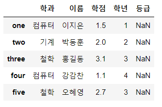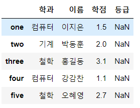

#### [9] row indexing

```python
# 1. 
# print(df[0]) # Error. row에 대해서 숫자 index로 단일 indexing 안된다.
# display(df[[0,2]])   # Error row에 대해서 index 숫자를 이용한 fancy indexing 안된다.
display(df[1:3])   # slicing 가능, 결과는 View, DataFrame로 return
display(df[1:])    #
```

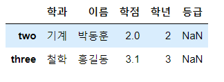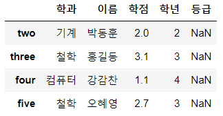

```python
# 2 행에 대한 별도의 index를 이용
# df['one']  # error
#display(df['three':-1])      # Error 숫자 index와 index를 혼용해서 슬라이싱 불가
#display(df[['two','four']])  # Error
display(df['one':'three'])   # 가능. -> loc를 이용해야함
display(df['three':])        # 가능.
```

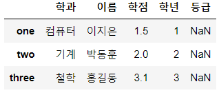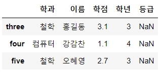

```python
# 3 loc()를 이용한 row indexing
print(df.loc['one'])  				 # 가능
display(df.loc['one':'three']) 		 # slicing 가능
display(df.loc['three':])			 # 가능
display(df.loc[['one','three']])     # Fancy 가능
#display(df.loc['one':-1]) 			 # Error
```

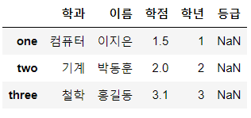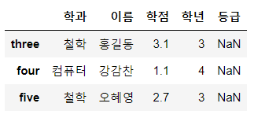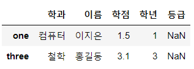

```python
# 4 iloc[]를 이용한 row indexing
# loc[]와 달리 숫자 index만 사용가능

print(df.iloc[0]) 
-------------------------
학과    컴퓨터
이름    이지은
학점    1.5
학년      1
등급    NaN
Name: one, dtype: object
--------------------------        
display(df.iloc[1:3])   
display(df.iloc[1:])   
display(df.iloc[[0,2]]) 
```

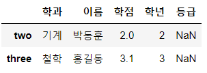                     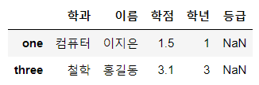

```python
## 연습

data ={'이름' : ['이지은', '박동훈', '홍길동','강감찬','오혜영'],
      '학과':['컴퓨터','기계','철학','컴퓨터','철학'],
      '학년':[1,2,3,4,3],
      '학점':[1.5,2.0,3.1,1.1,2.7]}
df = pd.DataFrame(data, columns = ['학과','이름','학점','학년','등급'],
                 index = ['one','two','three','four','five'])
display(df)

# 학점이 1.5점을 초과한 학생의 이름과 학점
df['학점'] > 1.5   # boolean mask
display(df.loc[df['학점'] > 1.5,['이름','학점']])

# 1. 이름이 박동훈인 사람의 이름, 학점
display(df.loc[df['이름'] == '박동훈',['이름','학점']])

# 2. 학점 1.5 < <2.5 사람들의 학과,이름. 학점
display(df.loc[(df['학점'] > 1.5) & (df['학점'] < 2.5),['학과','이름','학점']])

# 3. 학점이 3을 초과하는 사람들의 등급 A로 설정후 출력
df.loc[df['학점'] > 3,['등급']] ='A' 
display(df)
```

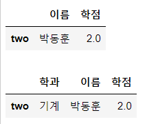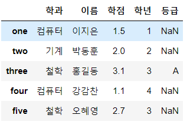

#### [10] 행 추가, 삭제

```python
import numpy as np
import pandas as pd

data ={'이름' : ['이지은', '박동훈', '홍길동','강감찬','오혜영'],
      '학과':['컴퓨터','기계','철학','컴퓨터','철학'],
      '학년':[1,2,3,4,3],
      '학점':[1.5,2.0,3.1,1.1,2.7]}
df = pd.DataFrame(data, columns = ['학과','이름','학점','학년','등급'],
                 index = ['one','two','three','four','five'])
display(df)

# df.loc['six',:] = ['영어영문','최길동',4.0,3,'A']
df.loc['six',['학과','이름']] = ['영어영문','최길동']
display(df)

display(df.drop('학점',axis = 1,inplace=False))
display(df.drop('three',axis = 0,inplace=False))
display(df.drop(['two','five'],axis = 0,inplace=False)
```

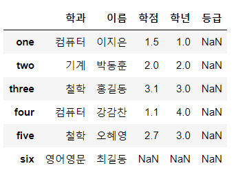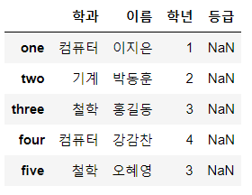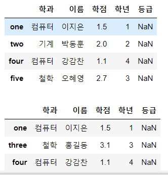

### 3) DataFrame이 제공하는 함수들

* 기댓값 (Expected value) : 어떤 확률을 가진 사건을 무한히 반복했을때 얻을 수 있는 값의 평균으로 기대할 수 있는 값
* 편차 (Deviation) : 확률변수 x와 평균(기댓값)의 차이
* 분산 (Variance) : 데이터의 흩어진 정도를 알기위해 사용됨, 편차의 제곱의 평균
* std (Standard deviation) : 표준편차 => 분산의 제곱근

```python
import numpy as np

 arr = np.array([4,6,1,3,8,8], dtype = np.int32)	
 print(arr)						# [4 6 1 3 8 8]
 print(arr.sum())				# 30
 print(arr.mean())				# 5.0
 print(arr.var())				# 6.666666666666667
 print(arr.std())				# 2.581988897471611

0.38131313131313216
```

####  [1] 공분산  

>  두 개의 확률변수 관계를 보여줄 때 사용하는 값으로 두 확률변수의 편차의 곱에 대한 평균. 공분산은 데이터의 변화량에 대한 총합을 의미한다. 따라서 양수, 음수로 데이터의 방향성은 알 수 있지만  강도는 알 수 없다.

```python
import numpy as np
import matplotlib.pyplot as plt

np.random.seed(1)
sampleNum = 100
x = np.random.randint(0,10,(sampleNum,))
y = np.random.randint(-20,20,(sampleNum,))

x_mean = x.mean()
y_mean = y.mean()

x_deviation = x - x_mean
y_deviation = y - y_mean

result = 0
for tmp in range(sampleNum):
    result += (x_deviation[tmp] * y_deviation[tmp])

result_covariance = result / (sampleNum-1)
print(result_covariance) # 0.38131313131313216

# 이 과정을 np.cov로 계산 가능
print(np.cov(x,y)) 	# [[  8.61363636   0.38131313] 0.3813dl x,y에 대한 공분산이다.
 					# [  0.38131313 113.32070707]] 나머지는 [x,x][y,y]에 대한 공분산
```

```python
# 주식으로 알아보느 공분산 
import numpy as np
import pandas as pd
import pandas_datareader.data as pdr
from datetime import datetime

start = datetime(2018,1,1) # 2019년  1월  1일
end = datetime(2018,12,31) # 2019년 12월 31일

# YAHOO 에서 제공하는 주가지수를 얻어온다.
df_KOSPI = pdr.DataReader('^KS11','yahoo',start,end)  # 'KOSPI'
df_SE = pdr.DataReader('005930.KS','yahoo',start,end) #'삼성전자'

closed_KOSPI = df_KOSPI['Close']
closed_SE = df_SE['Close']

# 반대로 움직이는 주식 데이터 공분산이 음수가 되는지 확인
df_LIG = pdr.DataReader('079550.KS','yahoo',start,end)  # LIG 넥스원
df_PUSAN = pdr.DataReader('011390.KS','yahoo',start,end) # 부산산업

closed_LIG = df_LIG['Close']
closed_PUSAN = df_PUSAN['Close']

print(np.cov(closed_KOSPI.values,closed_SE.values))
[[   24045.56247333   489067.36939603]
 [  489067.36939603 11918322.34148349]]
# 이 값이 양수 (489067.36939603) 하나가 증가하면 다른 하나가 증가하는 양의 관계
# 공분산으로는 두 데이터의 관계가 얼마나 강한지 알 수 없다.

print(np.cov(closed_LIG.values,closed_PUSAN.values))
[[ 6.24988174e+07 -3.81494283e+08]
 [-3.81494283e+08  4.64412566e+09]]
```

#### [2] 피어슨 상관계수

> `상관계수`는 `공분산`을 이용해서 도출한 값으로 방향성과 두 데이터의 관련성을 알 수 있다.
> `상관계수`는 -1~1 사이의 실수값으로 0일 경우 서로 `독립`이며 양수이면 `양의 상관관계`, 음수이면 `음의 상관관계`이다.

```python
import numpy as np
import pandas as pd
import pandas_datareader.data as pdr
from datetime import datetime

start = datetime(2018,1,1) # 2019년  1월  1일
end = datetime(2018,12,31) # 2019년 12월 31일

# YAHOO 에서 제공하는 주가지수를 얻어온다.
df_KOSPI = pdr.DataReader('^KS11','yahoo',start,end)  # 'KOSPI'
df_SE = pdr.DataReader('005930.KS','yahoo',start,end) #'삼성전자'

closed_KOSPI = df_KOSPI['Close']
closed_SE = df_SE['Close']

print(np.corrcoef(closed_KOSPI,closed_SE))
#[[1.         0.91357384]		# 0.9135 양의 상관관계
# [0.91357384 1.        ]]
```

#### [3] Sum()

```python
import numpy as np
import pandas as pd
import pandas_datareader.data as pdr
from datetime import datetime

# DataFrame 생성할 때 dict로만 만들었다.
# DataFrame 중첩리스트를 생성 => matrix를 이용해서
# np.nan = NaN

data = [[2,np.nan],
       [7,-3],
       [np.nan,np.nan],
       [1,-2]]
df = pd.DataFrame(data, columns = ['one','two'],
                 index = ['a','b','c','d'])
display(df)

#print(df.sum()) # numpy 일 때는 sum() axis를 주지 않으면 axis=None으로 설정
                 # sum()의 대상이 ndarray 전체요소
                 # DataFrame 일 때는 sum()을 수행하면 DataFrame의 모든 요소를
                 # 대상으로 하지 않는다. axis = 0
                 # Series로 리턴된다.  skipna = True(default) ==> NaN을 빼고한다.
print(df.sum(axis = 1))   
--------------
a    2.0
b    4.0
c    0.0
d   -1.0
dtype: float64
---------------
print(df['one'].sum())		# 10.0
```

#### [4] DataFrame의 정렬

```python
# DataFrame의 정렬!1 - ndarray matrix의 sort와 다르다.
# 정렬에 대한 함수 sort()

import numpy as np
import pandas as pd

# 난수의 재현성을 확보
np.random.seed(1)

# 2차원 ndarray를 정수형 난수로 생성하고 그 ndarray를 이용해서 DataFrame 생성
df = pd.DataFrame(np.random.randint(0,10,(6,4)))

df.columns = ['A','B','C','D']
---------------------
display(df)
---------------------
# 숫자 index 대신 날짜를 사용해 본다.
df.index = pd.date_range('20200101',periods=6)
---------------------
display(df)
---------------------
# 정렬 연습
# index 부분을 shuffle 하고 싶다.

arr = np.array([1,2,3,4,5])

#np.random.shuffle(arr) # 원본이 변경
#np.random.shuffle(df.index) # Error
random_date = np.random.permutation(df.index)  # index를 수정하지 않고 랜덤으로 섞은 ndarray 리턴

df2 = df.reindex(index =random_date, columns = ['B','A','D','C'] )

# DataFrame에서 정렬은 두가지만 알아둔다.
---------------------
display(df2.sort_index(axis=1,ascending =False))
---------------------

# 또 다른 정렬은 값으로 정렬
---------------------
display(df2.sort_values(by = 'B')) # B 기준으로 오름차순 
---------------------
display(df2.sort_values(by = ['B','A'])) # B를 우선으로 오름차순,
---------------------
```

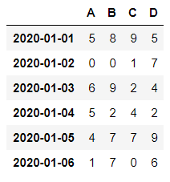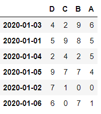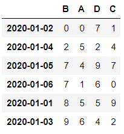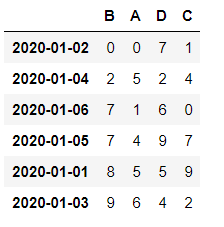

```python
# 2
import numpy as np
import pandas as pd

np.random.seed(1)
df= pd.DataFrame(np.random.randint(0,10,(6,4)),
                 index = pd.date_range('20200101', periods =6),
                 columns = ['A','B','C','D'])
df['E'] =  ['AA','BB','CC','CC', 'DD','AA']
display(df)

# 중복을 없애고 unique한 값만을 추출
print(df['E'].unique())				# ['AA' 'BB' 'CC' 'DD']	
# 각각의 값들의 개수
print(df['E'].value_counts())
-------------------------
AA    2
CC    2
BB    1
DD    1
Name: E, dtype: int64
-------------------------
print(df['E'].isin(['AA','BB'])) 
# 값이 포함되어 있는지를 확인하는 함수 => boolean indexing
-------------------------
2020-01-01     True
2020-01-02     True
2020-01-03    False
2020-01-04    False
2020-01-05    False
2020-01-06     True
Freq: D, Name: E, dtype: bool
-------------------------
```

#### [5] apply와 lambda를 이용한 처리

```python
# DataFrame의 유용한 함수 중 많이 사용되지만 사용하기 쉽지 않은것
# apply와 lambda를 이용한 처리

np.random.seed(1)
df= pd.DataFrame(np.random.randint(0,10,(6,4)),
                 index = pd.date_range('20200101', periods =6),
                 columns = ['A','B','C','D'])

display(df)

# python의 lambda식
my_func = lambda x : x.max() - x.min()
df['최대-최소'] = df.apply(my_func, axis = 1)
display(df)

print(df.apply(my_func, axis = 0))
----------------
A        6
B        9
C        9
D        7
최대-최소    4
```

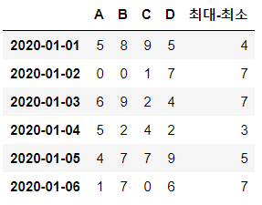

#### [6] DataFrame의 결합

```python
# DataFrame의 결합 (merge) => DB에서 Table join

import numpy as np
import pandas as pd

data1 = {'학번': [1,2,3,4],
         '이름 ': ['이지안','박동훈','이순신','강감찬'], 
         '학년': [2,4,1,3]}

data2 = {'학번': [1,2,4,5],
         '학과': ['CS','MATH','MATH','CS'],
         '학점' : [3.4, 2.9, 4.5, 1.2]}

data3 = {'학과': ['CS','MATH','MATH','CS'],
         '학점' : [3.4, 2.9, 4.5, 1.2]}

df1 = pd.DataFrame(data1)
df2 = pd.DataFrame(data2)
df3 = pd.DataFrame(data3, index=[1,2,4,5])


display(df1)
display(df2)
display(df3)

result = pd.merge(df1,df2, on='학번', how='inner')   # 교집합
result2 = pd.merge(df1,df2, how='outer')             # 합집합
result3 = pd.merge(df1,df2, on='학번', how='outer')  # full outer join
result4 = pd.merge(df1,df2, on='학번', how='left')
result5 = pd.merge(df1,df2, on='학번', how='right')

# result6 = pd.merge(df1,df2, left_on='학번',right_on='학생학번', how='inner')

result7 = pd.merge(df1,df3,
                    left_on='학번',
                    right_index=True, how='inner')

display(result)
display(result2)
display(result3)
display(result4)
display(result6)
display(result7)

result7.iloc[2]
# result7.iloc[3]  # error
```

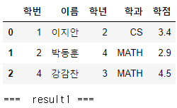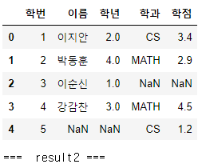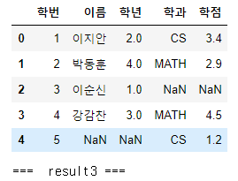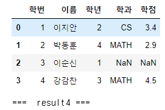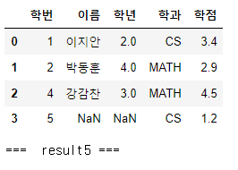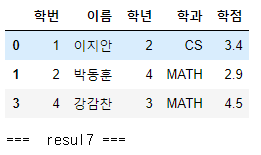

```python
data1 = {'이름 ': ['이지안','박동훈','이순신','강감찬'], 
         '학년': [2,4,1,3]}

data3 = {'학과': ['CS','MATH','MATH','CS'],
         '학점' : [3.4, 2.9, 4.5, 1.2]}

df1 = pd.DataFrame(data1,index=[1,2,3,4])
df3 = pd.DataFrame(data3, index=[1,2,4,5])

display(df1)
display(df3)

result = pd.merge(df1,df3,
                    left_index= True,
                    right_index=True, how='inner')
display(result)
```

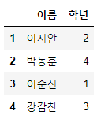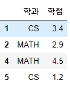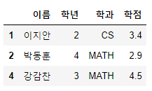

```python
# Series를 1차원, 2차원으로 연결하는 방법

import numpy as np
import pandas as pd

s1 = pd.Series([0,1],index=['a','c'])
s2 = pd.Series([4,3,2],index=['b','c','e'])
s3 = pd.Series([5,6],index=['f','g'])

# print(pd.concat([s1,s2,s3],axis=0))  # Series를 1차원으로 연결
display(pd.concat([s1,s2,s3],axis=1, sort=True))
print('==================')
display(pd.concat([s1,s2,s3],axis=1, sort=False))
```

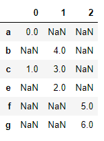                                                                      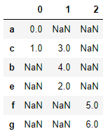

```python
# DataFrame 연결

import numpy as np
import pandas as pd

df1 = pd.DataFrame(np.arange(6).reshape(3,2),
                  index = ['a','c','b'],
                  columns=['one','two'])
display(df1)
df2 = pd.DataFrame(5 + np.arange(4).reshape(2,2),
                  index = ['a','b'],
                  columns=['three','four'])
display(df2)

result = pd.concat([df1,df2], axis=1, sort=True)
display(result)
result2 = pd.concat([df1,df2], axis=1, sort=False)
display(result2)
result3 = pd.concat([df1,df2], axis=0,ignore_index=False, sort=True) 
# column 정리 four의 f , one의 o 알파벳 순으로 정렬
display(result3)
result4 = pd.concat([df1,df2], axis=0,ignore_index=True, sort=False)
display(result4)
```

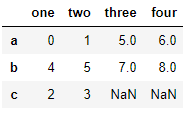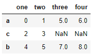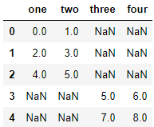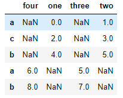

#### [7] Data 전처리

##### 1) 결측치 삭제

```python

# random seed 고정
# 0이상 10 미만의 정수형 난수 균등분포 6*4 DataFrame 생성
np.random.seed(0)

# index, column 설정
# column : ['A','B','C','D']
# index : 날짜 2020-01-01, 1일씩 6일동안

df = pd.DataFrame(np.random.randint(0,10,(6,4)))
df.index = pd.date_range('20200101',periods=6)
df.columns = ['A','B','C','D']

# 'E' column 추가
# [3, np.nan, 4, np.nan, 2, np.nan]
df['E'] = [7, np.nan, 4, np.nan, 2, np.nan] 
result = pd.concat([df,df2])


# 결측치 처리
# 1. 결측치가 있는 행을 삭제, 결측치가 몇개 안될 때
# 2. 값 대체

# 결측치 제거
dt=df.dropna(how='any', inplace=False) 
# (how='any') => NaN이 하나라도 행에 있으면 행 삭제
# (how='any') => 모든 행이 NAN일때
    
#new_df = df.fillna(value = 0)
display(df.loc[df['E'].isnull(),:])
display(df)
# display(new_df)
```

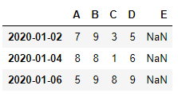

##### 2)  중복행 처리

```python
# 중복행 처리

import numpy as np
import pandas as pd

df = pd.DataFrame({ 'K1' : ['one']*3+['two']*4,
                    'K2' : [1,1,2,3,3,4,4],
                    'K3' : np.arange(7)})
display(df)
display(df.drop_duplicates())  # 중복행이 없어요
display(df.drop_duplicates(['K1'])) # K1 Column에서 중복되면 제거
display(df.drop_duplicates(['K1','K2'])) # K1,K2 Column에서 중복되면 제거
```


##### 3) 대체

```python 
# replace() => 대치

df =pd.DataFrame(np.random.randint(0,10,(6,4)),
                columns=['A','B','C','D'])

df['E'] = [7, np.nan, 3, np.nan, 2, np.nan]

display(df)

result = df.replace(np.nan,-100)
display(result)
```

         

#### [8] Grouping

```python
# pandas Grouping

import numpy as np
import pandas as pd

my_dict = {'학과' : ['컴퓨터','체육교육과','컴퓨터','체육교육과','컴퓨터'],
           '학년' : [1,2,3,2,3],
           '이름' : ['홍길동','김연아','최길동','아이유','신사임당'],
           '학점' : [1.5, 4.4, 3.7, 4.5, 3.8]}

df = pd.DataFrame(my_dict)
display(df)

dept = df['학점'].groupby(df['학과'])
#display(dept) # pandas.core.groupby.generic.SeriesGroupBy object

# 그룹안에 데이터를 확인하고 싶은 경우 get_group() 사용
print(dept.get_group('컴퓨터')) # Series
0    1.5
2    3.7
4    3.8
Name: 학점, dtype: float64
##################################        
# 각 그룹의 사이즈를 확인하고 싶은 경우
print(dept.size()) # Series
학과
체육교육과    2
컴퓨터      3
Name: 학점, dtype: int64
##################################        
print(dept.mean())
학과
체육교육과    4.45
컴퓨터      3.00
Name: 학점, dtype: float64
##################################        
dept_year = df['학점'].groupby([df['학과'],df['학년']])
print(dept_year.mean())
학과     학년
체육교육과  2     4.45
컴퓨터    1     1.50
       3     3.75
# unstack() : 최하위 index를 column으로 설정
dept_year.mean().unstack()

학년	1	2	3
학과			
체육교육과	NaN	4.45	NaN
컴퓨터	1.5	NaN	3.75
```


```python
import numpy as np
import pandas as pd

my_dict = {'학과' : ['컴퓨터','체육교육과','컴퓨터','체육교육과','컴퓨터'],
           '학년' : [1,2,3,2,3],
           '이름' : ['홍길동','김연아','최길동','아이유','신사임당'],
           '학점' : [1.5, 4.4, 3.7, 4.5, 3.8]}

df = pd.DataFrame(my_dict)
display(df)

# dept_year = df['학점'].groupby([df['학과'],df['학년']]) # Series
# DataFrame을 grouping

df_group_dept =  df.groupby(df['학과'])
print(df_group_dept) 
# <pandas.core.groupby.generic.DataFrameGroupBy object

display(df_group_dept.get_group('컴퓨터'))

display(df_group_dept.mean())

df_dept_year = df.groupby(['학과','학년'])
display(df_dept_year.mean().unstack())
```


```python
# 연습문제

import numpy as np
import pandas as pd

my_dict = {'학과' : ['컴퓨터','체육교육과','컴퓨터','체육교육과','컴퓨터'],
           '학년' : [1,2,3,2,3],
           '이름' : ['홍길동','김연아','최길동','아이유','신사임당'],
           '학점' : [1.5, 4.4, 3.7, 4.5, 3.8]}

df = pd.DataFrame(my_dict)
display(df)

# 학과별 평균 학점
print(df['학점'].groupby(df['학과']).mean())
학과
체육교육과    4.45
컴퓨터      3.00
Name: 학점, dtype: float64
        
# 학과별 몇명
print(df.groupby(['학과']).size())
학과
체육교육과    2
컴퓨터      3
dtype: int64

for ((dept,year), group) in df.groupby(['학과','학년']):
    print(dept)
    print(year)
    display(group)
    print('==========')   
```


