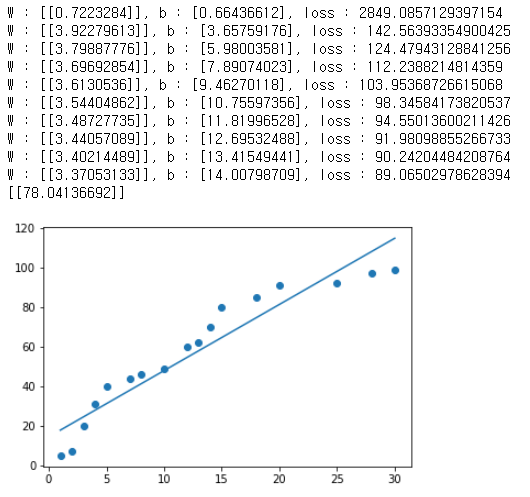
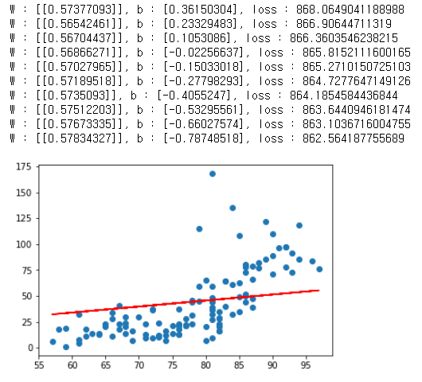
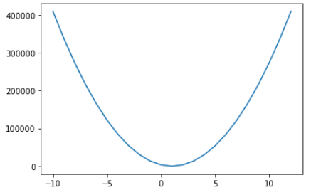
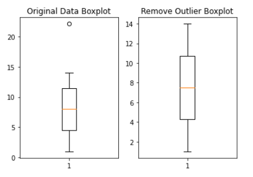
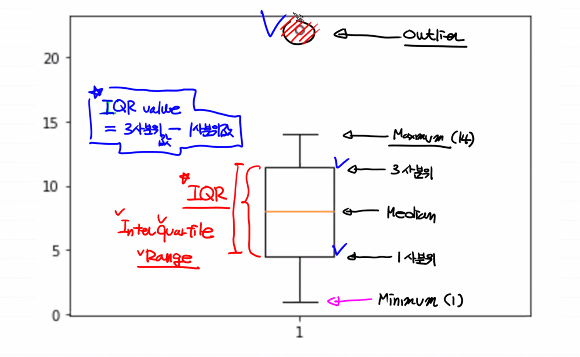

# 03. Machine Learning

* `AI` (Artificial Intelligence - 인공지능)   :  인간이 가지고 있는 학습능력, 응용력, 추론능력을 컴퓨터를 통해서 구현하고자 하는 가장 포괄적인 개념

*  `Machine Learning` : `AI`를 구현하는 하나의 방법론, 데이터를 이용해서 데이터의 특성과 패턴을 학습하고 그 결과를 바탕으로 미지의 데이터에 대한 미래결과를 예측하는 프로그래밍 기법
  ex ) **Regression**,  SVM(Support Vector Machine),  Random Forest, Descision Tree, Clustering, **Neural Network**, **Reinforcement Learning**, 등등등 ..
  * Data Mining : 데이터간의 상관관계나 새로운 속성(feature)을 찾는 것이 주 목적인 작업

* `Deep Learning` :  `Machine Learning`의 한 부분, `Neural Network`을 이용해서 학습하는 알고리즘의 집합. ( CNN, ANN, LSTM, GAN, ...)

## 1. Machine Learning

> 1960년대 개념이 만들어졌다. `Explicit program`의 한계 때문에 고안되었다. `Explicit program`은 `rule based program`으로 `Explicit programming`은 조건이 너무 많아서 프로그램으로 표현하기가 힘든 프로그램이 존재

* `Machine Learning` : 프로그램 자체가 데이터를 기반으로 학습을 통해 배우는 능력을 가지는 프로그램을 지칭,  결과를 바탕으로 미지의 데이터에 대해 미래 결과를 예측
  	1.  Regression (Linear Regression, Logistic Regression : 연속적인 값 예측, 분류 가능
   	2.  SVM (Support Vector Machine)
   	3.  Decision Tree
   	4.  Random Forest
   	5.  Naive Bayes
   	6.  KNN (K-Nearest Neighbor)
   	7.  Neural Network (신경망)
   	8.  Clustering (K-Means, DBSCAN)
   	9.  Reinforcement Learning

### 1) Type

> 학습 방법에 따라서 크게 4가지로 분류

(1) <u>**지도학습 (Supervised Learning)**</u>

- 우리가 해결해야 하는 현실세계의 대부분의 문제가 지도학습 문제

(2) 비지도학습 (Unsupervised Learning)

(3) 준지도학습 (SemiSupervised Learning)

(4) 강화학습 (Reinforcement Learning)


#### 1. 지도학습 (Supervised Learning)

> 지도학습은 학습에 사용되는 데이터와 그 정답(`label`) 을 이용해서 데이터의 특성과 분포를 학습하고 미래결과를 예측하는 방법. 입력값 (x)와 정답 (t)를 포함하는 Training Data Set을 이용. 어떤 종류의 미래값을 예측하느냐에 따라 크게 2가지로 나뉜다.

##### [1]  Regression(회귀) 

> 학습된 결과를 바탕으로 연속적인 숫자값을 예측.

###### 1 Linear Regression (선형회귀) 
> '얼마나' 를 예측하는 방법

###### ex 1) 공부시간 - 시험성적

```python
# Linear Regression Model 구현

import numpy as np
import pandas as pd
import matplotlib.pyplot as plt


# 1. Training Data Set 준비
#    머신러닝에 입력으로 사용될 데이터를 NumPy array 형태로 준비

x_data = np.array([1, 2, 3, 4, 5, 7, 8, 10, 12, 13, 14, 15, 18, 20, 25, 28, 30]).reshape(-1,1)
t_data = np.array([5, 7, 20, 31, 40, 44, 46, 49, 60, 62, 70, 80, 85, 91, 92, 97, 99]).reshape(-1,1)


# 2. Linear Regression Model 정의
#    y = Wx + b
#    W와 b에 대한 변수 선언한 후 초기값은 랜덤값을 이용
W = np.random.rand(1,1)
b = np.random.rand(1)


# 3. loss function 정의 : 손실함수 (loss function)에 대한 코드를 작성
#                         matrix 처리를 해야한다
def loss_func(x,t):
    
    y = np.dot(x,W) + b
    
    return np.mean(np.power((t-y),2))
        
# 미분함수
def numerical_derivative(f,x):
    # f : 다변수 함수
    # x : 모든 변수를 포함하고 있어야한다. ndarray(차원상관없이)
    delta_x = 1e-4
    derivative_x = np.zeros_like(x) # 미분 결과를 저장하는 ndarray

    it = np.nditer(x, flags=['multi_index'])
       
    while not it.finished:
        
        idx = it.multi_index # iterator의 현재 index를 추출(tuple)
        
        # 현재 칸의 값을 어딘가에 잠시 저장
        tmp = x[idx]
        
        x[idx] = tmp + delta_x
        fx_plus_delta = f(x) # f(x + delta_x)

        x[idx] = tmp - delta_x
        fx_minus_delta = f(x)  # f(x - delta_x)   
        
        derivative_x[idx] = (fx_plus_delta-fx_minus_delta) / (2 * delta_x)
        
        x[idx] = tmp
        
        it.iternext()
    return derivative_x


def predict(x):
    return np.dot(x,W) + b # Hypothesis, Linear Regression Model


# 4. learning rate 정의 : 일반적으로 customizing이 되는 값으로 초기에는
#                         0.001정도로 설정해서 사용하고 loss값을 보고
#                         수치를 조절할 필요가 있다.
learning_rate = 0.0001


# 5. 학습을 진행 : 반복적으로 편미분을 이용해서 W 와 b를 update하는 방식으로 구현
# 미분을 진행할 loss_func()에 대한 lambda 정의
f = lambda x : loss_func(x_data,t_data)

for step in range(30000):
    
    W = W - learning_rate * numerical_derivative(f,W)
    b = b - learning_rate * numerical_derivative(f,b)

    if step % 3000 == 0:
        print('W : {}, b : {}, loss : {}'.format(W,b,loss_func(x_data,t_data)))
       
    
print(predict(19))
plt.scatter(x_data.ravel(),t_data.ravel())
plt.plot(x_data, x_data * W +b)
plt.show()

```



###### ex 2)  온도 - 오존량

```python
# SImple Linear Regression
# 온도에 따른 오존량

import numpy as np
import pandas as pd
import matplotlib.pyplot as plt
from my_library.machine_learning_library import numerical_derivative

# 1. Raw Data Loading
df = pd.read_csv('./data/ozone.csv')

# 2. Data Preprocessing (데이터 전처리)
#    - 결측치 처리
#       - 삭제 !!, 값 변경(평균, 최대, 최소), 값을 예측해서 대체
#    - 이상치 처리 (outlier)
#       - 이상치를 검출, 변경하는 작업
#    - 데이터 정규화
#    - 칼럼을 추출, 새로 생성

# 필요한 column (Temp.Ozone)만 추출

training_data = df[['Temp','Ozone']]

# 결측값 제거
training_data = training_data.dropna(how = 'any')
#print(training_data.shape)

# 3. Training Data Set
x_data = training_data['Temp'].values.reshape(-1,1)
t_data = training_data['Ozone'].values.reshape(-1,1)

# 4. Simple Linear Regression
#    y = Wx + b
#    W,b를 정의

W = np.random.rand(1,1)
b = np.random.rand(1)


# 5. loss function 정의

def loss_func(x,t):   
    y = np.dot(x,W) + b  
    return np.mean(np.power((t-y),2))

# 6. 학습종료 후 예측
def predict(x):
    return np.dot(x,W) + b # Hypothesis, Linear Regression Model


# 7. 프로그램에서 필요한 변수 정의
learning_rate = 0.00001
f = lambda x : loss_func(x_data,t_data)
# 8. 학습하기
for step in range(30000):
    
    W = W - learning_rate * numerical_derivative(f,W)
    b = b - learning_rate * numerical_derivative(f,b)

    if step % 3000 == 0:
        print('W : {}, b : {}, loss : {}'.format(W,b,loss_func(x_data,t_data)))
       
# 9. 그림으로 확인
plt.scatter(x_data.ravel(),t_data.ravel())
plt.plot(x_data, np.dot(x_data,W)+b,color='r')
plt.show()

# 10. 예측
result = predict(62)
print(result) # [[35.04243599]]
```



###### ex 3) 온도 - 오존량 sklearn

```python
# sklean을 이용해서 데이터로 학습, 예측

# sklearn은 데이터 분석, 머신러닝 라이브러리
# 유명하고 효율이 좋은 라이브러리

import numpy as np
import pandas as pd
import matplotlib.pyplot as plt
from sklearn import linear_model

# 1. Raw Data Loading
df = pd.read_csv('./data/ozone.csv')

# 2. Data Preprocessing (데이터 전처리)
#    - 결측치 처리
#       - 삭제 !!, 값 변경(평균, 최대, 최소), 값을 예측해서 대체
#    - 이상치 처리 (outlier)
#       - 이상치를 검출, 변경하는 작업
#    - 데이터 정규화
#    - 칼럼을 추출, 새로 생성

# 필요한 column (Temp.Ozone)만 추출

training_data = df[['Temp','Ozone']]
#print(training_data.shape)

# 결측값 제거

training_data = training_data.dropna(how = 'any')
#print(training_data.shape)

# 3. Training Data Set
x_data = training_data['Temp'].values.reshape(-1,1)
t_data = training_data['Ozone'].values.reshape(-1,1)

# 4. sklearn을 이용해서 linear regression model 객체 생성
#    아직 완성되지 않음
model = linear_model.LinearRegression()

# 5. Training Data Set을 이용해서 학습 진행
model.fit(x_data,t_data)

# 6. W와 b
print('W : {}, b : {}'.format(model.coef_,model.intercept_))

# 7. 그래프 확인
plt.scatter(x_data,t_data)
plt.plot(x_data,np.dot(x_data,model.coef_)+model.intercept_,color='r')
plt.show()

# 8. 예측
predict_val = model.predict([[62]])
print(predict_val) # [[3.58411393]]
```


* 회귀 모델 : 어떠한 데이터에 대해 **<u>그 값에 영향을 주는 조건을 고려해서</u>** 데이터의 평균을 구하기 위한 함수
  * 회귀 : 평균으로의 회귀, 데이터가 회귀모델 제시하는 추세선으로 회귀한다.

$$
y =h(x_1,x_2,x_3,...x_k;\beta_1,\beta_1,\beta_1,...\beta_k)+\epsilon \\y = 실측치, 정답 \quad \beta = 회귀계수
$$
* 최종목표 : h()를 최대한 실제와 가깝게 만드는게 목표

* 회귀모델을 만들때, **<u>실제 데이터는 어떤 특성을 가지고 있다고 가정</u>**한다. 이런 가정이 많을수록 단순화 된다. 다양한 회귀모델이 존재. (선형, 비선형)을 구본하는 기준은 독립, 종속변수의 고려가 아니다.

  * Linear Regression Model : 회귀계수가 선형적으로 결합되는 모델. **<u>회귀계수를 추출하기 쉽고, 해석하기가 쉽다.</u>** <u>**새로운 특성(feature)를 쉽게 추가할 수 있다.**</u>

  $$
  y = \beta_0+\beta_1x_1+\beta_2x_2+\beta_3x_3
  \\ y = \beta_0x^{\beta_1} => \log{y} = \log{\beta_0}+\beta_1\log{x}
  $$
  
  $$
  \\ Clasical\ Linear \ Regression\ Model
  \\ \hat{y} = \beta_0+\sum_{i=1}^p \beta_ix_i
  \\ \hat{y} = \beta_0+\beta_1x_1 => y = ax+b => y = Wx +b
  $$

  * non-linear Regression Model
    $$
    y = {\beta_1x \over \beta_2+x}
    $$

* 종속변수의 개수에 따른 분류

  * 단변량 회귀모델
  * 다변량 회귀모델

  

###### 2. Logistic Regression (Binary clasification) 

>  분류하는 작업

##### [2] Classification(분류) 
> 학습된 결과를 바탕으로 어떤 종류의 값(discrete value)인지를 구별하는 방식,  '어떤것' 을 예측한다.

* 1. binary classification : 둘 중 하나를 예측

* 2. multinomual classification : 여러가지 중 하나를 예측


#### 2. 비지도학습 (Unsupervised Learning)

> 학습에 사용되는 데이터가 `label`이 없는 데이터만을 이용하기 때문에 입력값 자체가 가지고 있는 특성과 분포를 이용해서 `Grouping`하는 `Clustering`(군집화)하는데 주로 사용

* Cloustering : 비슷한 데이터끼리 Grouping (Classification : 어떤 분류에 속하는지 정답을 예측 )

#### 3. 준지도학습 (SemiSupervised Learning)

> 데이터의 일부분만 `label`이 제공되는 경우. 

#### 4. 강화학습 (Reinforcement Learning)

> `Agent`, `Environment`, `Action`, `Reward` 게임 쪽에서 많이 사용되는 학습방법.
> ex) Google 알파고


## 2. 수치미분

> 어떤 함수의 정의역 속 각 점에서 독립변수의 값의 변화량과 함수값의 변화량 비율의 극한 혹은 극한의 집합, 치역으로 가지는 새로운 함수. 이를 `미분`, `derivative`라고 한다. 다른 의미로 미분함수(도함수)를 구하는 작업을 `미분법`이라고 하고 `differentiation`이라고 한다.

> 논리적인 전개로 미분을 수행하는 `해석미분`(Anaytical differentiation), 해석미분을 이용해서 문제를 해결할 수 없을때 수치적 근사값을 이용해 미분을 수행하는 방법을 `수치미분`이라고 한다. `delta_x`라는 0과 근사한 값을 이용하는데 이때 소수점 8자리 이하로 내려가면 안된다.(파이썬) 일반적으로 `delta_x`를 0.00001 수준으로 설정해서 수치미분 수행

### 1) 중앙차분방식

$$
f'(x) = {f(x+\bigtriangleup) - f(x-\bigtriangleup)\over 2x}
$$

#### 1. Partial derivative(편미분)

> 입력변수가 하나 이상인 다변수함수에서 미분하고자 하는 변수하나를 제외한 나머지 변수를 상수로 취급하고 해당 변수를 미분

$$
f(x,y) = 2x+3xy+y^3
$$

$$
{\partial f(xy) \over \partial x} = 2 +3y
$$

#### 2. Chain rule (연쇄법칙)

> 여러 함수로 구성된 함수(합성함수), 합성함수를 미분하려면 Chain rule (연쇄법칙). 합성함수를 구성하고 있는 각 함수를 미분하고 곱으로 표현

$$
f(x) = e^{3x^2}
$$

$$
{\partial f \over \partial x} = {\partial f \over \partial t} \times {\partial t \over \partial x} = {\partial e^t \over \partial t} \times {\partial 3x^2 \over \partial x} = e^t \times 6x = 6xe^{3x^2}
$$

#### 3. Gradient Descent Algorithm (경사하강법)

>이 알고리즘으로 최적의 (W,b)를 찾으려면 `loss function`이 `convex function`의 형태를 가져야 한다.

#### # Python 코드로 중앙차분방식 구현

##### (1)

```python
# f(x) = x^2
# f'(5) = ?

def numerical_derivative(f,x):
    # f : 미분하려는 함수가 들어온다.
    #     python은 일급함수 지원
    #     하나의 함수를 다른 함수의 인자로 전달 가능
    #     일반적으로 외부에서 def, lambda를 이용해서 정의
    # x : 미분값을 알고자하는 입력 값.
    
    # delta_x 는 0과 가까운 작은값을 이용하고 1e-8이하는 사용x
    # 컴퓨터의 반올림 오차로 오답
    # delta_x는 1e-4 ~ 1e-6 정도로 설정
    
    delta_x = 1e-4
    
    # 중앙차분으로 미분 수행
    return (f(x+ delta_x) - f(x-delta_x))/(2*delta_x)

# 미분하려는 함수
def my_func(x):
    return x**2

result = numerical_derivative(my_func,5)
print(result)
# 9.999999999976694
```

##### (2) 다변식 함수

```python
# 다변수 함수에 대한 미분
# f(x,y) = 2x + 3xy + y^3
# f(1.0,2.0) = ??    (8,15)


# 수치미분 최종코드
import numpy as np

def numerical_derivative(f,x):
    # f : 다변수 함수
    # x : 모든 변수를 포함하고 있어야한다. ndarray(차원상관없이)
    delta_x = 1e-4
    derivative_x = np.zeros_like(x) # 미분 결과를 저장하는 ndarray

    it = np.nditer(x, flags=['multi_index'])

    while not it.finished:
        
        idx = it.multi_index # iterator의 현재 index를 추출(tuple)
        
        # 현재 칸의 값을 어딘가에 잠시 저장
        tmp = x[idx]
        
        x[idx] = tmp + delta_x
        fx_plus_delta = f(x) # f(x + delta_x)

        x[idx] = tmp - delta_x
        fx_minus_delta = f(x)  # f(x - delta_x)
        
        derivative_x[idx] = (fx_plus_delta-fx_minus_delta) / (2 * delta_x)
        
        x[idx] = tmp
        
        it.iternext()
    return derivative_x

def my_func(input_data):
    x = input_data[0]
    y = input_data[1]
    
    return 2*x + 3*x*y + np.power(y,3)

result = numerical_derivative(my_func,np.array([1.0, 2.0]))

print(result)
# [ 8.         15.00000001]
```

#### # loss Function

```python
# 초기의 기울기 a와 절편 b는 랜덤하게 결정
# 우리가 가지는 데이터의 특성을 잘 표현하는 직선을 찾아가는 과정을 학습(learning)
# 가장 잘 표현한 직선 (y)를 predictive model이라고 한다. (linear regression)

# y = ax + b (수학)
# y = Wx + b (W : weight,가중치)(b : bias,바이어스)

# Cost function(비용함수)
# loss function(손실함수) 차이를 더해 수식으로 표현 loss function

import numpy as np
import pandas as pd
import matplotlib.pyplot as plt

data = {"공부시간(x)" : [1,2,3,4,5,7,8,10,12,13,14,15,18,20,25,28,30],
        "시험점수(t)" : [5,7,20,31,40,44,46,49,60,62,70,80,85,91,92,97,99]}

df = pd.DataFrame(data)


plt.scatter(df['공부시간(x)'],df['시험점수(t)']) # 산점도를 구할 수 있다.
plt.plot(df['공부시간(x)'],df['공부시간(x)']*2+3, color='g')
plt.plot(df['공부시간(x)'],df['공부시간(x)']*5-7, color='r')
plt.plot(df['공부시간(x)'],df['공부시간(x)']*1+8, color='b')
plt.plot(df['공부시간(x)'],df['공부시간(x)']*4-10, color='m')
plt.show()
```

 

##### (1) 최소제곱법 (least squared Method) 
> 오차의 제곱의 평균이 최소가 되는 값을 찾는다.


$$
loss function = {[t_1-wx_1+t]^2 + [t_2-wx_2+t]^2 + ...[t_n-wx_n+t]^2 \over n}
$$

$$
lossfunction = {1 \over n}\sum_{i=1}^n[ t_i-(wx_i+b)]^2 = E(w,b)
$$

* E(w,b) 작다라는 의미는 오차가 작다.

```python
# loss function의 모양 확인

import numpy as np
import matplotlib.pyplot as plt

# training data set
x = np.arange(1,101)
t = np.arange(1,101)

# W
W = np.arange(-10,13)
loss = []

for tmp in W:
    loss.append(np.power((t-tmp*x),2).mean())

plt.plot(W,loss)
plt.show()
```


$$
w = w-\alpha{\partial E(w,b) \over \partial w}
$$
$$
b = b-\alpha{\partial E(w,b) \over \partial b}
$$
$$
\alpha = learning\ rate\ \simeq\ 0.001
$$

* 위 식을 통해서 오차의 합이 최소가 되는 w, b 값을 찾는다. 이 과정이 학습(learning)이다. 


## 3. 데이터 전처리

> 이상치(Outlier)는 속성의 값이 일반적인 값보다 편차가 큰 값을 의미. 데이터 전체 패턴에서 동떨어져 있는 관측치를 지칭. 평균뿐아니라 분산에도 영향을 미치기 때문에 안정성을 저해하는 요소로 반드시 처리하고 검출하고 처리하는데 시간이 많이 소요

### 1) Tukey Outlier

> 4분위값을 이용하는 이상치 검출방식으로 boxplot을 이용해서 검출이 가능하다.

```python
import numpy as np
import matplotlib.pyplot as plt

data = np.array([1,2,3,4,5,6,7,8,9,10,11,12,13,14,22.1])

fig = plt.figure()       # 새로운 그림(figure)을 생성

fig_1 = fig.add_subplot(1,2,1) # 1행 2열의 subplot의 위치가 1번 위치
fig_2 = fig.add_subplot(1,2,2)

fig_1.set_title('Original Data Boxplot')
fig_1.boxplot(data)

print(np.mean(data))     # 평균 8.473333333333333
print(np.median(data))   # 중위수, 2사분위, 미디언 = 8
print(np.percentile(data,25)) # 4.5
print(np.percentile(data,50)) # 8.0
print(np.percentile(data,75)) # 11.5

IQR_val = np.percentile(data,75) - np.percentile(data,25)

upper_fense = np.percentile(data,75) + 1.5 * IQR_val
lower_fense = np.percentile(data,25) - 1.5 * IQR_val

print('upper_fense : {}'.format(upper_fense))
# upper_fense : 22.0
print('lower_fense : {}'.format(lower_fense))
# lower_fense : -6.0

# 이상치를 제거하고 boxplot 그려보기

print(data[(data > upper_fense) | (data < lower_fense)])

result_data = data[(data < upper_fense) & (data > lower_fense)]

fig_2.set_title('Remove Outlier Boxplot')
fig_2.boxplot(result_data)

plt.show()
```



### 2) Z -Score

> 우리가 사용하는 데이터를 정규분포표로 만들고 각각의 데이터가 표준편차상 어느곳에 위치하는지 알려주는 값
>

```python
from scipy import stats

data = np.array([1,2,3,4,5,6,7,8,9,10,11,12,13,14,22.1])

zscore_threshold = 1.8 # zscore outlier 임계값 ( 일반적으로 2 )

outliers = data[np.abs(stats.zscore(data))> zscore_threshold]
print(outliers)
# [22.1]
print(data[np.isin(data,outliers , invert = True)])
# [ 1.  2.  3.  4.  5.  6.  7.  8.  9. 10. 11. 12. 13. 14.]
```

